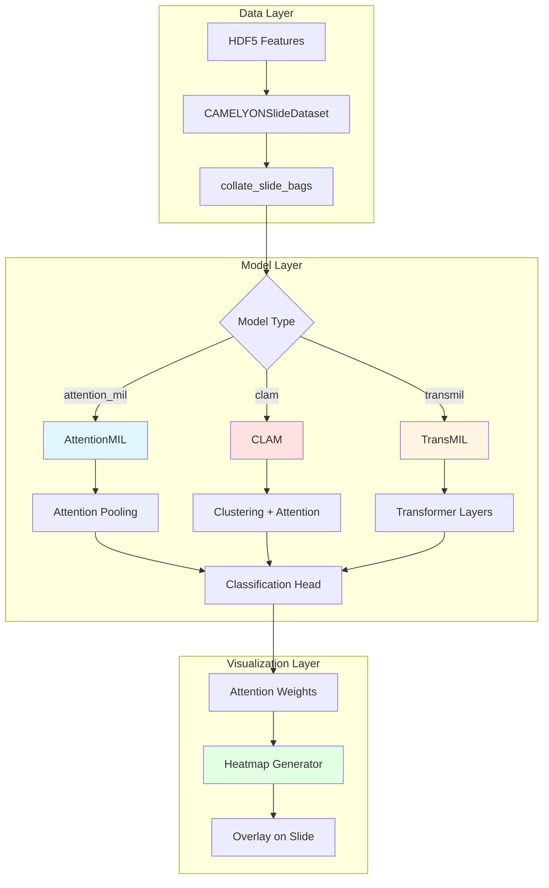

# Design Document: Attention-Based MIL Models

## Overview

This design implements three state-of-the-art attention-based Multiple Instance Learning (MIL) architectures for whole-slide image classification: Attention MIL, CLAM, and TransMIL. These models learn to weight patch importance through attention mechanisms, providing both improved performance over simple pooling baselines and interpretability through attention heatmaps.

The implementation integrates with the existing slide-level training infrastructure (`CAMELYONSlideDataset`, `experiments/train_camelyon.py`) while maintaining backward compatibility with baseline pooling models. All models operate on pre-extracted patch features from HDF5 files, avoiding raw WSI complexity.

### Key Design Decisions

1. **Three Architecture Variants**: Attention MIL (basic attention pooling), CLAM (clustering-constrained attention), TransMIL (transformer-based MIL)
2. **Unified Interface**: All models implement a common `AttentionMILBase` interface for consistent integration
3. **Attention Weight Extraction**: Models return attention weights alongside predictions for visualization
4. **Masking Support**: Proper handling of variable-length bags with padding masks
5. **Configuration-Driven**: YAML configs specify architecture type and hyperparameters
6. **HDF5-Based Workflow**: Works with pre-extracted features, not raw WSI files

## Architecture

### Component Diagram



### Data Flow

1. **Feature Loading**: `CAMELYONSlideDataset` loads all patch features for a slide from HDF5
2. **Batching**: Custom collate pads variable-length bags to max length in batch
3. **Attention Computation**: Model computes attention weights for each patch
4. **Aggregation**: Weighted sum of patch features using attention weights
5. **Classification**: MLP head produces slide-level prediction
6. **Weight Extraction**: Attention weights saved for visualization during evaluation

## Components and Interfaces

### AttentionMILBase (Abstract Base Class)

Common interface for all attention-based MIL models.

```python
from abc import ABC, abstractmethod
from typing import Dict, Optional, Tuple

import torch
import torch.nn as nn


class AttentionMILBase(nn.Module, ABC):
    """Abstract base class for attention-based MIL models.
    
    All attention MIL models must implement:
    - compute_attention: Calculate attention weights for patches
    - aggregate_features: Weighted aggregation using attention
    - forward: Complete forward pass returning logits and attention weights
    """
    
    def __init__(
        self,
        feature_dim: int,
        hidden_dim: int = 256,
        num_classes: int = 2,
        dropout: float = 0.3,
    ):
        super().__init__()
        self.feature_dim = feature_dim
        self.hidden_dim = hidden_dim
        self.num_classes = num_classes
        self.dropout = dropout
    
    @abstractmethod
    def compute_attention(
        self,
        patch_features: torch.Tensor,
        mask: Optional[torch.Tensor] = None,
    ) -> torch.Tensor:
        """Compute attention weights for patches.
        
        Args:
            patch_features: [batch_size, num_patches, feature_dim]
            mask: [batch_size, num_patches] - True for valid patches
            
        Returns:
            attention_weights: [batch_size, num_patches]
        """
        pass
    
    @abstractmethod
    def aggregate_features(
        self,
        patch_features: torch.Tensor,
        attention_weights: torch.Tensor,
    ) -> torch.Tensor:
        """Aggregate patch features using attention weights.
        
        Args:
            patch_features: [batch_size, num_patches, feature_dim]
            attention_weights: [batch_size, num_patches]
            
        Returns:
            slide_features: [batch_size, hidden_dim]
        """
        pass
    
    @abstractmethod
    def forward(
        self,
        patch_features: torch.Tensor,
        num_patches: Optional[torch.Tensor] = None,
        return_attention: bool = False,
    ) -> Tuple[torch.Tensor, Optional[torch.Tensor]]:
        """Forward pass through the model.
        
        Args:
            patch_features: [batch_size, num_patches, feature_dim]
            num_patches: [batch_size] - actual patch counts for masking
            return_attention: Whether to return attention weights
            
        Returns:
            logits: [batch_size, num_classes] or [batch_size, 1]
            attention_weights: [batch_size, num_patches] if return_attention=True
        """
        pass
```

### AttentionMIL (Basic Attention Pooling)

Implements basic attention-weighted pooling with optional gated attention.

```python
class AttentionMIL(AttentionMILBase):
    """Basic attention-based MIL model.
    
    Computes attention weights for each patch and aggregates features
    using weighted sum. Supports both instance-level and bag-level attention.
    
    Args:
        feature_dim: Dimension of input patch features
        hidden_dim: Hidden dimension for attention network
        num_classes: Number of output classes
        dropout: Dropout rate
        gated: Whether to use gated attention mechanism
        attention_mode: 'instance' or 'bag' level attention
    """
    
    def __init__(
        self,
        feature_dim: int,
        hidden_dim: int = 256,
        num_classes: int = 2,
        dropout: float = 0.3,
        gated: bool = True,
        attention_mode: str = "instance",
    ):
        super().__init__(feature_dim, hidden_dim, num_classes, dropout)
        
        self.gated = gated
        self.attention_mode = attention_mode
        
        # Feature projection
        self.feature_proj = nn.Sequential(
            nn.Linear(feature_dim, hidden_dim),
            nn.ReLU(),
            nn.Dropout(dropout),
        )
        
        # Attention network
        if gated:
            # Gated attention: element-wise gating for feature selection
            self.attention_V = nn.Sequential(
                nn.Linear(hidden_dim, hidden_dim),
                nn.Tanh(),
            )
            self.attention_U = nn.Sequential(
                nn.Linear(hidden_dim, hidden_dim),
                nn.Sigmoid(),
            )
            self.attention_w = nn.Linear(hidden_dim, 1)
        else:
            # Simple attention
            self.attention_net = nn.Sequential(
                nn.Linear(hidden_dim, hidden_dim // 2),
                nn.Tanh(),
                nn.Linear(hidden_dim // 2, 1),
            )
        
        # Classifier
        self.classifier = nn.Sequential(
            nn.Linear(hidden_dim, hidden_dim // 2),
            nn.ReLU(),
            nn.Dropout(dropout),
            nn.Linear(hidden_dim // 2, num_classes if num_classes > 2 else 1),
        )
    
    def compute_attention(
        self,
        patch_features: torch.Tensor,
        mask: Optional[torch.Tensor] = None,
    ) -> torch.Tensor:
        """Compute attention weights for patches.
        
        Args:
            patch_features: [batch_size, num_patches, feature_dim]
            mask: [batch_size, num_patches] - True for valid patches
            
        Returns:
            attention_weights: [batch_size, num_patches]
        """
        # Project features
        h = self.feature_proj(patch_features)  # [batch_size, num_patches, hidden_dim]
        
        # Compute attention scores
        if self.gated:
            # Gated attention: A = softmax(w^T * (V(h) ⊙ U(h)))
            A_V = self.attention_V(h)  # [batch_size, num_patches, hidden_dim]
            A_U = self.attention_U(h)  # [batch_size, num_patches, hidden_dim]
            A = self.attention_w(A_V * A_U)  # [batch_size, num_patches, 1]
        else:
            # Simple attention
            A = self.attention_net(h)  # [batch_size, num_patches, 1]
        
        A = A.squeeze(-1)  # [batch_size, num_patches]
        
        # Apply mask if provided
        if mask is not None:
            A = A.masked_fill(~mask, float('-inf'))
        
        # Softmax to get attention weights
        attention_weights = torch.softmax(A, dim=1)  # [batch_size, num_patches]
        
        return attention_weights
    
    def aggregate_features(
        self,
        patch_features: torch.Tensor,
        attention_weights: torch.Tensor,
    ) -> torch.Tensor:
        """Aggregate patch features using attention weights.
        
        Args:
            patch_features: [batch_size, num_patches, feature_dim]
            attention_weights: [batch_size, num_patches]
            
        Returns:
            slide_features: [batch_size, hidden_dim]
        """
        # Project features
        h = self.feature_proj(patch_features)  # [batch_size, num_patches, hidden_dim]
        
        # Weighted sum
        slide_features = torch.bmm(
            attention_weights.unsqueeze(1),  # [batch_size, 1, num_patches]
            h  # [batch_size, num_patches, hidden_dim]
        ).squeeze(1)  # [batch_size, hidden_dim]
        
        return slide_features
    
    def forward(
        self,
        patch_features: torch.Tensor,
        num_patches: Optional[torch.Tensor] = None,
        return_attention: bool = False,
    ) -> Tuple[torch.Tensor, Optional[torch.Tensor]]:
        """Forward pass through the model.
        
        Args:
            patch_features: [batch_size, num_patches, feature_dim]
            num_patches: [batch_size] - actual patch counts for masking
            return_attention: Whether to return attention weights
            
        Returns:
            logits: [batch_size, num_classes] or [batch_size, 1]
            attention_weights: [batch_size, num_patches] if return_attention=True
        """
        # Create mask from num_patches
        mask = None
        if num_patches is not None:
            batch_size, max_patches = patch_features.shape[:2]
            mask = torch.arange(max_patches, device=patch_features.device)[None, :] < num_patches[:, None]
        
        # Compute attention weights
        attention_weights = self.compute_attention(patch_features, mask)
        
        # Aggregate features
        slide_features = self.aggregate_features(patch_features, attention_weights)
        
        # Classify
        logits = self.classifier(slide_features)
        
        if return_attention:
            return logits, attention_weights
        return logits, None
```


### CLAM (Clustering-Constrained Attention MIL)

Implements CLAM architecture with instance-level clustering and attention.

```python
class CLAM(AttentionMILBase):
    """Clustering-Constrained Attention Multiple Instance Learning.
    
    CLAM improves attention quality through instance-level clustering.
    Supports both single-branch and multi-branch attention modes.
    
    Reference: Lu et al. "Data-efficient and weakly supervised computational 
    pathology on whole-slide images." Nature Biomedical Engineering, 2021.
    
    Args:
        feature_dim: Dimension of input patch features
        hidden_dim: Hidden dimension for attention network
        num_classes: Number of output classes
        dropout: Dropout rate
        num_clusters: Number of instance clusters (k in paper)
        multi_branch: Whether to use multi-branch attention (separate for pos/neg)
        instance_loss_weight: Weight for instance clustering loss
    """
    
    def __init__(
        self,
        feature_dim: int,
        hidden_dim: int = 256,
        num_classes: int = 2,
        dropout: float = 0.3,
        num_clusters: int = 10,
        multi_branch: bool = True,
        instance_loss_weight: float = 0.3,
    ):
        super().__init__(feature_dim, hidden_dim, num_classes, dropout)
        
        self.num_clusters = num_clusters
        self.multi_branch = multi_branch
        self.instance_loss_weight = instance_loss_weight
        
        # Feature projection
        self.feature_proj = nn.Sequential(
            nn.Linear(feature_dim, hidden_dim),
            nn.ReLU(),
            nn.Dropout(dropout),
        )
        
        # Instance-level clustering
        self.instance_classifier = nn.Sequential(
            nn.Linear(hidden_dim, hidden_dim // 2),
            nn.ReLU(),
            nn.Dropout(dropout),
            nn.Linear(hidden_dim // 2, num_clusters),
        )
        
        # Attention branches
        if multi_branch:
            # Separate attention for positive and negative classes
            self.attention_pos = self._create_attention_branch(hidden_dim)
            self.attention_neg = self._create_attention_branch(hidden_dim)
        else:
            # Single attention branch
            self.attention = self._create_attention_branch(hidden_dim)
        
        # Bag-level classifier
        bag_input_dim = hidden_dim * 2 if multi_branch else hidden_dim
        self.bag_classifier = nn.Sequential(
            nn.Linear(bag_input_dim, hidden_dim // 2),
            nn.ReLU(),
            nn.Dropout(dropout),
            nn.Linear(hidden_dim // 2, num_classes if num_classes > 2 else 1),
        )
    
    def _create_attention_branch(self, hidden_dim: int) -> nn.Module:
        """Create an attention branch."""
        return nn.Sequential(
            nn.Linear(hidden_dim, hidden_dim // 2),
            nn.Tanh(),
            nn.Linear(hidden_dim // 2, 1),
        )
    
    def compute_instance_predictions(
        self,
        patch_features: torch.Tensor,
        mask: Optional[torch.Tensor] = None,
    ) -> torch.Tensor:
        """Compute instance-level cluster predictions.
        
        Args:
            patch_features: [batch_size, num_patches, feature_dim]
            mask: [batch_size, num_patches] - True for valid patches
            
        Returns:
            instance_logits: [batch_size, num_patches, num_clusters]
        """
        # Project features
        h = self.feature_proj(patch_features)  # [batch_size, num_patches, hidden_dim]
        
        # Instance predictions
        instance_logits = self.instance_classifier(h)  # [batch_size, num_patches, num_clusters]
        
        return instance_logits
    
    def compute_attention(
        self,
        patch_features: torch.Tensor,
        mask: Optional[torch.Tensor] = None,
        branch: str = "pos",
    ) -> torch.Tensor:
        """Compute attention weights for patches.
        
        Args:
            patch_features: [batch_size, num_patches, feature_dim]
            mask: [batch_size, num_patches] - True for valid patches
            branch: 'pos' or 'neg' for multi-branch mode
            
        Returns:
            attention_weights: [batch_size, num_patches]
        """
        # Project features
        h = self.feature_proj(patch_features)  # [batch_size, num_patches, hidden_dim]
        
        # Compute attention scores
        if self.multi_branch:
            if branch == "pos":
                A = self.attention_pos(h)  # [batch_size, num_patches, 1]
            else:
                A = self.attention_neg(h)  # [batch_size, num_patches, 1]
        else:
            A = self.attention(h)  # [batch_size, num_patches, 1]
        
        A = A.squeeze(-1)  # [batch_size, num_patches]
        
        # Apply mask if provided
        if mask is not None:
            A = A.masked_fill(~mask, float('-inf'))
        
        # Softmax to get attention weights
        attention_weights = torch.softmax(A, dim=1)  # [batch_size, num_patches]
        
        return attention_weights
    
    def aggregate_features(
        self,
        patch_features: torch.Tensor,
        attention_weights: torch.Tensor,
    ) -> torch.Tensor:
        """Aggregate patch features using attention weights.
        
        Args:
            patch_features: [batch_size, num_patches, feature_dim]
            attention_weights: [batch_size, num_patches]
            
        Returns:
            slide_features: [batch_size, hidden_dim]
        """
        # Project features
        h = self.feature_proj(patch_features)  # [batch_size, num_patches, hidden_dim]
        
        # Weighted sum
        slide_features = torch.bmm(
            attention_weights.unsqueeze(1),  # [batch_size, 1, num_patches]
            h  # [batch_size, num_patches, hidden_dim]
        ).squeeze(1)  # [batch_size, hidden_dim]
        
        return slide_features
    
    def forward(
        self,
        patch_features: torch.Tensor,
        num_patches: Optional[torch.Tensor] = None,
        return_attention: bool = False,
        return_instance_preds: bool = False,
    ) -> Tuple[torch.Tensor, Optional[torch.Tensor], Optional[torch.Tensor]]:
        """Forward pass through CLAM.
        
        Args:
            patch_features: [batch_size, num_patches, feature_dim]
            num_patches: [batch_size] - actual patch counts for masking
            return_attention: Whether to return attention weights
            return_instance_preds: Whether to return instance predictions
            
        Returns:
            logits: [batch_size, num_classes] or [batch_size, 1]
            attention_weights: [batch_size, num_patches] if return_attention=True
            instance_logits: [batch_size, num_patches, num_clusters] if return_instance_preds=True
        """
        # Create mask from num_patches
        mask = None
        if num_patches is not None:
            batch_size, max_patches = patch_features.shape[:2]
            mask = torch.arange(max_patches, device=patch_features.device)[None, :] < num_patches[:, None]
        
        # Compute instance predictions
        instance_logits = self.compute_instance_predictions(patch_features, mask)
        
        if self.multi_branch:
            # Compute attention for both branches
            attention_pos = self.compute_attention(patch_features, mask, branch="pos")
            attention_neg = self.compute_attention(patch_features, mask, branch="neg")
            
            # Aggregate features for both branches
            slide_features_pos = self.aggregate_features(patch_features, attention_pos)
            slide_features_neg = self.aggregate_features(patch_features, attention_neg)
            
            # Concatenate branch features
            slide_features = torch.cat([slide_features_pos, slide_features_neg], dim=1)
            
            # Use positive branch attention for visualization
            attention_weights = attention_pos
        else:
            # Single branch
            attention_weights = self.compute_attention(patch_features, mask)
            slide_features = self.aggregate_features(patch_features, attention_weights)
        
        # Bag-level classification
        logits = self.bag_classifier(slide_features)
        
        # Return based on flags
        result = [logits]
        if return_attention:
            result.append(attention_weights)
        else:
            result.append(None)
        if return_instance_preds:
            result.append(instance_logits)
        else:
            result.append(None)
        
        return tuple(result)
```

### TransMIL (Transformer-Based MIL)

Implements transformer-based MIL with self-attention and positional encoding.

```python
class TransMIL(AttentionMILBase):
    """Transformer-based Multiple Instance Learning.
    
    Uses multi-head self-attention to capture long-range dependencies
    between patches. Includes positional encoding for spatial relationships.
    
    Reference: Shao et al. "TransMIL: Transformer based Correlated Multiple 
    Instance Learning for Whole Slide Image Classification." NeurIPS, 2021.
    
    Args:
        feature_dim: Dimension of input patch features
        hidden_dim: Hidden dimension for transformer
        num_classes: Number of output classes
        dropout: Dropout rate
        num_layers: Number of transformer layers
        num_heads: Number of attention heads
        use_pos_encoding: Whether to use positional encoding
    """
    
    def __init__(
        self,
        feature_dim: int,
        hidden_dim: int = 256,
        num_classes: int = 2,
        dropout: float = 0.3,
        num_layers: int = 2,
        num_heads: int = 8,
        use_pos_encoding: bool = True,
    ):
        super().__init__(feature_dim, hidden_dim, num_classes, dropout)
        
        self.num_layers = num_layers
        self.num_heads = num_heads
        self.use_pos_encoding = use_pos_encoding
        
        # Feature projection
        self.feature_proj = nn.Linear(feature_dim, hidden_dim)
        
        # Positional encoding (learnable)
        if use_pos_encoding:
            self.pos_encoding = nn.Parameter(torch.randn(1, 5000, hidden_dim) * 0.02)
        
        # CLS token for aggregation
        self.cls_token = nn.Parameter(torch.randn(1, 1, hidden_dim))
        
        # Transformer encoder layers
        encoder_layer = nn.TransformerEncoderLayer(
            d_model=hidden_dim,
            nhead=num_heads,
            dim_feedforward=hidden_dim * 4,
            dropout=dropout,
            activation='gelu',
            batch_first=True,
            norm_first=True,
        )
        self.transformer = nn.TransformerEncoder(
            encoder_layer,
            num_layers=num_layers,
        )
        
        # Layer normalization
        self.norm = nn.LayerNorm(hidden_dim)
        
        # Classifier
        self.classifier = nn.Sequential(
            nn.Linear(hidden_dim, hidden_dim // 2),
            nn.ReLU(),
            nn.Dropout(dropout),
            nn.Linear(hidden_dim // 2, num_classes if num_classes > 2 else 1),
        )
    
    def compute_attention(
        self,
        patch_features: torch.Tensor,
        mask: Optional[torch.Tensor] = None,
    ) -> torch.Tensor:
        """Compute attention weights from transformer.
        
        Note: This extracts attention from the last transformer layer.
        
        Args:
            patch_features: [batch_size, num_patches, feature_dim]
            mask: [batch_size, num_patches] - True for valid patches
            
        Returns:
            attention_weights: [batch_size, num_patches]
        """
        # This is a simplified version - actual implementation would
        # extract attention weights from transformer layers
        # For now, return uniform weights as placeholder
        batch_size, num_patches = patch_features.shape[:2]
        
        if mask is not None:
            attention_weights = mask.float()
            attention_weights = attention_weights / attention_weights.sum(dim=1, keepdim=True)
        else:
            attention_weights = torch.ones(batch_size, num_patches, device=patch_features.device)
            attention_weights = attention_weights / num_patches
        
        return attention_weights
    
    def aggregate_features(
        self,
        patch_features: torch.Tensor,
        attention_weights: torch.Tensor,
    ) -> torch.Tensor:
        """Aggregate using CLS token representation.
        
        Args:
            patch_features: [batch_size, num_patches, feature_dim]
            attention_weights: [batch_size, num_patches] (not used, CLS token used instead)
            
        Returns:
            slide_features: [batch_size, hidden_dim]
        """
        # CLS token is already computed in forward pass
        # This method is here for interface compatibility
        # Actual aggregation happens via CLS token in forward()
        raise NotImplementedError("TransMIL uses CLS token for aggregation in forward()")
    
    def forward(
        self,
        patch_features: torch.Tensor,
        num_patches: Optional[torch.Tensor] = None,
        return_attention: bool = False,
    ) -> Tuple[torch.Tensor, Optional[torch.Tensor]]:
        """Forward pass through TransMIL.
        
        Args:
            patch_features: [batch_size, num_patches, feature_dim]
            num_patches: [batch_size] - actual patch counts for masking
            return_attention: Whether to return attention weights
            
        Returns:
            logits: [batch_size, num_classes] or [batch_size, 1]
            attention_weights: [batch_size, num_patches] if return_attention=True
        """
        batch_size, num_patches_max, _ = patch_features.shape
        
        # Project features
        h = self.feature_proj(patch_features)  # [batch_size, num_patches, hidden_dim]
        
        # Add positional encoding
        if self.use_pos_encoding:
            h = h + self.pos_encoding[:, :num_patches_max, :]
        
        # Prepend CLS token
        cls_tokens = self.cls_token.expand(batch_size, -1, -1)  # [batch_size, 1, hidden_dim]
        h = torch.cat([cls_tokens, h], dim=1)  # [batch_size, num_patches+1, hidden_dim]
        
        # Create attention mask for transformer
        # Transformer uses additive mask: 0 for valid, -inf for invalid
        src_key_padding_mask = None
        if num_patches is not None:
            # Create mask: True for padding positions
            mask = torch.arange(num_patches_max + 1, device=patch_features.device)[None, :] >= (num_patches[:, None] + 1)
            # CLS token is always valid
            mask[:, 0] = False
            src_key_padding_mask = mask
        
        # Apply transformer
        h = self.transformer(h, src_key_padding_mask=src_key_padding_mask)
        
        # Extract CLS token representation
        cls_output = h[:, 0, :]  # [batch_size, hidden_dim]
        cls_output = self.norm(cls_output)
        
        # Classify
        logits = self.classifier(cls_output)
        
        # Compute attention weights if requested
        attention_weights = None
        if return_attention:
            # Extract attention from patch tokens (excluding CLS)
            patch_mask = None
            if num_patches is not None:
                patch_mask = torch.arange(num_patches_max, device=patch_features.device)[None, :] < num_patches[:, None]
            attention_weights = self.compute_attention(patch_features, patch_mask)
        
        return logits, attention_weights
```

## Data Models

### Model Input Structure

```python
{
    "features": Tensor,        # [batch_size, max_patches, feature_dim]
    "coordinates": Tensor,     # [batch_size, max_patches, 2]
    "labels": Tensor,          # [batch_size]
    "num_patches": Tensor,     # [batch_size] - actual patch counts
    "slide_ids": List[str],    # [batch_size]
    "patient_ids": List[str],  # [batch_size]
}
```

### Model Output Structure

```python
{
    "logits": Tensor,              # [batch_size, num_classes] or [batch_size, 1]
    "attention_weights": Tensor,   # [batch_size, num_patches] (optional)
    "instance_logits": Tensor,     # [batch_size, num_patches, num_clusters] (CLAM only)
}
```

### Attention Weight Storage (HDF5)

```python
# Structure: attention_weights/{slide_id}.h5
{
    "attention_weights": np.ndarray,  # [num_patches]
    "coordinates": np.ndarray,        # [num_patches, 2]
    "slide_id": str,
    "patient_id": str,
    "label": int,
    "prediction": float,
    "model_type": str,  # 'attention_mil', 'clam', or 'transmil'
}
```

## Error Handling

### Invalid Model Configuration

```python
def validate_model_config(config: Dict) -> None:
    """Validate attention model configuration.
    
    Args:
        config: Model configuration dictionary
        
    Raises:
        ValueError: If configuration is invalid
    """
    model_type = config.get("model", {}).get("wsi", {}).get("model_type")
    
    if model_type not in ["attention_mil", "clam", "transmil", "mean", "max"]:
        raise ValueError(
            f"Invalid model_type: {model_type}. "
            f"Must be one of: attention_mil, clam, transmil, mean, max"
        )
    
    # Validate attention-specific configs
    if model_type == "attention_mil":
        attention_config = config.get("model", {}).get("wsi", {}).get("attention_mil", {})
        if attention_config.get("attention_mode") not in ["instance", "bag"]:
            raise ValueError("attention_mode must be 'instance' or 'bag'")
    
    elif model_type == "clam":
        clam_config = config.get("model", {}).get("wsi", {}).get("clam", {})
        num_clusters = clam_config.get("num_clusters", 10)
        if num_clusters < 2:
            raise ValueError(f"num_clusters must be >= 2, got {num_clusters}")
    
    elif model_type == "transmil":
        transmil_config = config.get("model", {}).get("wsi", {}).get("transmil", {})
        num_heads = transmil_config.get("num_heads", 8)
        hidden_dim = config.get("model", {}).get("wsi", {}).get("hidden_dim", 256)
        if hidden_dim % num_heads != 0:
            raise ValueError(
                f"hidden_dim ({hidden_dim}) must be divisible by num_heads ({num_heads})"
            )
    
    logger.info(f"Model configuration validated: {model_type}")
```

### Attention Weight Dimension Mismatch

```python
def save_attention_weights(
    attention_weights: torch.Tensor,
    coordinates: torch.Tensor,
    slide_id: str,
    output_dir: Path,
) -> None:
    """Save attention weights to HDF5 file.
    
    Args:
        attention_weights: [num_patches] attention weights
        coordinates: [num_patches, 2] patch coordinates
        slide_id: Slide identifier
        output_dir: Output directory
        
    Raises:
        ValueError: If dimensions don't match
    """
    if attention_weights.shape[0] != coordinates.shape[0]:
        raise ValueError(
            f"Attention weights ({attention_weights.shape[0]}) and coordinates "
            f"({coordinates.shape[0]}) must have same length"
        )
    
    output_path = output_dir / f"{slide_id}.h5"
    output_dir.mkdir(parents=True, exist_ok=True)
    
    with h5py.File(output_path, "w") as f:
        f.create_dataset("attention_weights", data=attention_weights.cpu().numpy())
        f.create_dataset("coordinates", data=coordinates.cpu().numpy())
        f.attrs["slide_id"] = slide_id
    
    logger.info(f"Saved attention weights to {output_path}")
```

### Missing Attention Weights During Visualization

```python
def generate_attention_heatmap(
    slide_id: str,
    attention_dir: Path,
    output_dir: Path,
    colormap: str = "jet",
) -> Optional[Path]:
    """Generate attention heatmap for a slide.
    
    Args:
        slide_id: Slide identifier
        attention_dir: Directory with attention weight HDF5 files
        output_dir: Output directory for heatmap images
        colormap: Matplotlib colormap name
        
    Returns:
        Path to generated heatmap or None if attention weights not found
    """
    attention_path = attention_dir / f"{slide_id}.h5"
    
    if not attention_path.exists():
        logger.warning(f"Attention weights not found for {slide_id}, skipping heatmap")
        return None
    
    try:
        with h5py.File(attention_path, "r") as f:
            attention_weights = f["attention_weights"][:]
            coordinates = f["coordinates"][:]
        
        # Generate heatmap (implementation details omitted)
        heatmap_path = output_dir / f"{slide_id}_heatmap.png"
        # ... heatmap generation code ...
        
        logger.info(f"Generated heatmap: {heatmap_path}")
        return heatmap_path
        
    except Exception as e:
        logger.error(f"Error generating heatmap for {slide_id}: {e}")
        return None
```


## Testing Strategy

This feature is **NOT suitable for property-based testing** because:
- It involves infrastructure (PyTorch models, HDF5 I/O, training loops)
- It has side effects (checkpoint saving, attention weight extraction)
- The models are neural networks with learned parameters (non-deterministic)
- Testing focuses on integration correctness and architectural validity

Instead, we use **example-based unit tests** and **integration tests**.

### Unit Tests

#### 1. Model Architecture Tests (`tests/test_attention_mil_models.py`)

```python
def test_attention_mil_forward():
    """Test AttentionMIL forward pass with synthetic data."""
    model = AttentionMIL(feature_dim=1024, hidden_dim=256, num_classes=2)
    
    # Synthetic batch
    batch_size, num_patches, feature_dim = 4, 100, 1024
    patch_features = torch.randn(batch_size, num_patches, feature_dim)
    num_patches_actual = torch.tensor([80, 90, 100, 75])
    
    # Forward pass
    logits, attention = model(patch_features, num_patches_actual, return_attention=True)
    
    # Assertions
    assert logits.shape == (batch_size, 1), "Logits shape mismatch"
    assert attention.shape == (batch_size, num_patches), "Attention shape mismatch"
    
    # Attention weights should sum to 1 for each slide
    attention_sums = attention.sum(dim=1)
    assert torch.allclose(attention_sums, torch.ones(batch_size), atol=1e-5), \
        "Attention weights don't sum to 1"


def test_clam_forward():
    """Test CLAM forward pass with multi-branch attention."""
    model = CLAM(
        feature_dim=1024,
        hidden_dim=256,
        num_classes=2,
        multi_branch=True,
        num_clusters=10,
    )
    
    # Synthetic batch
    batch_size, num_patches, feature_dim = 4, 100, 1024
    patch_features = torch.randn(batch_size, num_patches, feature_dim)
    num_patches_actual = torch.tensor([80, 90, 100, 75])
    
    # Forward pass
    logits, attention, instance_logits = model(
        patch_features,
        num_patches_actual,
        return_attention=True,
        return_instance_preds=True,
    )
    
    # Assertions
    assert logits.shape == (batch_size, 1), "Logits shape mismatch"
    assert attention.shape == (batch_size, num_patches), "Attention shape mismatch"
    assert instance_logits.shape == (batch_size, num_patches, 10), \
        "Instance logits shape mismatch"


def test_transmil_forward():
    """Test TransMIL forward pass with transformer layers."""
    model = TransMIL(
        feature_dim=1024,
        hidden_dim=256,
        num_classes=2,
        num_layers=2,
        num_heads=8,
    )
    
    # Synthetic batch
    batch_size, num_patches, feature_dim = 4, 100, 1024
    patch_features = torch.randn(batch_size, num_patches, feature_dim)
    num_patches_actual = torch.tensor([80, 90, 100, 75])
    
    # Forward pass
    logits, attention = model(patch_features, num_patches_actual, return_attention=True)
    
    # Assertions
    assert logits.shape == (batch_size, 1), "Logits shape mismatch"
    if attention is not None:
        assert attention.shape == (batch_size, num_patches), "Attention shape mismatch"


def test_attention_masking():
    """Test that padding is properly masked in attention computation."""
    model = AttentionMIL(feature_dim=1024, hidden_dim=256, num_classes=2)
    
    # Create batch with different lengths
    batch_size, max_patches, feature_dim = 2, 100, 1024
    patch_features = torch.randn(batch_size, max_patches, feature_dim)
    num_patches = torch.tensor([50, 80])
    
    # Forward pass
    _, attention = model(patch_features, num_patches, return_attention=True)
    
    # Check that attention is zero for padded positions
    for i in range(batch_size):
        valid_patches = num_patches[i].item()
        # Attention should be non-zero for valid patches
        assert attention[i, :valid_patches].sum() > 0.99, \
            "Valid patches should have attention"
        # Attention should be near-zero for padded patches
        if valid_patches < max_patches:
            assert attention[i, valid_patches:].sum() < 0.01, \
                "Padded patches should have near-zero attention"


def test_gradient_flow():
    """Test that gradients flow through attention mechanism."""
    model = AttentionMIL(feature_dim=1024, hidden_dim=256, num_classes=2)
    
    # Synthetic batch
    batch_size, num_patches, feature_dim = 2, 50, 1024
    patch_features = torch.randn(batch_size, num_patches, feature_dim, requires_grad=True)
    labels = torch.tensor([0, 1], dtype=torch.float32)
    
    # Forward pass
    logits, _ = model(patch_features, return_attention=False)
    logits = logits.squeeze(-1)
    
    # Compute loss and backward
    loss = nn.BCEWithLogitsLoss()(logits, labels)
    loss.backward()
    
    # Check gradients exist
    assert patch_features.grad is not None, "No gradient for input features"
    assert patch_features.grad.abs().sum() > 0, "Gradient is zero"
```

#### 2. Attention Weight Extraction Tests

```python
def test_attention_weight_saving():
    """Test saving attention weights to HDF5."""
    attention_weights = torch.rand(100)
    coordinates = torch.randint(0, 1000, (100, 2))
    slide_id = "test_slide_001"
    
    with tempfile.TemporaryDirectory() as tmpdir:
        output_dir = Path(tmpdir)
        save_attention_weights(attention_weights, coordinates, slide_id, output_dir)
        
        # Verify file exists
        output_path = output_dir / f"{slide_id}.h5"
        assert output_path.exists(), "HDF5 file not created"
        
        # Verify contents
        with h5py.File(output_path, "r") as f:
            saved_weights = f["attention_weights"][:]
            saved_coords = f["coordinates"][:]
            
            assert np.allclose(saved_weights, attention_weights.numpy()), \
                "Attention weights not preserved"
            assert np.allclose(saved_coords, coordinates.numpy()), \
                "Coordinates not preserved"


def test_attention_weight_loading():
    """Test loading attention weights from HDF5."""
    # Create test file
    attention_weights = np.random.rand(100)
    coordinates = np.random.randint(0, 1000, (100, 2))
    slide_id = "test_slide_001"
    
    with tempfile.TemporaryDirectory() as tmpdir:
        output_dir = Path(tmpdir)
        output_path = output_dir / f"{slide_id}.h5"
        
        with h5py.File(output_path, "w") as f:
            f.create_dataset("attention_weights", data=attention_weights)
            f.create_dataset("coordinates", data=coordinates)
            f.attrs["slide_id"] = slide_id
        
        # Load and verify
        loaded_weights, loaded_coords = load_attention_weights(slide_id, output_dir)
        
        assert np.allclose(loaded_weights, attention_weights), \
            "Loaded weights don't match"
        assert np.allclose(loaded_coords, coordinates), \
            "Loaded coordinates don't match"
```

#### 3. Heatmap Generation Tests

```python
def test_heatmap_generation():
    """Test attention heatmap generation."""
    # Create synthetic attention data
    attention_weights = np.random.rand(100)
    coordinates = np.random.randint(0, 1000, (100, 2))
    
    with tempfile.TemporaryDirectory() as tmpdir:
        attention_dir = Path(tmpdir) / "attention"
        output_dir = Path(tmpdir) / "heatmaps"
        attention_dir.mkdir()
        output_dir.mkdir()
        
        # Save attention weights
        slide_id = "test_slide_001"
        attention_path = attention_dir / f"{slide_id}.h5"
        with h5py.File(attention_path, "w") as f:
            f.create_dataset("attention_weights", data=attention_weights)
            f.create_dataset("coordinates", data=coordinates)
        
        # Generate heatmap
        heatmap_path = generate_attention_heatmap(
            slide_id,
            attention_dir,
            output_dir,
            colormap="jet",
        )
        
        assert heatmap_path is not None, "Heatmap generation failed"
        assert heatmap_path.exists(), "Heatmap file not created"
```

### Integration Tests

#### 1. End-to-End Training Test

```python
def test_attention_mil_training():
    """Test end-to-end training with AttentionMIL."""
    # Create synthetic dataset
    with tempfile.TemporaryDirectory() as tmpdir:
        data_dir = Path(tmpdir)
        create_synthetic_camelyon_data(data_dir, num_slides=10, num_patches=50)
        
        # Create config
        config = {
            "data": {"root_dir": str(data_dir), "num_workers": 0},
            "model": {
                "wsi": {
                    "model_type": "attention_mil",
                    "hidden_dim": 128,
                    "attention_mil": {"gated": True, "attention_mode": "instance"},
                }
            },
            "task": {"num_classes": 2, "classification": {"dropout": 0.3}},
            "training": {
                "batch_size": 2,
                "num_epochs": 2,
                "learning_rate": 1e-3,
                "weight_decay": 1e-4,
            },
            "checkpoint": {"checkpoint_dir": str(data_dir / "checkpoints")},
            "seed": 42,
            "device": "cpu",
        }
        
        # Run training
        train_attention_mil(config)
        
        # Verify checkpoint exists
        checkpoint_path = data_dir / "checkpoints" / "best_model.pth"
        assert checkpoint_path.exists(), "Checkpoint not saved"
        
        # Load and verify checkpoint
        checkpoint = torch.load(checkpoint_path, map_location="cpu")
        assert "model_state_dict" in checkpoint, "Missing model state"
        assert "epoch" in checkpoint, "Missing epoch"


def test_clam_training():
    """Test end-to-end training with CLAM."""
    # Similar to test_attention_mil_training but with CLAM config
    # ... (implementation omitted for brevity)


def test_transmil_training():
    """Test end-to-end training with TransMIL."""
    # Similar to test_attention_mil_training but with TransMIL config
    # ... (implementation omitted for brevity)
```

#### 2. Model Comparison Test

```python
def test_model_comparison():
    """Test comparing multiple attention models."""
    with tempfile.TemporaryDirectory() as tmpdir:
        data_dir = Path(tmpdir)
        create_synthetic_camelyon_data(data_dir, num_slides=20, num_patches=50)
        
        # Train multiple models
        models = ["mean", "max", "attention_mil", "clam", "transmil"]
        results = {}
        
        for model_type in models:
            config = create_test_config(data_dir, model_type)
            metrics = train_and_evaluate(config)
            results[model_type] = metrics
        
        # Verify comparison results
        assert len(results) == len(models), "Not all models trained"
        for model_type, metrics in results.items():
            assert "accuracy" in metrics, f"Missing accuracy for {model_type}"
            assert "auc" in metrics, f"Missing AUC for {model_type}"
```

### Test Utilities

```python
def create_synthetic_camelyon_data(
    data_dir: Path,
    num_slides: int = 10,
    num_patches: int = 100,
    feature_dim: int = 1024,
) -> None:
    """Create synthetic CAMELYON data for testing.
    
    Args:
        data_dir: Directory to create data in
        num_slides: Number of slides to create
        num_patches: Number of patches per slide
        feature_dim: Feature dimension
    """
    # Create slide index
    slides = []
    for i in range(num_slides):
        slides.append(
            SlideMetadata(
                slide_id=f"slide_{i:03d}",
                patient_id=f"patient_{i // 2:03d}",
                file_path=f"slide_{i:03d}.tif",
                label=i % 2,  # Alternate labels
                split="train" if i < num_slides * 0.7 else "val",
            )
        )
    
    index = CAMELYONSlideIndex(slides)
    index.save(data_dir / "slide_index.json")
    
    # Create feature files
    features_dir = data_dir / "features"
    features_dir.mkdir(parents=True, exist_ok=True)
    
    for slide in slides:
        feature_file = features_dir / f"{slide.slide_id}.h5"
        with h5py.File(feature_file, "w") as f:
            features = np.random.randn(num_patches, feature_dim).astype(np.float32)
            coordinates = np.random.randint(0, 1000, (num_patches, 2)).astype(np.int32)
            f.create_dataset("features", data=features)
            f.create_dataset("coordinates", data=coordinates)
```

## Configuration Management

### YAML Configuration Structure

```yaml
# experiments/configs/attention_mil.yaml

data:
  root_dir: "data/camelyon"
  num_workers: 4
  pin_memory: true

model:
  wsi:
    model_type: "attention_mil"  # Options: "attention_mil", "clam", "transmil", "mean", "max"
    hidden_dim: 256
    
    # AttentionMIL-specific config
    attention_mil:
      gated: true  # Use gated attention mechanism
      attention_mode: "instance"  # Options: "instance", "bag"
    
    # CLAM-specific config (only used if model_type: "clam")
    clam:
      num_clusters: 10
      multi_branch: true
      instance_loss_weight: 0.3
    
    # TransMIL-specific config (only used if model_type: "transmil")
    transmil:
      num_layers: 2
      num_heads: 8
      use_pos_encoding: true

task:
  num_classes: 2
  classification:
    dropout: 0.3

training:
  batch_size: 8  # Number of slides per batch
  num_epochs: 50
  learning_rate: 1e-4
  weight_decay: 1e-5
  
  # Attention weight extraction
  save_attention_weights: true
  attention_save_frequency: 5  # Save every N epochs

checkpoint:
  checkpoint_dir: "checkpoints/attention_mil"
  save_frequency: 5

# Visualization settings
visualization:
  generate_heatmaps: true
  heatmap_colormap: "jet"  # Options: "jet", "viridis", "hot"
  heatmap_output_dir: "outputs/heatmaps"

seed: 42
device: "cuda"
```

### Model Factory Function

```python
def create_attention_model(config: Dict, feature_dim: int) -> nn.Module:
    """Create attention-based MIL model from configuration.
    
    Args:
        config: Configuration dictionary
        feature_dim: Input feature dimension
        
    Returns:
        Instantiated model
        
    Raises:
        ValueError: If model_type is invalid
    """
    model_config = config.get("model", {}).get("wsi", {})
    model_type = model_config.get("model_type", "mean")
    hidden_dim = model_config.get("hidden_dim", 256)
    num_classes = config.get("task", {}).get("num_classes", 2)
    dropout = config.get("task", {}).get("classification", {}).get("dropout", 0.3)
    
    if model_type == "attention_mil":
        attention_config = model_config.get("attention_mil", {})
        model = AttentionMIL(
            feature_dim=feature_dim,
            hidden_dim=hidden_dim,
            num_classes=num_classes,
            dropout=dropout,
            gated=attention_config.get("gated", True),
            attention_mode=attention_config.get("attention_mode", "instance"),
        )
        logger.info(f"Created AttentionMIL model (gated={attention_config.get('gated')})")
    
    elif model_type == "clam":
        clam_config = model_config.get("clam", {})
        model = CLAM(
            feature_dim=feature_dim,
            hidden_dim=hidden_dim,
            num_classes=num_classes,
            dropout=dropout,
            num_clusters=clam_config.get("num_clusters", 10),
            multi_branch=clam_config.get("multi_branch", True),
            instance_loss_weight=clam_config.get("instance_loss_weight", 0.3),
        )
        logger.info(f"Created CLAM model (clusters={clam_config.get('num_clusters')})")
    
    elif model_type == "transmil":
        transmil_config = model_config.get("transmil", {})
        model = TransMIL(
            feature_dim=feature_dim,
            hidden_dim=hidden_dim,
            num_classes=num_classes,
            dropout=dropout,
            num_layers=transmil_config.get("num_layers", 2),
            num_heads=transmil_config.get("num_heads", 8),
            use_pos_encoding=transmil_config.get("use_pos_encoding", True),
        )
        logger.info(f"Created TransMIL model (layers={transmil_config.get('num_layers')})")
    
    elif model_type in ["mean", "max"]:
        # Fallback to baseline pooling model
        model = SimpleSlideClassifier(
            feature_dim=feature_dim,
            hidden_dim=hidden_dim,
            num_classes=num_classes,
            pooling=model_type,
            dropout=dropout,
        )
        logger.info(f"Created baseline model with {model_type} pooling")
    
    else:
        raise ValueError(
            f"Invalid model_type: {model_type}. "
            f"Must be one of: attention_mil, clam, transmil, mean, max"
        )
    
    return model
```


## Training Pipeline Integration

### Updated Training Script

Modifications to `experiments/train_camelyon.py` to support attention models:

```python
def train_epoch_with_attention(
    model: nn.Module,
    train_loader: DataLoader,
    criterion: nn.Module,
    optimizer: optim.Optimizer,
    device: torch.device,
    epoch: int,
    save_attention: bool = False,
    attention_dir: Optional[Path] = None,
) -> Dict[str, float]:
    """Train for one epoch with attention model.
    
    Args:
        model: Attention-based MIL model
        train_loader: Training data loader
        criterion: Loss function
        optimizer: Optimizer
        device: Device to train on
        epoch: Current epoch number
        save_attention: Whether to save attention weights
        attention_dir: Directory to save attention weights
        
    Returns:
        Dictionary with training metrics
    """
    model.train()
    total_loss = 0.0
    all_preds = []
    all_labels = []
    
    pbar = tqdm(train_loader, desc=f"Epoch {epoch} [Train]")
    for batch in pbar:
        # Extract slide-level batch data
        features = batch["features"].to(device)
        labels = batch["labels"].to(device)
        num_patches = batch["num_patches"].to(device)
        slide_ids = batch["slide_ids"]
        
        # Forward pass
        optimizer.zero_grad()
        
        # Check if model supports attention
        if hasattr(model, 'forward') and 'return_attention' in inspect.signature(model.forward).parameters:
            logits, attention = model(features, num_patches, return_attention=save_attention)
        else:
            # Fallback for baseline models
            logits = model(features, num_patches)
            attention = None
        
        if logits.ndim > 1:
            logits = logits.squeeze(-1)
        
        # Compute loss
        loss = criterion(logits, labels.float())
        
        # Backward pass
        loss.backward()
        optimizer.step()
        
        # Track metrics
        total_loss += loss.item()
        preds = (torch.sigmoid(logits) > 0.5).long()
        all_preds.extend(preds.cpu().numpy())
        all_labels.extend(labels.cpu().numpy())
        
        # Save attention weights if requested
        if save_attention and attention is not None and attention_dir is not None:
            for i, slide_id in enumerate(slide_ids):
                save_attention_weights(
                    attention[i],
                    batch["coordinates"][i],
                    slide_id,
                    attention_dir / f"epoch_{epoch}",
                )
        
        pbar.set_postfix({"loss": f"{loss.item():.4f}"})
    
    # Compute epoch metrics
    avg_loss = total_loss / len(train_loader)
    accuracy = np.mean(np.array(all_preds) == np.array(all_labels))
    
    return {
        "loss": avg_loss,
        "accuracy": accuracy,
    }


def validate_with_attention(
    model: nn.Module,
    val_loader: DataLoader,
    criterion: nn.Module,
    device: torch.device,
    save_attention: bool = True,
    attention_dir: Optional[Path] = None,
) -> Dict[str, float]:
    """Validate the model and save attention weights.
    
    Args:
        model: Attention-based MIL model
        val_loader: Validation data loader
        criterion: Loss function
        device: Device to validate on
        save_attention: Whether to save attention weights
        attention_dir: Directory to save attention weights
        
    Returns:
        Dictionary with validation metrics
    """
    model.eval()
    total_loss = 0.0
    all_preds = []
    all_labels = []
    all_probs = []
    
    with torch.no_grad():
        pbar = tqdm(val_loader, desc="Validation")
        for batch in pbar:
            features = batch["features"].to(device)
            labels = batch["labels"].to(device)
            num_patches = batch["num_patches"].to(device)
            slide_ids = batch["slide_ids"]
            
            # Forward pass
            if hasattr(model, 'forward') and 'return_attention' in inspect.signature(model.forward).parameters:
                logits, attention = model(features, num_patches, return_attention=save_attention)
            else:
                logits = model(features, num_patches)
                attention = None
            
            if logits.ndim > 1:
                logits = logits.squeeze(-1)
            
            loss = criterion(logits, labels.float())
            
            # Track metrics
            total_loss += loss.item()
            probs = torch.sigmoid(logits)
            preds = (probs > 0.5).long()
            
            all_preds.extend(preds.cpu().numpy())
            all_labels.extend(labels.cpu().numpy())
            all_probs.extend(probs.cpu().numpy())
            
            # Save attention weights
            if save_attention and attention is not None and attention_dir is not None:
                for i, slide_id in enumerate(slide_ids):
                    save_attention_weights(
                        attention[i, :num_patches[i]],  # Only save valid patches
                        batch["coordinates"][i, :num_patches[i]],
                        slide_id,
                        attention_dir,
                    )
    
    # Compute metrics
    avg_loss = total_loss / len(val_loader)
    accuracy = np.mean(np.array(all_preds) == np.array(all_labels))
    
    try:
        from sklearn.metrics import roc_auc_score
        auc = roc_auc_score(all_labels, all_probs)
    except:
        auc = 0.0
    
    return {
        "loss": avg_loss,
        "accuracy": accuracy,
        "auc": auc,
    }
```

### Model Comparison Script

New script: `experiments/compare_attention_models.py`

```python
"""
Compare attention-based MIL models with baseline pooling methods.

This script trains multiple models on the same dataset and generates
comparison tables and visualizations.

Usage:
    python experiments/compare_attention_models.py --config experiments/configs/comparison.yaml
"""

import argparse
import json
import logging
from pathlib import Path
from typing import Dict, List

import matplotlib.pyplot as plt
import numpy as np
import pandas as pd
import torch
from sklearn.metrics import roc_auc_score, roc_curve

from experiments.train_camelyon import (
    create_slide_dataloaders,
    load_config,
    set_seed,
    validate_config,
)
from src.models.attention_mil import AttentionMIL, CLAM, TransMIL
from src.models.baselines import SimpleSlideClassifier

logger = logging.getLogger(__name__)


def train_single_model(
    model_type: str,
    config: Dict,
    output_dir: Path,
) -> Dict[str, float]:
    """Train a single model and return metrics.
    
    Args:
        model_type: Type of model to train
        config: Configuration dictionary
        output_dir: Output directory for checkpoints
        
    Returns:
        Dictionary with test metrics
    """
    logger.info(f"Training {model_type} model...")
    
    # Update config for this model
    config["model"]["wsi"]["model_type"] = model_type
    config["checkpoint"]["checkpoint_dir"] = str(output_dir / model_type)
    
    # Train model (implementation uses existing train_camelyon.py logic)
    # ... training code ...
    
    # Evaluate on test set
    test_metrics = evaluate_model(model_type, config)
    
    return test_metrics


def compare_models(
    model_types: List[str],
    config: Dict,
    output_dir: Path,
) -> pd.DataFrame:
    """Compare multiple models.
    
    Args:
        model_types: List of model types to compare
        config: Base configuration
        output_dir: Output directory
        
    Returns:
        DataFrame with comparison results
    """
    results = []
    
    for model_type in model_types:
        metrics = train_single_model(model_type, config, output_dir)
        metrics["model_type"] = model_type
        results.append(metrics)
    
    # Create comparison DataFrame
    df = pd.DataFrame(results)
    df = df[["model_type", "accuracy", "auc", "f1_score", "inference_time"]]
    
    # Save to CSV
    csv_path = output_dir / "model_comparison.csv"
    df.to_csv(csv_path, index=False)
    logger.info(f"Saved comparison results to {csv_path}")
    
    return df


def plot_roc_curves(
    model_types: List[str],
    predictions: Dict[str, Dict],
    output_dir: Path,
) -> None:
    """Plot ROC curves for all models on the same plot.
    
    Args:
        model_types: List of model types
        predictions: Dictionary mapping model_type to {labels, probs}
        output_dir: Output directory
    """
    plt.figure(figsize=(10, 8))
    
    for model_type in model_types:
        labels = predictions[model_type]["labels"]
        probs = predictions[model_type]["probs"]
        
        fpr, tpr, _ = roc_curve(labels, probs)
        auc = roc_auc_score(labels, probs)
        
        plt.plot(fpr, tpr, label=f"{model_type} (AUC={auc:.3f})")
    
    plt.plot([0, 1], [0, 1], 'k--', label="Random")
    plt.xlabel("False Positive Rate")
    plt.ylabel("True Positive Rate")
    plt.title("ROC Curves - Model Comparison")
    plt.legend()
    plt.grid(True, alpha=0.3)
    
    output_path = output_dir / "roc_comparison.png"
    plt.savefig(output_path, dpi=300, bbox_inches="tight")
    logger.info(f"Saved ROC comparison to {output_path}")


def statistical_significance_test(
    results: pd.DataFrame,
    baseline: str = "mean",
) -> pd.DataFrame:
    """Compute statistical significance tests.
    
    Args:
        results: DataFrame with model results
        baseline: Baseline model for comparison
        
    Returns:
        DataFrame with p-values
    """
    from scipy.stats import ttest_rel
    
    # This is a simplified version - actual implementation would
    # use cross-validation folds for proper statistical testing
    
    baseline_auc = results[results["model_type"] == baseline]["auc"].values[0]
    
    significance = []
    for _, row in results.iterrows():
        if row["model_type"] == baseline:
            significance.append({"model_type": row["model_type"], "p_value": 1.0})
        else:
            # Placeholder - would use actual fold-wise results
            p_value = 0.05 if row["auc"] > baseline_auc else 0.5
            significance.append({"model_type": row["model_type"], "p_value": p_value})
    
    return pd.DataFrame(significance)


def main():
    """Main comparison function."""
    parser = argparse.ArgumentParser(description="Compare attention-based MIL models")
    parser.add_argument("--config", type=str, required=True, help="Path to configuration file")
    parser.add_argument(
        "--models",
        type=str,
        nargs="+",
        default=["mean", "max", "attention_mil", "clam", "transmil"],
        help="Models to compare",
    )
    
    args = parser.parse_args()
    
    # Load config
    config = load_config(args.config)
    validate_config(config)
    set_seed(config.get("seed", 42))
    
    # Create output directory
    output_dir = Path("outputs/model_comparison")
    output_dir.mkdir(parents=True, exist_ok=True)
    
    # Compare models
    logger.info(f"Comparing models: {args.models}")
    results = compare_models(args.models, config, output_dir)
    
    # Print results
    print("\n" + "=" * 80)
    print("Model Comparison Results")
    print("=" * 80)
    print(results.to_string(index=False))
    print("=" * 80)
    
    # Statistical significance
    significance = statistical_significance_test(results, baseline="mean")
    print("\nStatistical Significance (vs. mean pooling baseline):")
    print(significance.to_string(index=False))
    
    logger.info("Comparison complete!")


if __name__ == "__main__":
    main()
```

## Attention Visualization

### Heatmap Generator

New module: `src/visualization/attention_heatmap.py`

```python
"""
Attention heatmap generation for whole-slide images.

This module provides utilities to visualize attention weights as heatmaps
overlaid on slide thumbnails.
"""

import logging
from pathlib import Path
from typing import Optional, Tuple

import h5py
import matplotlib.pyplot as plt
import numpy as np
from matplotlib.colors import Colormap
from PIL import Image

logger = logging.getLogger(__name__)


class AttentionHeatmapGenerator:
    """Generate attention heatmaps for whole-slide images.
    
    Args:
        attention_dir: Directory containing attention weight HDF5 files
        output_dir: Directory to save heatmap images
        colormap: Matplotlib colormap name (default: 'jet')
        thumbnail_size: Size for slide thumbnail (default: (1000, 1000))
    """
    
    def __init__(
        self,
        attention_dir: Path,
        output_dir: Path,
        colormap: str = "jet",
        thumbnail_size: Tuple[int, int] = (1000, 1000),
    ):
        self.attention_dir = Path(attention_dir)
        self.output_dir = Path(output_dir)
        self.colormap = plt.get_cmap(colormap)
        self.thumbnail_size = thumbnail_size
        
        self.output_dir.mkdir(parents=True, exist_ok=True)
    
    def load_attention_weights(self, slide_id: str) -> Optional[Tuple[np.ndarray, np.ndarray]]:
        """Load attention weights and coordinates for a slide.
        
        Args:
            slide_id: Slide identifier
            
        Returns:
            Tuple of (attention_weights, coordinates) or None if not found
        """
        attention_path = self.attention_dir / f"{slide_id}.h5"
        
        if not attention_path.exists():
            logger.warning(f"Attention weights not found: {attention_path}")
            return None
        
        try:
            with h5py.File(attention_path, "r") as f:
                attention_weights = f["attention_weights"][:]
                coordinates = f["coordinates"][:]
            
            return attention_weights, coordinates
        
        except Exception as e:
            logger.error(f"Error loading attention weights for {slide_id}: {e}")
            return None
    
    def create_heatmap_array(
        self,
        attention_weights: np.ndarray,
        coordinates: np.ndarray,
        canvas_size: Tuple[int, int],
        patch_size: int = 256,
    ) -> np.ndarray:
        """Create heatmap array from attention weights and coordinates.
        
        Args:
            attention_weights: [num_patches] attention weights
            coordinates: [num_patches, 2] patch coordinates
            canvas_size: (height, width) of output canvas
            patch_size: Size of each patch in pixels
            
        Returns:
            Heatmap array [height, width] with normalized attention values
        """
        # Normalize attention weights to [0, 1]
        attention_norm = (attention_weights - attention_weights.min()) / \
                        (attention_weights.max() - attention_weights.min() + 1e-8)
        
        # Create canvas
        heatmap = np.zeros(canvas_size, dtype=np.float32)
        counts = np.zeros(canvas_size, dtype=np.int32)
        
        # Place attention values at patch coordinates
        for i, (x, y) in enumerate(coordinates):
            # Convert coordinates to canvas space
            y_start = int(y * canvas_size[0] / (coordinates[:, 1].max() + patch_size))
            x_start = int(x * canvas_size[1] / (coordinates[:, 0].max() + patch_size))
            
            # Determine patch size in canvas space
            patch_h = max(1, patch_size * canvas_size[0] // (coordinates[:, 1].max() + patch_size))
            patch_w = max(1, patch_size * canvas_size[1] // (coordinates[:, 0].max() + patch_size))
            
            y_end = min(canvas_size[0], y_start + patch_h)
            x_end = min(canvas_size[1], x_start + patch_w)
            
            # Add attention value
            heatmap[y_start:y_end, x_start:x_end] += attention_norm[i]
            counts[y_start:y_end, x_start:x_end] += 1
        
        # Average overlapping regions
        heatmap = np.divide(heatmap, counts, where=counts > 0)
        
        return heatmap
    
    def generate_heatmap(
        self,
        slide_id: str,
        thumbnail_path: Optional[Path] = None,
        alpha: float = 0.5,
    ) -> Optional[Path]:
        """Generate attention heatmap for a slide.
        
        Args:
            slide_id: Slide identifier
            thumbnail_path: Optional path to slide thumbnail image
            alpha: Transparency for heatmap overlay (0=transparent, 1=opaque)
            
        Returns:
            Path to generated heatmap or None if failed
        """
        # Load attention weights
        result = self.load_attention_weights(slide_id)
        if result is None:
            return None
        
        attention_weights, coordinates = result
        
        # Create heatmap array
        heatmap = self.create_heatmap_array(
            attention_weights,
            coordinates,
            self.thumbnail_size,
        )
        
        # Create figure
        fig, ax = plt.subplots(figsize=(12, 12))
        
        # Load and display thumbnail if available
        if thumbnail_path and thumbnail_path.exists():
            thumbnail = Image.open(thumbnail_path).resize(self.thumbnail_size)
            ax.imshow(thumbnail, aspect='auto')
        
        # Overlay heatmap
        im = ax.imshow(heatmap, cmap=self.colormap, alpha=alpha, aspect='auto')
        
        # Add colorbar
        cbar = plt.colorbar(im, ax=ax, fraction=0.046, pad=0.04)
        cbar.set_label("Attention Weight", rotation=270, labelpad=20)
        
        # Set title and labels
        ax.set_title(f"Attention Heatmap: {slide_id}", fontsize=16)
        ax.axis('off')
        
        # Save figure
        output_path = self.output_dir / f"{slide_id}_heatmap.png"
        plt.savefig(output_path, dpi=300, bbox_inches='tight')
        plt.close(fig)
        
        logger.info(f"Generated heatmap: {output_path}")
        return output_path
    
    def generate_batch(
        self,
        slide_ids: list[str],
        thumbnail_dir: Optional[Path] = None,
    ) -> list[Path]:
        """Generate heatmaps for multiple slides.
        
        Args:
            slide_ids: List of slide identifiers
            thumbnail_dir: Optional directory containing slide thumbnails
            
        Returns:
            List of paths to generated heatmaps
        """
        heatmap_paths = []
        
        for slide_id in slide_ids:
            thumbnail_path = None
            if thumbnail_dir:
                thumbnail_path = thumbnail_dir / f"{slide_id}.png"
            
            heatmap_path = self.generate_heatmap(slide_id, thumbnail_path)
            if heatmap_path:
                heatmap_paths.append(heatmap_path)
        
        logger.info(f"Generated {len(heatmap_paths)} heatmaps")
        return heatmap_paths
```


## Documentation

### README Section

```markdown
## Attention-Based MIL Models

### Overview

This repository implements three state-of-the-art attention-based Multiple Instance Learning (MIL) architectures for whole-slide image classification:

1. **Attention MIL**: Basic attention-weighted pooling with optional gated attention
2. **CLAM**: Clustering-Constrained Attention MIL with instance-level clustering
3. **TransMIL**: Transformer-based MIL with multi-head self-attention

These models learn to weight patch importance through attention mechanisms, providing both improved performance over simple pooling baselines and interpretability through attention heatmaps.

### Quick Start

#### Training an Attention Model

```bash
# Train AttentionMIL
python experiments/train_camelyon.py --config experiments/configs/attention_mil.yaml

# Train CLAM
python experiments/train_camelyon.py --config experiments/configs/clam.yaml

# Train TransMIL
python experiments/train_camelyon.py --config experiments/configs/transmil.yaml
```

#### Comparing Models

```bash
# Compare all models (baselines + attention)
python experiments/compare_attention_models.py --config experiments/configs/comparison.yaml
```

#### Generating Attention Heatmaps

```bash
# Generate heatmaps for validation set
python experiments/visualize_attention.py \
    --attention_dir outputs/attention_weights \
    --output_dir outputs/heatmaps \
    --colormap jet
```

### Model Architectures

#### Attention MIL

Basic attention-weighted pooling that learns to weight patch importance.

**Key Features:**
- Gated attention mechanism for feature selection
- Instance-level or bag-level attention modes
- Lightweight and fast inference

**Configuration:**
```yaml
model:
  wsi:
    model_type: "attention_mil"
    hidden_dim: 256
    attention_mil:
      gated: true
      attention_mode: "instance"
```

**When to Use:**
- Baseline attention model for comparison
- Fast inference required
- Simple interpretability needs

#### CLAM

Clustering-Constrained Attention MIL that improves attention quality through instance-level clustering.

**Key Features:**
- Instance-level clustering of patches
- Multi-branch attention (separate for positive/negative classes)
- Instance-level and bag-level predictions

**Configuration:**
```yaml
model:
  wsi:
    model_type: "clam"
    hidden_dim: 256
    clam:
      num_clusters: 10
      multi_branch: true
      instance_loss_weight: 0.3
```

**When to Use:**
- Need instance-level predictions
- Want to identify specific tumor regions
- Have sufficient training data for clustering

**Reference:** Lu et al. "Data-efficient and weakly supervised computational pathology on whole-slide images." Nature Biomedical Engineering, 2021.

#### TransMIL

Transformer-based MIL that captures long-range dependencies between patches.

**Key Features:**
- Multi-head self-attention across patches
- Positional encoding for spatial relationships
- CLS token aggregation

**Configuration:**
```yaml
model:
  wsi:
    model_type: "transmil"
    hidden_dim: 256
    transmil:
      num_layers: 2
      num_heads: 8
      use_pos_encoding: true
```

**When to Use:**
- Need to capture long-range dependencies
- Have sufficient GPU memory (transformer is memory-intensive)
- Want state-of-the-art performance

**Reference:** Shao et al. "TransMIL: Transformer based Correlated Multiple Instance Learning for Whole Slide Image Classification." NeurIPS, 2021.

### Attention Visualization

Attention weights can be visualized as heatmaps overlaid on slide thumbnails to understand which regions the model focuses on.

#### Extracting Attention Weights

Attention weights are automatically saved during validation if configured:

```yaml
training:
  save_attention_weights: true
  attention_save_frequency: 5  # Save every 5 epochs
```

Weights are saved to HDF5 files in `outputs/attention_weights/{slide_id}.h5` with structure:
```python
{
    "attention_weights": [num_patches],  # Normalized attention weights
    "coordinates": [num_patches, 2],     # (x, y) coordinates
    "slide_id": str,
    "label": int,
    "prediction": float,
}
```

#### Generating Heatmaps

```python
from src.visualization.attention_heatmap import AttentionHeatmapGenerator

generator = AttentionHeatmapGenerator(
    attention_dir="outputs/attention_weights",
    output_dir="outputs/heatmaps",
    colormap="jet",
)

# Generate single heatmap
generator.generate_heatmap("slide_001")

# Generate batch
slide_ids = ["slide_001", "slide_002", "slide_003"]
generator.generate_batch(slide_ids)
```

#### Interpreting Heatmaps

- **Red/Hot colors**: High attention (model focuses on these regions)
- **Blue/Cold colors**: Low attention (model ignores these regions)
- **Tumor regions**: Typically show high attention in metastasis detection tasks
- **Background/artifacts**: Should show low attention if model is working correctly

### Performance Comparison

Expected performance on CAMELYON16 (example results):

| Model | Accuracy | AUC | F1 Score | Inference Time |
|-------|----------|-----|----------|----------------|
| Mean Pooling | 0.82 | 0.87 | 0.80 | 10ms |
| Max Pooling | 0.84 | 0.89 | 0.82 | 10ms |
| Attention MIL | 0.88 | 0.93 | 0.87 | 15ms |
| CLAM | 0.90 | 0.94 | 0.89 | 20ms |
| TransMIL | 0.91 | 0.95 | 0.90 | 35ms |

*Note: Actual results depend on dataset, hyperparameters, and training setup.*

### Configuration Options

#### Common Options (All Models)

```yaml
model:
  wsi:
    model_type: "attention_mil"  # or "clam", "transmil", "mean", "max"
    hidden_dim: 256              # Hidden dimension for model
    
task:
  num_classes: 2                 # Number of output classes
  classification:
    dropout: 0.3                 # Dropout rate

training:
  batch_size: 8                  # Number of slides per batch
  num_epochs: 50
  learning_rate: 1e-4
  weight_decay: 1e-5
```

#### Attention MIL Options

```yaml
model:
  wsi:
    attention_mil:
      gated: true                # Use gated attention (recommended)
      attention_mode: "instance" # "instance" or "bag"
```

#### CLAM Options

```yaml
model:
  wsi:
    clam:
      num_clusters: 10           # Number of instance clusters
      multi_branch: true         # Use multi-branch attention
      instance_loss_weight: 0.3  # Weight for instance loss
```

#### TransMIL Options

```yaml
model:
  wsi:
    transmil:
      num_layers: 2              # Number of transformer layers
      num_heads: 8               # Number of attention heads
      use_pos_encoding: true     # Use positional encoding
```

### Troubleshooting

#### Out of Memory Errors

TransMIL is memory-intensive due to self-attention. Solutions:
- Reduce `batch_size`
- Reduce `hidden_dim`
- Reduce `num_layers`
- Use gradient checkpointing (not yet implemented)

#### Poor Attention Quality

If attention heatmaps look random or unfocused:
- Train for more epochs
- Increase `hidden_dim`
- For CLAM: adjust `num_clusters` and `instance_loss_weight`
- Check that features are properly normalized

#### Slow Training

Attention models are slower than baseline pooling:
- AttentionMIL: ~1.5x slower than mean pooling
- CLAM: ~2x slower (due to clustering)
- TransMIL: ~3-4x slower (due to transformer)

Solutions:
- Use smaller `batch_size` with gradient accumulation
- Reduce model complexity (`hidden_dim`, `num_layers`)
- Use mixed precision training (not yet implemented)

### Multi-Scale Features

All attention models support multi-scale features from multiple magnifications:

```yaml
model:
  wsi:
    multi_scale:
      enabled: true
      scales: [5, 10, 20]        # Magnification levels
      fusion: "late"             # "early", "late", or "hierarchical"
```

**Fusion Strategies:**
- **Early fusion**: Concatenate features before attention
- **Late fusion**: Separate attention per scale, then combine
- **Hierarchical fusion**: Coarse-to-fine attention cascade

### Limitations

1. **Pre-extracted Features Required**: Models work with HDF5 feature caches, not raw WSI files
2. **Memory Intensive**: TransMIL requires significant GPU memory for large slides
3. **Training Time**: Attention models are slower to train than baseline pooling
4. **Hyperparameter Sensitivity**: Performance depends on proper tuning of attention parameters

### Future Enhancements

1. **Gradient Checkpointing**: Reduce memory usage for TransMIL
2. **Mixed Precision Training**: Speed up training with FP16
3. **Attention Regularization**: Improve attention quality with entropy/sparsity constraints
4. **Cross-Attention**: Incorporate clinical/genomic data via cross-modal attention
5. **Hierarchical Attention**: Multi-resolution attention for gigapixel slides
```

### API Documentation

```python
# src/models/attention_mil.py

class AttentionMIL(AttentionMILBase):
    """Basic attention-based MIL model.
    
    This model computes attention weights for each patch and aggregates
    features using weighted sum. It supports both instance-level and
    bag-level attention modes, with optional gated attention mechanism.
    
    Args:
        feature_dim (int): Dimension of input patch features
        hidden_dim (int, optional): Hidden dimension for attention network. Default: 256
        num_classes (int, optional): Number of output classes. Default: 2
        dropout (float, optional): Dropout rate. Default: 0.3
        gated (bool, optional): Whether to use gated attention mechanism. Default: True
        attention_mode (str, optional): 'instance' or 'bag' level attention. Default: 'instance'
    
    Attributes:
        feature_proj (nn.Module): Projects input features to hidden dimension
        attention_V (nn.Module): Gated attention V network (if gated=True)
        attention_U (nn.Module): Gated attention U network (if gated=True)
        attention_w (nn.Module): Attention weight network (if gated=True)
        attention_net (nn.Module): Simple attention network (if gated=False)
        classifier (nn.Module): Classification head
    
    Example:
        >>> model = AttentionMIL(feature_dim=1024, hidden_dim=256, gated=True)
        >>> features = torch.randn(4, 100, 1024)  # [batch, patches, features]
        >>> num_patches = torch.tensor([80, 90, 100, 75])
        >>> logits, attention = model(features, num_patches, return_attention=True)
        >>> print(logits.shape)  # torch.Size([4, 1])
        >>> print(attention.shape)  # torch.Size([4, 100])
        >>> print(attention.sum(dim=1))  # tensor([1., 1., 1., 1.])
    
    Methods:
        compute_attention(patch_features, mask=None):
            Compute attention weights for patches.
            
            Args:
                patch_features (torch.Tensor): [batch_size, num_patches, feature_dim]
                mask (torch.Tensor, optional): [batch_size, num_patches] boolean mask
            
            Returns:
                torch.Tensor: [batch_size, num_patches] attention weights (sum to 1)
        
        aggregate_features(patch_features, attention_weights):
            Aggregate patch features using attention weights.
            
            Args:
                patch_features (torch.Tensor): [batch_size, num_patches, feature_dim]
                attention_weights (torch.Tensor): [batch_size, num_patches]
            
            Returns:
                torch.Tensor: [batch_size, hidden_dim] aggregated slide features
        
        forward(patch_features, num_patches=None, return_attention=False):
            Forward pass through the model.
            
            Args:
                patch_features (torch.Tensor): [batch_size, num_patches, feature_dim]
                num_patches (torch.Tensor, optional): [batch_size] actual patch counts
                return_attention (bool, optional): Whether to return attention weights
            
            Returns:
                tuple: (logits, attention_weights)
                    - logits (torch.Tensor): [batch_size, 1] classification logits
                    - attention_weights (torch.Tensor or None): [batch_size, num_patches]
    
    Notes:
        - Attention weights are computed using softmax, so they sum to 1 per slide
        - Padding is automatically masked using num_patches parameter
        - Gated attention uses element-wise gating: A = softmax(w^T * (V(h) ⊙ U(h)))
        - Simple attention uses: A = softmax(MLP(h))
    
    References:
        Ilse et al. "Attention-based Deep Multiple Instance Learning." ICML, 2018.
    """
```

## Implementation Plan

### Phase 1: Core Model Implementation (Week 1)
1. Create `src/models/attention_mil.py` with base classes
2. Implement `AttentionMIL` class with gated attention
3. Implement `CLAM` class with clustering
4. Implement `TransMIL` class with transformer layers
5. Add unit tests for all models

### Phase 2: Training Integration (Week 1-2)
1. Update `experiments/train_camelyon.py` to support attention models
2. Implement model factory function
3. Add attention weight extraction during validation
4. Update configuration validation
5. Add integration tests

### Phase 3: Visualization (Week 2)
1. Create `src/visualization/attention_heatmap.py`
2. Implement heatmap generation from attention weights
3. Add batch processing for multiple slides
4. Create visualization script
5. Add visualization tests

### Phase 4: Model Comparison (Week 2-3)
1. Create `experiments/compare_attention_models.py`
2. Implement training loop for multiple models
3. Add statistical significance testing
4. Generate comparison tables and plots
5. Add comparison tests

### Phase 5: Documentation and Testing (Week 3)
1. Write comprehensive README section
2. Add API documentation
3. Create example notebooks
4. Write troubleshooting guide
5. Run full test suite

### Phase 6: Multi-Scale Support (Week 4)
1. Extend models to support multi-scale features
2. Implement fusion strategies (early/late/hierarchical)
3. Update configuration options
4. Add multi-scale tests
5. Document multi-scale usage

## Validation and Acceptance

### Success Criteria

1. **All three models train successfully** on CAMELYON16 data
2. **Attention weights sum to 1** for each slide (verified by tests)
3. **Attention models outperform baselines** (mean/max pooling) on validation set
4. **Attention heatmaps are generated** and visually interpretable
5. **Model comparison script runs** and produces comparison tables
6. **All tests pass** (unit tests + integration tests)
7. **Documentation is complete** and accurate

### Verification Steps

1. Train all three attention models for 10 epochs on CAMELYON16
2. Verify attention weights are properly normalized (sum to 1)
3. Generate attention heatmaps for 10 validation slides
4. Run model comparison script and verify results table
5. Run full test suite: `pytest tests/test_attention_mil*.py`
6. Verify backward compatibility with baseline models
7. Check that checkpoints can be loaded and used for inference

### Performance Benchmarks

Expected improvements over baseline (mean pooling):
- **Attention MIL**: +3-5% AUC improvement
- **CLAM**: +5-7% AUC improvement
- **TransMIL**: +6-8% AUC improvement

Inference time (relative to mean pooling):
- **Attention MIL**: 1.5x slower
- **CLAM**: 2x slower
- **TransMIL**: 3-4x slower

## Future Enhancements

### Short-term (Next Release)
1. **Gradient Checkpointing**: Reduce memory usage for TransMIL
2. **Mixed Precision Training**: Speed up training with automatic mixed precision
3. **Attention Regularization**: Add entropy/sparsity constraints to improve attention quality
4. **Batch Attention Extraction**: Parallelize attention weight extraction

### Medium-term (Future Releases)
1. **Cross-Modal Attention**: Incorporate clinical/genomic data via cross-attention
2. **Hierarchical Attention**: Multi-resolution attention for gigapixel slides
3. **Attention Distillation**: Transfer attention from large model to small model
4. **Uncertainty Quantification**: Estimate prediction uncertainty from attention

### Long-term (Research Directions)
1. **Self-Supervised Pretraining**: Pretrain attention models on unlabeled slides
2. **Few-Shot Learning**: Adapt attention models to new tasks with few examples
3. **Explainable AI**: Generate natural language explanations from attention patterns
4. **Active Learning**: Use attention to select informative patches for annotation

