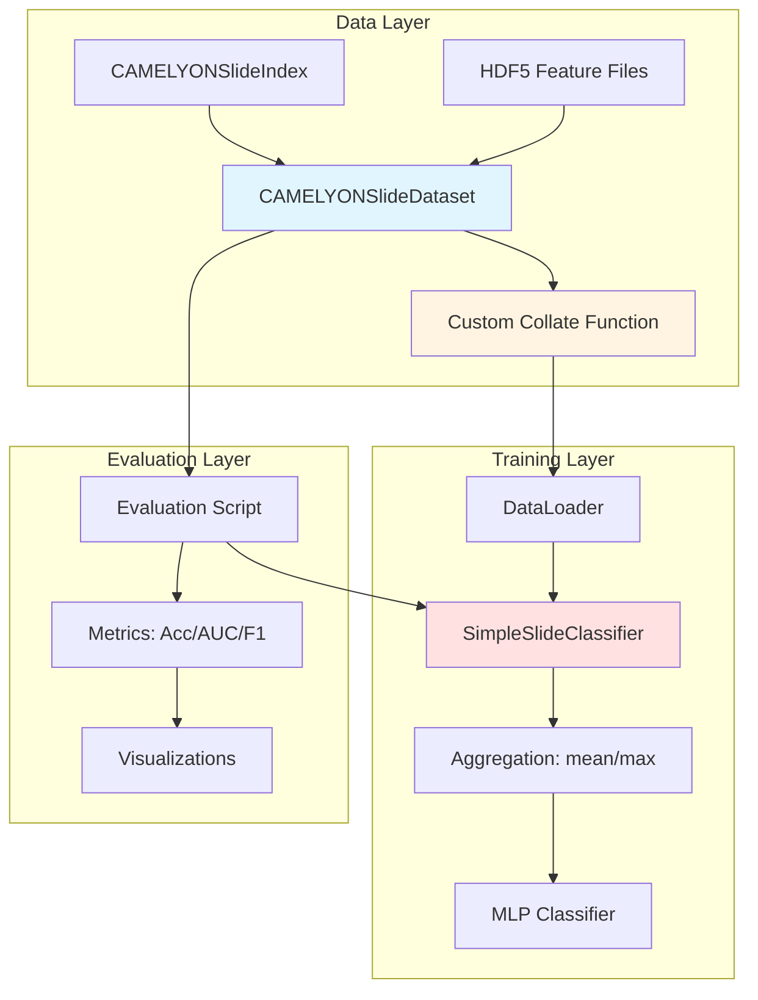

# Design Document: CAMELYON Slide-Level Training

## Overview

This design addresses the train/eval mismatch in the CAMELYON pipeline where training operates on individual patches wrapped as length-1 sequences while evaluation aggregates complete slides. The solution introduces a true slide-level dataset (`CAMELYONSlideDataset`) that loads complete bags of patch features from HDF5 caches, ensuring training and evaluation operate at the same granularity.

The implementation focuses on the feature-cache baseline using mean/max pooling aggregation, avoiding raw WSI/OpenSlide complexity. This keeps the scope practical while establishing correct slide-level training semantics that match the existing evaluation path.

### Key Design Decisions

1. **Slide-Level Dataset**: New `CAMELYONSlideDataset` class returns complete slides (all patches) per sample, unlike the existing `CAMELYONPatchDataset` which returns individual patches
2. **Variable-Length Batching**: Custom collate function handles variable numbers of patches per slide without truncation
3. **Aggregation Consistency**: Training uses the same mean/max pooling as evaluation, configurable via YAML
4. **Backward Compatibility**: Maintains existing checkpoint format and model architecture
5. **HDF5-Based**: Works with pre-extracted patch features, not raw WSI files

## Architecture

### Component Diagram



### Data Flow

1. **Slide Index Loading**: `CAMELYONSlideIndex.load()` reads slide metadata from JSON
2. **Dataset Initialization**: `CAMELYONSlideDataset` filters slides by split and validates HDF5 files exist
3. **Sample Retrieval**: `__getitem__` loads all patches for a slide from HDF5 cache
4. **Batching**: Custom collate function pads variable-length slide bags to max length in batch
5. **Training**: Model aggregates patches via mean/max pooling, then classifies
6. **Evaluation**: Same aggregation method applied to compute slide-level metrics

## Components and Interfaces

### CAMELYONSlideDataset

New PyTorch Dataset class for slide-level sampling.

```python
class CAMELYONSlideDataset(Dataset):
    """Dataset that returns complete slides with all patch features.
    
    Args:
        slide_index: CAMELYONSlideIndex with slide metadata
        features_dir: Directory containing HDF5 feature files
        split: Which split to load ('train', 'val', 'test')
        transform: Optional transform for features
        
    Returns:
        Dictionary containing:
            - 'slide_id': str
            - 'patient_id': str
            - 'label': int (slide-level label)
            - 'features': Tensor [num_patches, feature_dim]
            - 'coordinates': Tensor [num_patches, 2]
            - 'num_patches': int
    """
    
    def __init__(
        self,
        slide_index: CAMELYONSlideIndex,
        features_dir: Union[str, Path],
        split: str = "train",
        transform: Optional[Callable] = None,
    ):
        self.slide_index = slide_index
        self.features_dir = Path(features_dir)
        self.split = split
        self.transform = transform
        
        # Get slides for this split
        self.slides = slide_index.get_slides_by_split(split)
        
        # Validate feature files exist
        self.valid_slides = []
        for slide in self.slides:
            feature_file = self.features_dir / f"{slide.slide_id}.h5"
            if feature_file.exists():
                self.valid_slides.append(slide)
            else:
                logger.warning(f"Feature file not found: {feature_file}")
        
        logger.info(
            f"Loaded {len(self.valid_slides)} slides for {split} split"
        )
    
    def __len__(self) -> int:
        """Return number of slides."""
        return len(self.valid_slides)
    
    def __getitem__(self, idx: int) -> Dict[str, Union[torch.Tensor, str, int]]:
        """Get all patches for a single slide."""
        slide = self.valid_slides[idx]
        feature_file = self.features_dir / f"{slide.slide_id}.h5"
        
        with h5py.File(feature_file, "r") as f:
            features = torch.tensor(f["features"][:], dtype=torch.float32)
            coordinates = torch.tensor(f["coordinates"][:], dtype=torch.int32)
        
        if self.transform:
            features = self.transform(features)
        
        return {
            "slide_id": slide.slide_id,
            "patient_id": slide.patient_id,
            "label": slide.label,
            "features": features,  # [num_patches, feature_dim]
            "coordinates": coordinates,  # [num_patches, 2]
            "num_patches": int(features.shape[0]),
        }
```

### Custom Collate Function

Handles variable-length slide bags by padding to max length in batch.

```python
def collate_slide_bags(batch: List[Dict]) -> Dict[str, Union[torch.Tensor, List]]:
    """Collate function for variable-length slide bags.
    
    Pads all slides to the maximum number of patches in the batch.
    
    Args:
        batch: List of samples from CAMELYONSlideDataset
        
    Returns:
        Dictionary containing:
            - 'features': Tensor [batch_size, max_patches, feature_dim]
            - 'coordinates': Tensor [batch_size, max_patches, 2]
            - 'labels': Tensor [batch_size]
            - 'num_patches': Tensor [batch_size] - actual patch counts
            - 'slide_ids': List[str]
            - 'patient_ids': List[str]
    """
    # Extract components
    features_list = [item["features"] for item in batch]
    coordinates_list = [item["coordinates"] for item in batch]
    labels = torch.tensor([item["label"] for item in batch], dtype=torch.long)
    num_patches = torch.tensor([item["num_patches"] for item in batch], dtype=torch.long)
    slide_ids = [item["slide_id"] for item in batch]
    patient_ids = [item["patient_id"] for item in batch]
    
    # Pad to max length
    max_patches = max(f.shape[0] for f in features_list)
    feature_dim = features_list[0].shape[1]
    batch_size = len(batch)
    
    padded_features = torch.zeros(batch_size, max_patches, feature_dim)
    padded_coordinates = torch.zeros(batch_size, max_patches, 2, dtype=torch.int32)
    
    for i, (features, coordinates) in enumerate(zip(features_list, coordinates_list)):
        n_patches = features.shape[0]
        padded_features[i, :n_patches, :] = features
        padded_coordinates[i, :n_patches, :] = coordinates
    
    return {
        "features": padded_features,
        "coordinates": padded_coordinates,
        "labels": labels,
        "num_patches": num_patches,
        "slide_ids": slide_ids,
        "patient_ids": patient_ids,
    }
```

### Updated Training Script

Modifications to `experiments/train_camelyon.py`:

```python
def create_slide_dataloaders(config: Dict) -> Tuple[DataLoader, DataLoader]:
    """Create train and val dataloaders for slide-level data."""
    root_dir = Path(config["data"]["root_dir"])
    features_dir = root_dir / "features"
    index_path = root_dir / "slide_index.json"
    
    # Load slide index
    slide_index = CAMELYONSlideIndex.load(index_path)
    logger.info(f"Loaded slide index with {len(slide_index)} slides")
    
    # Create slide-level datasets
    train_dataset = CAMELYONSlideDataset(
        slide_index=slide_index,
        features_dir=features_dir,
        split="train",
    )
    
    val_dataset = CAMELYONSlideDataset(
        slide_index=slide_index,
        features_dir=features_dir,
        split="val",
    )
    
    # Create dataloaders with custom collate
    batch_size = config["training"]["batch_size"]
    num_workers = config["data"].get("num_workers", 4)
    
    train_loader = DataLoader(
        train_dataset,
        batch_size=batch_size,
        shuffle=True,
        num_workers=num_workers,
        collate_fn=collate_slide_bags,
        pin_memory=config["data"].get("pin_memory", True),
    )
    
    val_loader = DataLoader(
        val_dataset,
        batch_size=batch_size,
        shuffle=False,
        num_workers=num_workers,
        collate_fn=collate_slide_bags,
        pin_memory=config["data"].get("pin_memory", True),
    )
    
    logger.info(f"Train: {len(train_dataset)} slides, Val: {len(val_dataset)} slides")
    
    return train_loader, val_loader
```

### Model Forward Pass

The `SimpleSlideClassifier` already supports variable-length inputs via aggregation:

```python
def forward(self, patch_features: torch.Tensor, num_patches: Optional[torch.Tensor] = None) -> torch.Tensor:
    """Forward pass with optional masking for padded patches.
    
    Args:
        patch_features: [batch_size, max_patches, feature_dim]
        num_patches: [batch_size] - actual patch counts for masking
        
    Returns:
        logits: [batch_size, 1] for binary classification
    """
    # Aggregate patches (mean/max pooling)
    if self.pooling == "mean":
        if num_patches is not None:
            # Masked mean: only average over actual patches
            mask = torch.arange(patch_features.size(1), device=patch_features.device)[None, :] < num_patches[:, None]
            mask = mask.unsqueeze(-1).float()  # [batch_size, max_patches, 1]
            slide_features = (patch_features * mask).sum(dim=1) / num_patches.unsqueeze(-1).float()
        else:
            slide_features = patch_features.mean(dim=1)
    elif self.pooling == "max":
        slide_features = patch_features.max(dim=1)[0]
    else:
        raise ValueError(f"Unknown pooling: {self.pooling}")
    
    # Classify
    logits = self.classifier(slide_features)
    return logits
```

## Data Models

### Slide Sample Structure

```python
{
    "slide_id": str,           # Unique slide identifier
    "patient_id": str,         # Patient identifier
    "label": int,              # Slide-level label (0=normal, 1=tumor)
    "features": Tensor,        # [num_patches, feature_dim] patch features
    "coordinates": Tensor,     # [num_patches, 2] (x, y) coordinates
    "num_patches": int,        # Number of patches in this slide
}
```

### Batch Structure (After Collation)

```python
{
    "features": Tensor,        # [batch_size, max_patches, feature_dim]
    "coordinates": Tensor,     # [batch_size, max_patches, 2]
    "labels": Tensor,          # [batch_size]
    "num_patches": Tensor,     # [batch_size] - actual counts
    "slide_ids": List[str],    # [batch_size]
    "patient_ids": List[str],  # [batch_size]
}
```

## Error Handling

### Missing Feature Files

```python
# In CAMELYONSlideDataset.__init__
for slide in self.slides:
    feature_file = self.features_dir / f"{slide.slide_id}.h5"
    if feature_file.exists():
        self.valid_slides.append(slide)
    else:
        logger.warning(f"Feature file not found: {feature_file}, skipping slide")

if len(self.valid_slides) == 0:
    raise ValueError(
        f"No valid feature files found in {self.features_dir} for {split} split. "
        f"Please ensure HDF5 feature files exist for the slides in the index."
    )
```

### Invalid HDF5 Structure

```python
# In CAMELYONSlideDataset.__getitem__
try:
    with h5py.File(feature_file, "r") as f:
        if "features" not in f or "coordinates" not in f:
            raise KeyError(f"HDF5 file missing required datasets: {feature_file}")
        
        features = torch.tensor(f["features"][:], dtype=torch.float32)
        coordinates = torch.tensor(f["coordinates"][:], dtype=torch.int32)
        
        if features.shape[0] != coordinates.shape[0]:
            raise ValueError(
                f"Mismatched patch counts in {feature_file}: "
                f"features={features.shape[0]}, coordinates={coordinates.shape[0]}"
            )
except Exception as e:
    logger.error(f"Error loading slide {slide.slide_id}: {e}")
    raise
```

### Configuration Validation

```python
# In train_camelyon.py main()
def validate_config(config: Dict) -> None:
    """Validate configuration has required fields."""
    required_fields = [
        ("data", "root_dir"),
        ("training", "batch_size"),
        ("training", "num_epochs"),
        ("model", "wsi", "hidden_dim"),
        ("task", "num_classes"),
    ]
    
    for *path, field in required_fields:
        obj = config
        for key in path:
            if key not in obj:
                raise ValueError(f"Missing config field: {'.'.join(path + [field])}")
            obj = obj[key]
        if field not in obj:
            raise ValueError(f"Missing config field: {'.'.join(path + [field])}")
    
    # Validate aggregation method
    aggregation = config.get("model", {}).get("wsi", {}).get("aggregation", "mean")
    if aggregation not in ["mean", "max"]:
        raise ValueError(f"Invalid aggregation method: {aggregation}. Must be 'mean' or 'max'")
    
    logger.info("Configuration validation passed")
```

## Testing Strategy

### Unit Tests

1. **Slide Dataset Tests** (`tests/test_camelyon_slide_dataset.py`):
   - Test dataset length matches number of slides
   - Test `__getitem__` returns correct structure
   - Test split filtering works correctly
   - Test handling of missing feature files
   - Test transform application

2. **Collate Function Tests**:
   - Test padding to max length
   - Test batch structure correctness
   - Test handling of single-slide batches
   - Test preservation of metadata

3. **Training Integration Tests**:
   - Test dataloader creation
   - Test single batch forward pass
   - Test training loop runs for one epoch
   - Test checkpoint saving/loading

4. **Evaluation Tests**:
   - Test evaluation script loads slide-level checkpoints
   - Test metrics computation
   - Test aggregation consistency with training

### Integration Tests

1. **End-to-End Training**:
   - Run training for 2 epochs on synthetic data
   - Verify checkpoint is saved
   - Verify metrics are logged

2. **End-to-End Evaluation**:
   - Load trained checkpoint
   - Run evaluation on test split
   - Verify metrics JSON is generated
   - Verify plots are created (if matplotlib available)

### Property-Based Tests

This feature is not suitable for property-based testing because:
- It involves infrastructure (file I/O, HDF5 loading, PyTorch DataLoader)
- It has side effects (checkpoint saving, logging)
- The behavior is deterministic given fixed inputs
- Testing focuses on integration correctness, not universal properties

Instead, we use example-based unit tests with synthetic data and integration tests that verify the complete pipeline.

## Configuration Management

### YAML Configuration Structure

```yaml
# experiments/configs/camelyon.yaml

data:
  root_dir: "data/camelyon"
  num_workers: 4
  pin_memory: true

model:
  wsi:
    hidden_dim: 256
    aggregation: "mean"  # Options: "mean", "max"
    dropout: 0.3

task:
  num_classes: 2
  classification:
    dropout: 0.3

training:
  batch_size: 8  # Number of slides per batch
  num_epochs: 50
  learning_rate: 1e-4
  weight_decay: 1e-5

checkpoint:
  checkpoint_dir: "checkpoints/camelyon"
  save_frequency: 5

seed: 42
device: "cuda"
```

### Configuration Loading

```python
def load_config(config_path: str) -> Dict:
    """Load and validate YAML configuration."""
    with open(config_path, "r") as f:
        config = yaml.safe_load(f)
    
    validate_config(config)
    return config
```

## Documentation Updates

### Training Script Docstring

```python
"""
Training script for CAMELYON16 slide-level classification.

This script implements slide-level training using pre-extracted patch features
from HDF5 files. Each training sample represents a complete slide with all its
patches, ensuring consistency with the evaluation pipeline.

IMPORTANT: This is a feature-cache baseline that uses pre-extracted HDF5 features,
not raw WSI files. It does not perform on-the-fly patch extraction from OpenSlide.

Architecture:
    - Slide-level dataset: CAMELYONSlideDataset
    - Aggregation: Mean or max pooling of patch features
    - Classifier: Simple MLP on aggregated features

Usage:
    python experiments/train_camelyon.py --config experiments/configs/camelyon.yaml

Requirements:
    - Slide index JSON at data/camelyon/slide_index.json
    - Pre-extracted HDF5 features at data/camelyon/features/
    - Each HDF5 file contains 'features' [num_patches, feature_dim] and 'coordinates' [num_patches, 2]

Configuration:
    - model.wsi.aggregation: "mean" or "max" pooling method
    - training.batch_size: Number of slides per batch
    - data.root_dir: Root directory containing slide_index.json and features/
"""
```

### README Section

```markdown
## CAMELYON Slide-Level Training

### Overview

The CAMELYON training pipeline operates at the slide level, where each training sample
represents a complete whole-slide image with all its patch features. This ensures
consistency with the evaluation pipeline, which also operates at the slide level.

### Data Requirements

1. **Slide Index**: JSON file with slide metadata (`data/camelyon/slide_index.json`)
2. **Feature Cache**: HDF5 files with pre-extracted patch features (`data/camelyon/features/`)

Each HDF5 file must contain:
- `features`: [num_patches, feature_dim] - patch feature vectors
- `coordinates`: [num_patches, 2] - (x, y) coordinates in slide

### Training

```bash
python experiments/train_camelyon.py --config experiments/configs/camelyon.yaml
```

### Evaluation

```bash
python experiments/evaluate_camelyon.py --checkpoint checkpoints/camelyon/best_model.pth
```

### Aggregation Methods

- **Mean Pooling**: Average patch features across the slide (default)
- **Max Pooling**: Take maximum activation across patches

Configure via `model.wsi.aggregation` in the YAML config.

### Limitations

- This is a feature-cache baseline using pre-extracted features
- Does not perform on-the-fly patch extraction from raw WSI files
- Requires pre-processing step to generate HDF5 feature caches
- Simple mean/max pooling aggregation (no attention mechanism)
```

## Implementation Plan

### Phase 1: Core Dataset Implementation
1. Create `CAMELYONSlideDataset` class in `src/data/camelyon_dataset.py`
2. Implement `collate_slide_bags` function
3. Add unit tests for dataset and collate function

### Phase 2: Training Script Updates
1. Update `create_slide_dataloaders` to use `CAMELYONSlideDataset`
2. Update `train_epoch` to handle slide-level batches
3. Update `validate` function for slide-level validation
4. Add configuration validation

### Phase 3: Model Updates
1. Update `SimpleSlideClassifier.forward` to support masked aggregation
2. Add aggregation method configuration
3. Ensure backward compatibility with existing checkpoints

### Phase 4: Testing
1. Create synthetic CAMELYON data for testing
2. Implement unit tests for all components
3. Add integration tests for training and evaluation
4. Verify train/eval consistency

### Phase 5: Documentation
1. Update training script docstrings
2. Add README section for slide-level training
3. Document configuration options
4. Add example commands

## Validation and Acceptance

### Success Criteria

1. **Training runs successfully** on slide-level data without errors
2. **Evaluation loads checkpoints** and computes slide-level metrics
3. **Aggregation consistency** between training and evaluation
4. **Tests pass** for all components
5. **Documentation is accurate** and complete

### Verification Steps

1. Run training for 5 epochs on synthetic data
2. Verify checkpoint is saved with correct structure
3. Load checkpoint and run evaluation
4. Verify metrics match expected values
5. Run full test suite and confirm all tests pass

## Future Enhancements

1. **Attention-Based Aggregation**: Replace mean/max pooling with learned attention
2. **Multiple Instance Learning**: Implement proper MIL loss functions
3. **On-the-Fly Patch Extraction**: Add support for raw WSI files with OpenSlide
4. **Data Augmentation**: Add stain normalization and geometric transforms
5. **Multi-Scale Features**: Extract features at multiple magnifications
