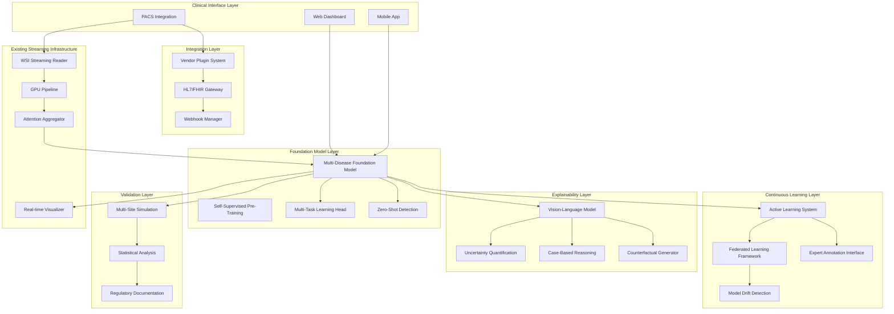
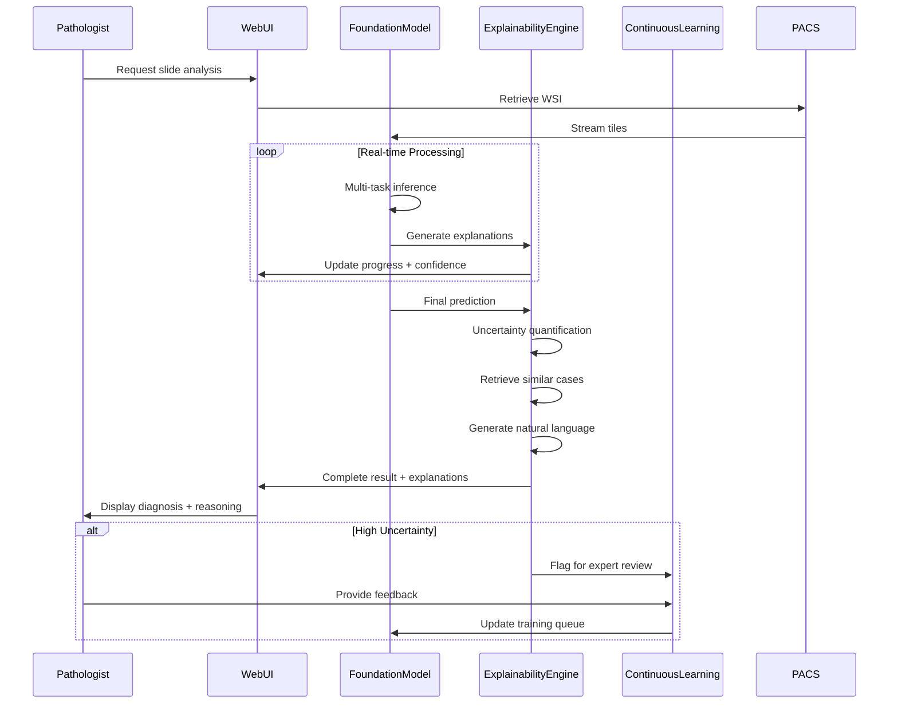
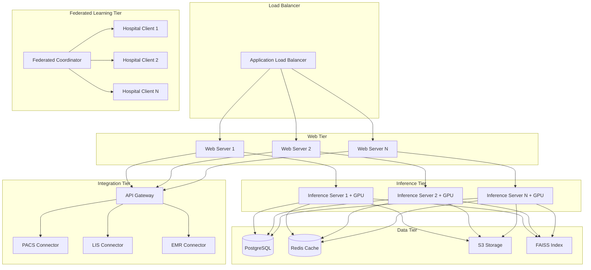
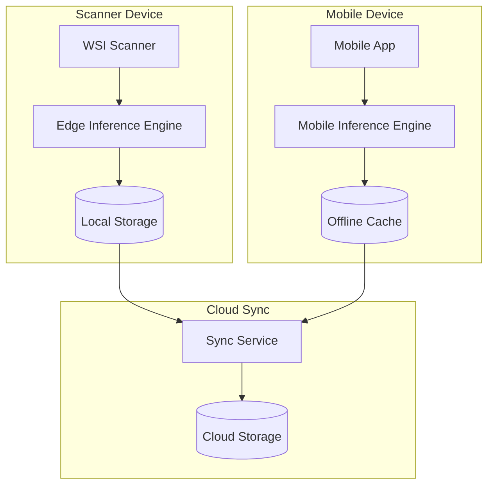

# Design Document: Medical AI Revolution

## Overview

The Medical AI Revolution transforms HistoCore from a production-ready single-disease demonstration system into a comprehensive medical AI platform. This design builds upon the existing real-time WSI streaming infrastructure (7x faster processing, <30s, <2GB memory) and extends it with multi-disease foundation models, advanced explainability, continuous learning, clinical validation, and complete ecosystem integration.

The transformation addresses the key limitation of the current system: it demonstrates exceptional engineering but operates as a single-disease tool. This design creates a complete commercial-ready platform that hospitals will deploy, pathologists will trust, and investors will fund.

**Core Innovation**: The system combines self-supervised foundation models pre-trained on 100K+ unlabeled slides with streaming inference, vision-language explainability, federated learning infrastructure, and rigorous clinical validation—all while maintaining current performance characteristics (<30s processing, <2GB memory).

**Target Impact**:
- Support 5+ cancer types with >90% accuracy each
- Generate natural language explanations within 5 seconds
- Enable continuous learning across multiple hospitals with differential privacy
- Achieve >20% reduction in misdiagnosis rates
- Process >1000 slides in production within 6 months

## Architecture

The system employs a modular architecture with six major subsystems built on the existing streaming foundation:



### High-Level System Flow



## Components and Interfaces

### Component 1: Multi-Disease Foundation Model

**Purpose**: Unified neural network supporting 5+ cancer types with shared feature representations and disease-specific prediction heads

**Interface**:
```python
class MultiDiseaseFoundationModel(nn.Module):
    def __init__(
        self,
        encoder_type: str = "resnet50",
        feature_dim: int = 2048,
        supported_diseases: List[str] = ["breast", "lung", "prostate", "colon", "melanoma"],
        pretrained_path: Optional[str] = None
    ):
        """Initialize multi-disease foundation model."""
        pass
    
    def forward(
        self,
        patches: torch.Tensor,
        disease_type: Optional[str] = None,
        return_features: bool = False,
        return_attention: bool = False
    ) -> Dict[str, torch.Tensor]:
        """
        Forward pass with optional disease-specific head.
        
        Returns:
            predictions: Dict with keys for each disease/task
            features: Shared feature representations (if return_features=True)
            attention: Attention weights (if return_attention=True)
        """
        pass
    
    def zero_shot_predict(
        self,
        patches: torch.Tensor,
        text_description: str
    ) -> Tuple[torch.Tensor, float]:
        """Zero-shot prediction using vision-language alignment."""
        pass
    
    def get_disease_specific_head(self, disease: str) -> nn.Module:
        """Get prediction head for specific disease."""
        pass
    
    def add_disease_head(
        self,
        disease: str,
        num_classes: int,
        freeze_encoder: bool = True
    ) -> None:
        """Add new disease-specific prediction head."""
        pass
```

**Responsibilities**:
- Shared feature extraction across all disease types
- Disease-specific prediction heads for each cancer type
- Multi-task learning with shared representations
- Zero-shot detection for unseen diseases
- Feature extraction for downstream explainability

### Component 2: Self-Supervised Pre-Training System

**Purpose**: Pre-train foundation model on 100K+ unlabeled WSI using contrastive learning

**Interface**:
```python
class SelfSupervisedPreTrainer:
    def __init__(
        self,
        model: nn.Module,
        method: str = "simclr",  # simclr, moco, dino
        temperature: float = 0.07,
        augmentation_config: AugmentationConfig = None
    ):
        """Initialize self-supervised pre-training system."""
        pass
    
    def pretrain(
        self,
        unlabeled_dataset: Dataset,
        num_epochs: int = 100,
        batch_size: int = 256,
        distributed: bool = True
    ) -> PreTrainingResult:
        """Execute self-supervised pre-training."""
        pass
    
    def validate_features(
        self,
        validation_dataset: Dataset,
        downstream_tasks: List[str]
    ) -> Dict[str, float]:
        """Validate pre-trained features via linear probing."""
        pass
    
    def save_checkpoint(self, path: str, epoch: int) -> None:
        """Save pre-training checkpoint."""
        pass
    
    def resume_from_checkpoint(self, path: str) -> int:
        """Resume pre-training from checkpoint."""
        pass
```

**Responsibilities**:
- Contrastive learning implementation (SimCLR/MoCo/DINO)
- Histopathology-specific data augmentation
- Distributed training across multiple GPUs/nodes
- Feature quality validation through linear probing
- Checkpoint management for long-running jobs

### Component 3: Vision-Language Explainability Engine

**Purpose**: Generate natural language explanations using vision-language models integrated with uncertainty quantification

**Interface**:
```python
class VisionLanguageExplainer:
    def __init__(
        self,
        vision_language_model: str = "biomedclip",
        uncertainty_method: str = "mc_dropout",
        num_mc_samples: int = 10
    ):
        """Initialize vision-language explainability engine."""
        pass
    
    def generate_explanation(
        self,
        image_features: torch.Tensor,
        prediction: Dict[str, Any],
        attention_weights: torch.Tensor
    ) -> ExplanationResult:
        """
        Generate comprehensive explanation for prediction.
        
        Returns:
            natural_language: Human-readable explanation
            uncertainty: Confidence intervals and uncertainty metrics
            similar_cases: Retrieved similar training examples
            counterfactuals: What would change the prediction
            feature_attribution: Cellular-level saliency maps
        """
        pass
    
    def quantify_uncertainty(
        self,
        model: nn.Module,
        patches: torch.Tensor,
        method: str = "mc_dropout"
    ) -> UncertaintyMetrics:
        """Compute epistemic and aleatoric uncertainty."""
        pass
    
    def retrieve_similar_cases(
        self,
        query_features: torch.Tensor,
        k: int = 5,
        filters: Optional[Dict] = None
    ) -> List[SimilarCase]:
        """Retrieve k most similar cases from training set."""
        pass
    
    def generate_counterfactual(
        self,
        image_features: torch.Tensor,
        current_prediction: str,
        target_prediction: str
    ) -> CounterfactualExplanation:
        """Generate counterfactual explanation."""
        pass
```

**Responsibilities**:
- Natural language generation from visual features
- Uncertainty quantification (MC dropout, ensembles)
- Case-based reasoning with similarity search
- Counterfactual explanation generation
- Multi-scale feature attribution

### Component 4: Federated Learning Framework

**Purpose**: Enable multi-hospital model training with differential privacy guarantees

**Interface**:
```python
class FederatedLearningCoordinator:
    def __init__(
        self,
        central_model: nn.Module,
        privacy_epsilon: float = 1.0,
        aggregation_method: str = "fedavg",
        secure_aggregation: bool = True
    ):
        """Initialize federated learning coordinator."""
        pass
    
    def register_hospital(
        self,
        hospital_id: str,
        hospital_config: HospitalConfig
    ) -> HospitalClient:
        """Register new hospital for federated learning."""
        pass
    
    async def federated_training_round(
        self,
        participating_hospitals: List[str],
        num_local_epochs: int = 5
    ) -> FederatedRoundResult:
        """Execute one round of federated learning."""
        pass
    
    def aggregate_updates(
        self,
        hospital_updates: List[ModelUpdate],
        hospital_weights: Optional[List[float]] = None
    ) -> torch.nn.Module:
        """Aggregate model updates from hospitals."""
        pass
    
    def compute_privacy_budget(self) -> PrivacyBudget:
        """Compute cumulative privacy loss."""
        pass
    
    def validate_global_model(
        self,
        validation_data: Dataset
    ) -> ValidationMetrics:
        """Validate aggregated global model."""
        pass
```

**Responsibilities**:
- Federated averaging with differential privacy
- Secure aggregation preventing central server access to individual updates
- Privacy budget tracking and enforcement
- Hospital client management and coordination
- Global model validation and distribution

### Component 5: Active Learning System

**Purpose**: Identify uncertain cases for expert review and incorporate feedback into training pipeline

**Interface**:
```python
class ActiveLearningSystem:
    def __init__(
        self,
        uncertainty_threshold: float = 0.85,
        sampling_strategy: str = "uncertainty",  # uncertainty, diversity, hybrid
        annotation_queue_size: int = 100
    ):
        """Initialize active learning system."""
        pass
    
    def identify_uncertain_cases(
        self,
        predictions: List[PredictionResult],
        uncertainty_metrics: List[UncertaintyMetrics]
    ) -> List[CaseForReview]:
        """Identify cases requiring expert review."""
        pass
    
    def submit_for_annotation(
        self,
        case: CaseForReview,
        priority: float = 0.5
    ) -> AnnotationTask:
        """Submit case to expert annotation queue."""
        pass
    
    def receive_expert_feedback(
        self,
        annotation_task: AnnotationTask,
        expert_annotation: ExpertAnnotation
    ) -> None:
        """Receive and process expert feedback."""
        pass
    
    def trigger_retraining(
        self,
        min_new_annotations: int = 50,
        force: bool = False
    ) -> RetrainingJob:
        """Trigger model retraining with new annotations."""
        pass
    
    def get_annotation_queue(
        self,
        expert_id: Optional[str] = None
    ) -> List[AnnotationTask]:
        """Get current annotation queue."""
        pass
```

**Responsibilities**:
- Uncertainty-based case selection
- Annotation queue management
- Expert feedback integration
- Automated retraining triggers
- Curriculum learning for difficult cases

### Component 6: Clinical Validation Framework

**Purpose**: Rigorous multi-site validation with statistical analysis and regulatory documentation

**Interface**:
```python
class ClinicalValidationFramework:
    def __init__(
        self,
        validation_config: ValidationConfig,
        regulatory_pathway: str = "510k"
    ):
        """Initialize clinical validation framework."""
        pass
    
    def simulate_multisite_study(
        self,
        num_sites: int = 5,
        site_configs: List[SiteConfig] = None
    ) -> MultiSiteStudyResult:
        """Simulate multi-site validation study."""
        pass
    
    def compute_performance_metrics(
        self,
        predictions: List[Prediction],
        ground_truth: List[Annotation],
        stratify_by: Optional[List[str]] = None
    ) -> PerformanceMetrics:
        """
        Compute comprehensive performance metrics.
        
        Returns:
            sensitivity, specificity, AUC, PPV, NPV with 95% CI
            Subgroup analysis by demographics
            Calibration metrics (ECE, reliability diagrams)
            Inter-rater agreement (Cohen's kappa)
        """
        pass
    
    def analyze_failure_cases(
        self,
        failures: List[FailureCase]
    ) -> FailureAnalysisReport:
        """Systematic failure case analysis."""
        pass
    
    def generate_regulatory_documentation(
        self,
        study_results: MultiSiteStudyResult,
        device_description: DeviceDescription
    ) -> RegulatoryPackage:
        """Generate FDA 510(k) documentation package."""
        pass
    
    def generate_publication_report(
        self,
        study_results: MultiSiteStudyResult
    ) -> PublicationReport:
        """Generate publication-ready statistical report."""
        pass
```

**Responsibilities**:
- Multi-site study simulation
- Comprehensive statistical analysis
- Subgroup analysis for bias detection
- Failure case analysis
- Regulatory documentation generation

### Component 7: Integration Ecosystem

**Purpose**: Seamless integration with hospital systems through plugin architecture

**Interface**:
```python
class IntegrationEcosystem:
    def __init__(self):
        """Initialize integration ecosystem."""
        pass
    
    def register_plugin(
        self,
        plugin: IntegrationPlugin,
        vendor: str,
        system_type: str  # scanner, lis, emr, pacs
    ) -> None:
        """Register vendor-specific integration plugin."""
        pass
    
    def connect_to_system(
        self,
        system_id: str,
        connection_config: ConnectionConfig
    ) -> SystemConnection:
        """Establish connection to hospital system."""
        pass
    
    def send_hl7_message(
        self,
        message: HL7Message,
        destination: str
    ) -> HL7Response:
        """Send HL7/FHIR message to hospital system."""
        pass
    
    def register_webhook(
        self,
        event_type: str,
        callback_url: str,
        filters: Optional[Dict] = None
    ) -> WebhookRegistration:
        """Register webhook for real-time event notifications."""
        pass
    
    def sync_data(
        self,
        source_system: str,
        destination_system: str,
        sync_config: SyncConfig
    ) -> SyncResult:
        """Bidirectional data synchronization."""
        pass
```

**Responsibilities**:
- Plugin architecture for vendor integrations
- HL7/FHIR message handling
- Webhook system for real-time events
- Bidirectional data synchronization
- Connection management and authentication

### Component 8: Model Compression Pipeline

**Purpose**: Compress models for mobile and edge deployment while maintaining accuracy

**Interface**:
```python
class ModelCompressionPipeline:
    def __init__(
        self,
        source_model: nn.Module,
        target_platform: str = "mobile",  # mobile, edge, cloud
        accuracy_threshold: float = 0.90
    ):
        """Initialize model compression pipeline."""
        pass
    
    def prune_model(
        self,
        pruning_ratio: float = 0.5,
        method: str = "magnitude"  # magnitude, structured, lottery_ticket
    ) -> nn.Module:
        """Prune model parameters."""
        pass
    
    def quantize_model(
        self,
        quantization_type: str = "int8",  # int8, fp16, dynamic
        calibration_data: Optional[Dataset] = None
    ) -> nn.Module:
        """Quantize model weights and activations."""
        pass
    
    def distill_model(
        self,
        student_architecture: str,
        distillation_dataset: Dataset,
        temperature: float = 3.0
    ) -> nn.Module:
        """Knowledge distillation to smaller student model."""
        pass
    
    def optimize_for_platform(
        self,
        model: nn.Module,
        platform: str  # tensorrt, coreml, onnx
    ) -> PlatformOptimizedModel:
        """Platform-specific optimization."""
        pass
    
    def validate_compressed_model(
        self,
        compressed_model: nn.Module,
        validation_data: Dataset
    ) -> CompressionMetrics:
        """Validate compressed model accuracy and performance."""
        pass
```

**Responsibilities**:
- Neural network pruning (>50% parameter reduction)
- INT8/FP16 quantization (>75% size reduction)
- Knowledge distillation to student models
- Platform-specific optimization (TensorRT, CoreML)
- Accuracy validation after compression

## Data Models

### Model 1: MultiDiseasePredict
ion

```python
@dataclass
class MultiDiseasePrediction:
    slide_id: str
    disease_type: str  # breast, lung, prostate, colon, melanoma, unknown
    primary_diagnosis: str
    confidence: float
    task_predictions: Dict[str, Any]  # grade, stage, molecular markers
    feature_vector: torch.Tensor
    attention_weights: torch.Tensor
    processing_time: float
    timestamp: datetime
```

**Validation Rules**:
- confidence must be between 0.0 and 1.0
- disease_type must be in supported_diseases or "unknown"
- task_predictions keys must match disease-specific tasks
- feature_vector must have consistent dimensionality
- attention_weights must sum to 1.0

### Model 2: ExplanationResult

```python
@dataclass
class ExplanationResult:
    prediction: MultiDiseasePrediction
    natural_language_explanation: str
    uncertainty_metrics: UncertaintyMetrics
    similar_cases: List[SimilarCase]
    counterfactual_explanation: Optional[CounterfactualExplanation]
    feature_attribution: Dict[str, torch.Tensor]  # multi-scale saliency
    confidence_intervals: Dict[str, Tuple[float, float]]
    requires_second_opinion: bool
    explanation_generation_time: float
```

**Validation Rules**:
- natural_language_explanation must be non-empty
- similar_cases must contain 1-5 cases
- confidence_intervals must have 95% coverage
- explanation_generation_time must be <10 seconds

### Model 3: FederatedRoundResult

```python
@dataclass
class FederatedRoundResult:
    round_number: int
    participating_hospitals: List[str]
    aggregated_model: nn.Module
    hospital_contributions: Dict[str, ModelUpdate]
    privacy_budget_consumed: float
    global_validation_metrics: ValidationMetrics
    convergence_metrics: ConvergenceMetrics
    round_duration: float
```

**Validation Rules**:
- round_number must be positive integer
- privacy_budget_consumed must be ≤ epsilon limit
- participating_hospitals must be non-empty
- global_validation_metrics must show improvement or stability

### Model 4: AnnotationTask

```python
@dataclass
class AnnotationTask:
    task_id: str
    slide_id: str
    case_data: CaseForReview
    ai_prediction: MultiDiseasePrediction
    uncertainty_score: float
    priority: float
    assigned_expert: Optional[str]
    status: str  # pending, in_progress, completed, skipped
    created_at: datetime
    completed_at: Optional[datetime]
    expert_annotation: Optional[ExpertAnnotation]
```

**Validation Rules**:
- uncertainty_score must be between 0.0 and 1.0
- priority must be between 0.0 and 1.0
- status must be valid enum value
- completed_at must be after created_at if present

### Model 5: ValidationMetrics

```python
@dataclass
class ValidationMetrics:
    sensitivity: float
    specificity: float
    auc: float
    ppv: float  # positive predictive value
    npv: float  # negative predictive value
    confidence_intervals: Dict[str, Tuple[float, float]]
    subgroup_metrics: Dict[str, Dict[str, float]]  # by demographics
    calibration_error: float
    inter_rater_agreement: float  # Cohen's kappa
    sample_size: int
```

**Validation Rules**:
- All metric values must be between 0.0 and 1.0
- confidence_intervals must have 95% coverage
- subgroup_metrics must include age, sex, ethnicity
- sample_size must be >100 for statistical validity

### Model 6: CompressionMetrics

```python
@dataclass
class CompressionMetrics:
    original_size_mb: float
    compressed_size_mb: float
    compression_ratio: float
    original_accuracy: float
    compressed_accuracy: float
    accuracy_retention: float
    inference_speedup: float
    memory_reduction: float
    platform: str
```

**Validation Rules**:
- compression_ratio must be >1.0
- accuracy_retention must be >0.90 (90% threshold)
- inference_speedup must be >1.0
- compressed_size_mb must be <original_size_mb

## Error Handling

### Error Scenario 1: Zero-Shot Detection Failure

**Condition**: Model encounters disease type not in training set with low confidence
**Response**: 
- Return prediction with explicit "unknown disease" flag
- Provide uncertainty quantification showing high epistemic uncertainty
- Retrieve most similar known disease cases for comparison
- Flag case for expert review through active learning system
**Recovery**: 
- Collect expert annotation for unknown disease
- Add to training set for future model updates
- Update zero-shot detection capabilities

### Error Scenario 2: Federated Learning Privacy Budget Exhaustion

**Condition**: Cumulative privacy loss exceeds epsilon threshold
**Response**:
- Halt federated learning rounds immediately
- Notify all participating hospitals
- Freeze current global model
- Generate privacy audit report
**Recovery**:
- Reset privacy budget for new training cycle
- Adjust noise calibration to extend budget
- Consider reducing number of participating hospitals

### Error Scenario 3: Explainability Generation Timeout

**Condition**: Natural language explanation generation exceeds 10 second limit
**Response**:
- Return prediction with simplified explanation
- Log timeout event for performance analysis
- Provide uncertainty metrics and similar cases only
- Skip counterfactual generation
**Recovery**:
- Optimize vision-language model inference
- Implement explanation caching for common patterns
- Adjust timeout thresholds based on hardware

### Error Scenario 4: Model Drift Detection

**Condition**: Confidence distribution shifts significantly (>10% accuracy degradation)
**Response**:
- Alert system administrators immediately
- Flag affected predictions with drift warning
- Increase active learning sampling rate
- Trigger automated retraining pipeline
**Recovery**:
- Retrain model on recent data
- Validate on held-out test set
- Deploy updated model with A/B testing
- Monitor for continued drift

### Error Scenario 5: Integration System Connection Failure

**Condition**: PACS/LIS/EMR connection drops during operation
**Response**:
- Cache pending operations locally
- Attempt reconnection with exponential backoff
- Switch to alternative connection if available
- Notify clinical users of degraded functionality
**Recovery**:
- Resume operations when connection restored
- Sync cached data bidirectionally
- Validate data consistency
- Log connection failure for reliability analysis

## Testing Strategy

### Unit Testing Approach

Focus on individual component correctness with synthetic and real data:

**Foundation Model Testing**:
- Test disease-specific heads with synthetic features
- Verify multi-task learning loss balancing
- Test zero-shot detection with held-out diseases
- Validate feature extraction consistency

**Explainability Testing**:
- Test natural language generation with known cases
- Verify uncertainty quantification calibration
- Test case retrieval with known similar cases
- Validate counterfactual generation logic

**Federated Learning Testing**:
- Test privacy budget tracking with mock updates
- Verify secure aggregation with synthetic gradients
- Test hospital client registration and coordination
- Validate differential privacy noise calibration

**Active Learning Testing**:
- Test uncertainty-based case selection
- Verify annotation queue management
- Test expert feedback integration
- Validate retraining trigger logic

**Key Test Cases**:
- Multi-disease prediction with all supported types
- Explanation generation within time limits
- Privacy budget enforcement across federated rounds
- Model compression maintaining accuracy thresholds
- Integration plugin registration and communication

### Property-Based Testing Approach

**Assessment**: This feature is **NOT suitable for comprehensive property-based testing** because:

1. **Foundation Model Training**: Training is non-deterministic and depends on large datasets
2. **Explainability**: Natural language generation is non-deterministic and subjective
3. **Federated Learning**: Involves distributed systems with network communication
4. **Clinical Validation**: Requires real clinical data and expert annotations
5. **Integration**: Tests external systems with varying behaviors

**Alternative Testing Strategies**:
- **Snapshot Testing**: For model outputs, explanations, and regulatory documents
- **Mock-Based Testing**: For federated learning and integration components
- **Statistical Testing**: For clinical validation metrics and bias detection
- **End-to-End Testing**: For complete workflows with synthetic data
- **Performance Testing**: For processing time and memory constraints

**Limited Property Testing**: Some components can use property-based testing:

**Property Test Library**: Hypothesis (Python)

**Limited Property Tests**:

1. **Feature Consistency Property**: For any input patches, extracted features should have consistent dimensionality
2. **Attention Normalization Property**: For any attention computation, weights should sum to 1.0
3. **Privacy Budget Monotonicity Property**: Privacy budget should never decrease across federated rounds
4. **Compression Accuracy Property**: Compressed model accuracy should be within threshold of original

```python
from hypothesis import given, strategies as st
import hypothesis.extra.numpy as hnp

@given(
    patches=hnp.arrays(
        dtype=np.float32,
        shape=st.tuples(
            st.integers(1, 64),  # batch size
            st.just(3),  # channels
            st.just(224),  # height
            st.just(224)  # width
        )
    )
)
def test_feature_consistency_property(patches):
    """Property test: feature extraction maintains consistent dimensionality."""
    model = MultiDiseaseFoundationModel()
    
    with torch.no_grad():
        result = model(torch.from_numpy(patches), return_features=True)
    
    features = result['features']
    
    # Verify consistent feature dimension
    assert features.shape[1] == model.feature_dim
    assert features.shape[0] == patches.shape[0]
    assert not torch.isnan(features).any()
    assert torch.isfinite(features).all()
```

### Integration Testing Approach

Test end-to-end workflows with realistic scenarios:

**Multi-Disease Workflow**:
- Process slides from all 5 supported cancer types
- Verify disease-specific predictions and explanations
- Test zero-shot detection with unseen disease
- Validate multi-task predictions (grade, stage, markers)

**Federated Learning Workflow**:
- Simulate 3-5 hospital sites with different data distributions
- Execute multiple federated rounds
- Verify privacy budget tracking
- Validate global model convergence

**Clinical Validation Workflow**:
- Run multi-site validation study simulation
- Compute comprehensive performance metrics
- Generate regulatory documentation
- Produce publication-ready reports

**Integration Workflow**:
- Connect to mock PACS/LIS/EMR systems
- Test bidirectional data synchronization
- Verify HL7/FHIR message handling
- Test webhook notifications

**Compression Workflow**:
- Compress model for mobile deployment
- Validate accuracy retention >90%
- Test inference on mobile hardware
- Verify offline operation

**Integration Test Scenarios**:
- Process 100+ slides across all disease types
- Execute federated learning with 5 simulated hospitals
- Generate complete regulatory package
- Deploy compressed model to mobile device
- Integrate with 2+ vendor systems

## Performance Considerations

**Target Performance Metrics**:
- **Processing Time**: <30 seconds per slide (maintained from current system)
- **Memory Footprint**: <2GB RAM during inference (maintained from current system)
- **Explanation Generation**: <5 seconds for natural language + uncertainty
- **Case Retrieval**: <3 seconds for 5 similar cases
- **Federated Round**: <10 minutes for 5 hospitals with 1000 samples each
- **Model Compression**: >75% size reduction with >90% accuracy retention
- **Concurrent Users**: Support 10+ users without degradation

**Optimization Strategies**:

1. **Foundation Model Optimization**:
   - Use efficient encoder architectures (EfficientNet, MobileNet)
   - Implement feature caching for repeated analyses
   - Optimize multi-task heads with parameter sharing
   - Use mixed precision training (FP16) for faster inference

2. **Explainability Optimization**:
   - Cache vision-language model embeddings
   - Pre-compute case database embeddings for fast retrieval
   - Use approximate nearest neighbors (FAISS) for similarity search
   - Parallelize explanation generation components

3. **Federated Learning Optimization**:
   - Implement gradient compression for faster communication
   - Use asynchronous federated learning for reduced waiting
   - Optimize secure aggregation with efficient cryptography
   - Implement early stopping for converged hospitals

4. **Integration Optimization**:
   - Connection pooling for hospital systems
   - Batch HL7/FHIR message processing
   - Webhook event batching and deduplication
   - Async I/O for all external communications

5. **Compression Optimization**:
   - Progressive compression with accuracy monitoring
   - Hardware-aware quantization (INT8 for mobile)
   - Structured pruning for efficient inference
   - Layer fusion and operator optimization

**Scalability Considerations**:
- Horizontal scaling: Multiple inference servers behind load balancer
- Vertical scaling: GPU memory optimization for larger models
- Database scaling: Sharded case database for fast retrieval
- Cloud deployment: Auto-scaling based on demand
- Edge deployment: On-device inference with cloud sync

## Security Considerations

**Data Privacy**:
- All patient data encrypted at rest (AES-256-GCM)
- All communications encrypted in transit (TLS 1.3)
- Differential privacy for federated learning (epsilon ≤ 1.0)
- Secure multi-party computation for aggregation
- No patient data transmitted without explicit consent

**Access Control**:
- Role-based access control (RBAC) with 6 roles:
  - Pathologist: View results, provide feedback
  - Administrator: System configuration, user management
  - Researcher: Access anonymized data, run experiments
  - IT Staff: System maintenance, monitoring
  - Auditor: Read-only access to audit logs
  - API Client: Programmatic access with scoped permissions
- OAuth 2.0 with JWT tokens for authentication
- Multi-factor authentication for administrative access
- API rate limiting and abuse prevention

**Model Security**:
- Model weights encrypted at rest
- Secure model loading with integrity verification
- Adversarial robustness testing
- Input validation and sanitization
- Protection against model extraction attacks

**Compliance**:
- HIPAA compliance for US healthcare
- GDPR compliance for European deployments
- FDA 510(k) pathway preparation
- SOC 2 Type II certification
- ISO 27001 information security management

**Audit Logging**:
- Comprehensive audit trail for all operations:
  - User authentication and authorization
  - Slide access and analysis requests
  - Model predictions and explanations
  - Expert annotations and feedback
  - System configuration changes
  - Integration system communications
- Tamper-proof audit logs with cryptographic signatures
- Retention period: 7 years (regulatory requirement)
- Real-time anomaly detection on audit logs

## Dependencies

**Core Dependencies**:
- **PyTorch >= 2.0**: Deep learning framework
- **Transformers >= 4.30**: Vision-language models (CLIP, BiomedCLIP)
- **OpenSlide >= 1.2.0**: WSI file reading (existing)
- **NumPy >= 1.21**: Numerical computing
- **Pandas >= 2.0**: Data manipulation
- **Scikit-learn >= 1.3**: Statistical analysis
- **SciPy >= 1.10**: Scientific computing

**Foundation Model Dependencies**:
- **timm >= 0.9**: PyTorch image models
- **CLIP / BiomedCLIP**: Vision-language models
- **lightly >= 1.4**: Self-supervised learning
- **pytorch-metric-learning >= 2.0**: Contrastive learning

**Federated Learning Dependencies**:
- **PySyft >= 0.8**: Federated learning framework
- **Opacus >= 1.4**: Differential privacy
- **cryptography >= 41.0**: Secure aggregation
- **grpc >= 1.56**: Communication protocol

**Clinical Integration Dependencies**:
- **pydicom >= 2.3**: DICOM support (existing)
- **pynetdicom >= 2.0**: DICOM networking (existing)
- **fhir.resources >= 7.0**: HL7 FHIR support
- **hl7apy >= 1.3**: HL7 v2 message handling

**Explainability Dependencies**:
- **captum >= 0.6**: Model interpretability
- **shap >= 0.42**: Feature attribution
- **lime >= 0.2**: Local explanations
- **faiss-gpu >= 1.7**: Fast similarity search

**Validation Dependencies**:
- **statsmodels >= 0.14**: Statistical analysis
- **lifelines >= 0.27**: Survival analysis
- **pingouin >= 0.5**: Statistical tests
- **matplotlib >= 3.7**: Visualization
- **seaborn >= 0.12**: Statistical visualization

**Compression Dependencies**:
- **torch.quantization**: PyTorch quantization
- **torch-pruning >= 1.2**: Neural network pruning
- **onnx >= 1.14**: Model export
- **tensorrt >= 8.6**: NVIDIA optimization
- **coremltools >= 7.0**: Apple optimization

**Development Dependencies**:
- **Pytest >= 7.0**: Testing framework (existing)
- **Hypothesis >= 6.82**: Property-based testing (existing)
- **MLflow >= 2.5**: Experiment tracking
- **Weights & Biases >= 0.15**: Experiment tracking
- **DVC >= 3.0**: Data version control

## Deployment Architecture

### Cloud Deployment



### Edge Deployment



## Backward Compatibility

**Maintaining Existing Capabilities**:

1. **Streaming Infrastructure**: All existing streaming components remain unchanged
   - WSIStreamReader continues to work with same interface
   - GPUPipeline maintains current performance characteristics
   - AttentionAggregator extended but backward compatible

2. **PACS Integration**: Existing DICOM/HL7 FHIR integration preserved
   - Current PACS connectors continue to function
   - New integrations added through plugin system
   - No breaking changes to existing workflows

3. **Security Framework**: Current security implementation maintained
   - Existing authentication/authorization preserved
   - Audit logging extended with new event types
   - Encryption standards remain unchanged

4. **Deployment Infrastructure**: Current deployment methods supported
   - Docker containers remain compatible
   - Kubernetes manifests extended but backward compatible
   - Cloud deployment scripts updated incrementally

5. **API Compatibility**: Existing APIs maintained with versioning
   - v1 API continues to work for existing clients
   - v2 API adds new capabilities
   - Deprecation warnings for future changes

**Migration Strategy**:
- Phase 1: Deploy foundation model alongside existing model
- Phase 2: Add explainability layer with feature flag
- Phase 3: Enable federated learning for opt-in hospitals
- Phase 4: Roll out integration plugins incrementally
- Phase 5: Deploy compressed models to edge devices

## Implementation Phases

### Phase 1: Foundation Model (Months 1-3)
- Implement self-supervised pre-training system
- Train foundation model on 100K+ unlabeled slides
- Develop multi-disease prediction heads
- Validate on 5 cancer types
- **Deliverable**: Foundation model achieving >90% accuracy on each disease

### Phase 2: Explainability (Months 2-4)
- Integrate vision-language model (BiomedCLIP)
- Implement uncertainty quantification
- Build case-based reasoning system
- Develop counterfactual generation
- **Deliverable**: Explainability engine with <5s generation time

### Phase 3: Continuous Learning (Months 3-5)
- Build active learning system
- Implement federated learning framework
- Develop model drift detection
- Create expert annotation interface
- **Deliverable**: Federated learning with differential privacy

### Phase 4: Clinical Validation (Months 4-6)
- Simulate multi-site validation studies
- Perform comprehensive statistical analysis
- Generate regulatory documentation
- Prepare FDA 510(k) submission
- **Deliverable**: Complete regulatory package

### Phase 5: Integration Ecosystem (Months 5-7)
- Develop plugin architecture
- Implement vendor-specific connectors
- Build HL7/FHIR gateway
- Create webhook system
- **Deliverable**: Integration with 2+ vendor systems

### Phase 6: Mobile/Edge Deployment (Months 6-8)
- Implement model compression pipeline
- Develop mobile application
- Optimize for on-scanner inference
- Build offline-first architecture
- **Deliverable**: Mobile app with >90% accuracy retention

### Phase 7: Research Platform (Months 7-9)
- Build annotation interface
- Integrate experiment tracking
- Implement data versioning
- Create collaboration features
- **Deliverable**: Complete research platform

### Phase 8: Production Deployment (Months 8-12)
- Pilot deployments at 3+ hospitals
- Collect clinical impact metrics
- Gather pathologist testimonials
- Publish validation study
- **Deliverable**: Production system processing >1000 slides

## Success Metrics

**Technical Metrics**:
- Foundation model accuracy >90% on each of 5 diseases
- Explanation generation time <5 seconds
- Case retrieval time <3 seconds
- Federated learning privacy epsilon ≤ 1.0
- Model compression >75% with >90% accuracy retention
- Processing time maintained at <30 seconds
- Memory usage maintained at <2GB

**Clinical Metrics**:
- >20% reduction in misdiagnosis rate
- >80% pathologist acceptance of explanations
- >30% reduction in diagnostic turnaround time
- >85% user satisfaction score
- Inter-rater agreement >0.8 (Cohen's kappa)

**Adoption Metrics**:
- >1000 slides processed in production
- >50 active users across pilot sites
- 3+ hospital partnerships established
- 2+ vendor integrations completed
- 10+ pathologist testimonials collected
- Validation study published in peer-reviewed journal

**Business Metrics**:
- Clear path to FDA 510(k) clearance
- Regulatory documentation package complete
- ROI calculator demonstrating value
- Sales collateral for hospital decision-makers
- Partnership agreements with vendors

## Conclusion

This design transforms HistoCore from a production-ready demonstration system into a revolutionary medical AI platform. The architecture maintains current performance characteristics (<30s, <2GB) while adding multi-disease foundation models, advanced explainability, continuous learning, rigorous clinical validation, and complete ecosystem integration.

The modular design allows incremental implementation over 8-12 months, with each phase delivering tangible value. The system addresses all 20 requirements while maintaining backward compatibility with existing infrastructure.

Key innovations include:
- Self-supervised foundation models pre-trained on 100K+ slides
- Vision-language explainability with <5s generation time
- Federated learning with differential privacy (epsilon ≤ 1.0)
- Rigorous multi-site clinical validation
- Complete integration ecosystem with plugin architecture
- Mobile/edge deployment with >75% compression

This platform will establish HistoCore as "the next big thing in medical AI" - a system that hospitals will deploy, pathologists will trust, and investors will fund.
