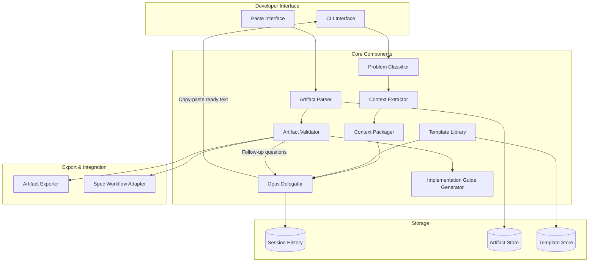
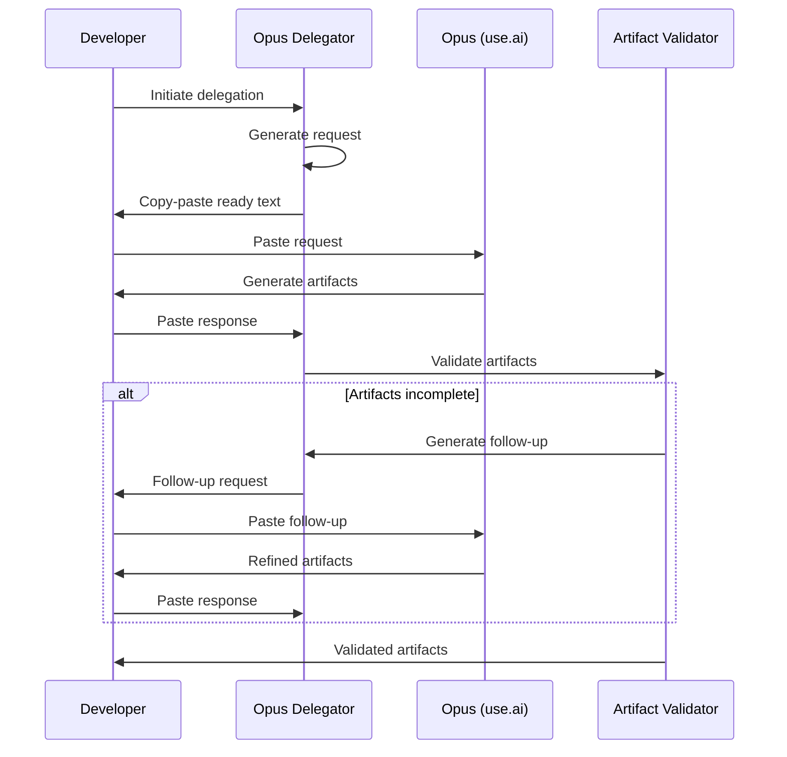
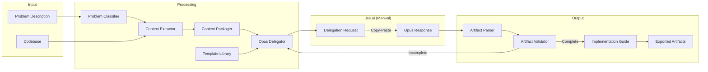

# Opus Delegation System: Design Document

## Overview

This design document describes the architecture and implementation approach for the Opus Delegation System—a toolchain that packages complex architectural problems, extracts relevant codebase context, and structures interactions with Claude Opus 4.5 via use.ai's copy-paste interface.

The system bridges the gap between Opus's superior reasoning capabilities and its lack of repository access by automating context extraction, delegation request formatting, artifact parsing, and implementation guide generation.

## Architecture



## Component Design

### 1. Problem Classifier

**Purpose:** Determines whether a problem is suitable for Opus delegation and categorizes it by type.

**Classification Criteria:**

| Indicator | Weight | Description |
|-----------|--------|-------------|
| Architectural scope | High | Multi-component design, system boundaries |
| Formal reasoning | High | Verification, correctness proofs, invariants |
| Novel patterns | Medium | Unfamiliar domain, research-adjacent |
| Integration complexity | Medium | Multiple external systems, protocols |
| Strategic decisions | Medium | Technology selection, trade-off analysis |

**Delegation Types:**

- `architecture_design` — System structure, component relationships, data flow
- `api_design` — Endpoint design, schemas, versioning strategy
- `test_strategy` — Property-based tests, coverage approach, test architecture
- `integration_design` — External system integration, protocol handling
- `refactoring_analysis` — Code restructuring, dependency untangling
- `formal_verification` — Invariants, correctness properties, proof sketches

**Output:** Delegation recommendation including type, required context categories, estimated complexity, and expected artifact types.

### 2. Context Extractor

**Purpose:** Identifies and extracts relevant code, documentation, and configuration from the repository based on problem type.

**Extraction Strategies by Problem Type:**

| Problem Type | Primary Sources | Secondary Sources |
|--------------|----------------|-------------------|
| architecture_design | Architecture docs, component interfaces, system diagrams | Config files, deployment specs |
| api_design | Existing endpoints, data models, OpenAPI specs | Client code, integration tests |
| test_strategy | Test files, code under test, test utilities | Coverage reports, CI config |
| integration_design | Protocol specs, external API docs, adapters | Error logs, retry policies |
| refactoring_analysis | Target modules, dependency graph, metrics | Git history, code review comments |

**Extraction Process:**

1. **Semantic search** — Find files matching problem keywords and domain terms
2. **Dependency analysis** — Trace imports and references from seed files
3. **Recency weighting** — Prioritize recently modified files
4. **Relevance ranking** — Score files by keyword density and structural importance
5. **Truncation** — Apply size limits, keeping highest-ranked content

### 3. Context Packager

**Purpose:** Formats extracted context as copy-paste-ready markdown optimized for Opus consumption.

**Package Structure:**

```markdown
# Context Bundle: [Problem Title]

## Problem Summary
[Brief description from delegation request]

## Relevant Code

### [file_path.py] (lines 45-120)
```python
[code snippet with syntax highlighting]
```

### [another_file.ts] (lines 1-80)
```typescript
[code snippet]
```

## Documentation Excerpts

**From:** docs/architecture.md
[Relevant section]

## Constraints
- [Constraint 1]
- [Constraint 2]

## Context Manifest

| Source | Type | Size | Relevance |
|--------|------|------|-----------|
| src/core/engine.py | Code | 2.1 KB | High |
| docs/api.md | Doc | 1.5 KB | Medium |
```

**Size Management:**
- Default limit: 50,000 characters
- Compression: Remove redundant whitespace, collapse similar patterns
- Summarization: Extract key points from large docs
- Priority queue: Include highest-relevance content first, summarize excluded items

---

### 4. Template Library

**Purpose:** Provides pre-built delegation templates for common problem types.

**Template Structure:**

```yaml
template_id: federated_learning_architecture
name: Federated Learning System Architecture
category: architecture_design
version: 1.2.0

parameters:
  - name: system_name
    required: true
  - name: node_types
    required: true
    type: list
  - name: aggregation_strategy
    default: federated_averaging
  - name: privacy_requirements
    default: differential_privacy

context_requirements:
  - existing_ml_models
  - data_schemas
  - network_constraints
  - compliance_requirements

expected_artifacts:
  - type: mermaid_diagram
    subtype: architecture
  - type: api_specification
    format: openapi_yaml
  - type: implementation_plan
    granularity: detailed

prompt_template: |
  Design a federated learning architecture for {{system_name}}.
  
  **Node Types:** {{node_types}}
  **Aggregation Strategy:** {{aggregation_strategy}}
  **Privacy Requirements:** {{privacy_requirements}}
  
  Please provide:
  1. System architecture diagram (Mermaid)
  2. Node communication API (OpenAPI YAML)
  3. Implementation plan with dependencies
  
  Consider the following context:
  {{context_bundle}}
```

**Built-in Templates:**

- Federated learning architecture
- PACS/DICOM integration design
- Property-based test suite design
- WSI streaming architecture
- Microservice decomposition
- Event-driven system design

### 5. Opus Delegator

**Purpose:** Orchestrates the delegation workflow, generates requests, and manages multi-round sessions.

**Delegation Request Format:**

```markdown
# Delegation Request: [Problem Title]

## Objective
[Clear statement of what needs to be designed/solved]

## Background
[Why this problem matters, what constraints exist]

## Expected Artifacts
Please generate the following:

1. **Architecture Diagram** — Mermaid diagram showing system components and relationships
2. **API Specification** — OpenAPI 3.0 YAML for component interfaces
3. **Implementation Plan** — Numbered steps with dependencies and complexity estimates

## Output Format Requirements
- Diagrams: Use Mermaid syntax in fenced code blocks
- API specs: Use OpenAPI 3.0 YAML in fenced code blocks
- Plans: Use markdown numbered lists with sub-items for dependencies

## Context
[Context Bundle inserted here]

## Questions to Address
1. [Specific question 1]
2. [Specific question 2]
```

**Multi-Round Session Management:**



### 6. Artifact Parser

**Purpose:** Extracts structured artifacts from Opus's text response.

**Parsing Rules:**

| Artifact Type | Detection Pattern | Extraction Method |
|---------------|------------------|-------------------|
| Mermaid diagram | ```mermaid code block | Extract block content, validate syntax |
| OpenAPI spec | ```yaml with openapi: | Extract YAML, validate against schema |
| Implementation plan | Numbered markdown list | Parse hierarchy, extract steps |
| Test strategy | Section header + test descriptions | Extract test cases and properties |
| Code snippet | ``` with language identifier | Extract with metadata |

**Parsed Artifact Structure:**

```typescript
interface ParsedArtifact {
  id: string;
  type: ArtifactType;
  content: string;
  metadata: {
    sourceLocation: { start: number; end: number };
    parseWarnings: string[];
    extractedAt: Date;
  };
  structured?: {
    // Type-specific parsed representation
    mermaid?: MermaidAST;
    openapi?: OpenAPISpec;
    implementationSteps?: Step[];
  };
}
```

### 7. Artifact Validator

**Purpose:** Checks artifacts for completeness, correctness, and implementability.

**Validation Criteria by Type:**

**Architecture Diagrams:**
- All nodes have descriptive labels
- All edges have relationship labels
- No orphan nodes (disconnected components flagged)
- Consistent naming conventions

**API Specifications:**
- All endpoints have request/response schemas
- Error responses defined (at least 400, 500)
- Authentication requirements specified
- Examples provided for complex schemas

**Implementation Plans:**
- Each step has clear action verb
- Dependencies explicitly stated
- No circular dependencies
- Complexity estimates present

**Test Strategies:**
- Coverage targets specified
- Property-based tests include generators
- Edge cases identified
- Test data requirements defined

**Completeness Score Calculation:**

```
score = (present_required_elements / total_required_elements) × 70 +
        (present_optional_elements / total_optional_elements) × 20 +
        (quality_bonus) × 10
```

### 8. Implementation Guide Generator

**Purpose:** Transforms validated artifacts into actionable implementation instructions.

**Guide Structure:**

```markdown
# Implementation Guide: [Feature Name]

## Prerequisites
- [Dependency 1]
- [Dependency 2]

## Implementation Steps

### Phase 1: Foundation (Complexity: Low)

#### Step 1.1: Create base interfaces
**File:** `src/interfaces/[name].ts`
**Action:** Define TypeScript interfaces from API specification
**Artifacts:** References API spec section 2.1

```typescript
// Boilerplate generated from Opus design
interface [Name] {
  // ...
}
```

**Verification:** Unit tests for interface validation

#### Step 1.2: Implement core service
**File:** `src/services/[name].ts`
**Dependencies:** Step 1.1
**Action:** Implement service following architecture diagram node [X]

### Phase 2: Integration (Complexity: Medium)
...

## Test Implementation

### Property-Based Tests
[Generated test stubs from test strategy]

## Risk Register

| Risk | Mitigation | Owner |
|------|------------|-------|
| [Risk 1] | [Mitigation] | TBD |
```

---

### 9. Session History Manager

**Purpose:** Persists delegation sessions for reuse and audit.

**Session Record Schema:**

```typescript
interface DelegationSession {
  id: string;
  createdAt: Date;
  updatedAt: Date;
  
  problem: {
    title: string;
    description: string;
    type: DelegationType;
    complexity: 'simple' | 'moderate' | 'complex';
  };
  
  rounds: Array<{
    roundNumber: number;
    request: string;
    response: string;
    artifacts: ParsedArtifact[];
    validation: ValidationResult;
    timestamp: Date;
  }>;
  
  finalArtifacts: ParsedArtifact[];
  implementationGuide?: ImplementationGuide;
  
  metrics: {
    totalTime: number;
    contextSize: number;
    roundCount: number;
    finalCompleteness: number;
  };
}
```

### 10. Artifact Exporter

**Purpose:** Converts artifacts to standard formats for documentation and tooling.

**Export Formats:**

| Artifact Type | Export Formats |
|---------------|----------------|
| Mermaid diagram | PNG, SVG, PDF |
| OpenAPI spec | YAML file, HTML docs (via Redoc) |
| Implementation plan | Markdown, JIRA import CSV |
| Test strategy | Test file templates |
| Full session | ZIP archive with all artifacts |

### 11. Spec Workflow Adapter

**Purpose:** Generates spec workflow documents from Opus artifacts.

**Mapping Rules:**

| Opus Artifact | Spec Document | Transformation |
|---------------|---------------|----------------|
| Requirements from Opus | requirements.md | Convert to EARS patterns |
| Architecture diagram + API | design.md | Structure per design template |
| Implementation plan | tasks.md | Extract task hierarchy |

## Data Flow



## CLI Interface Design

**Commands:**

```bash
# Initialize new delegation
opus-delegate init --type architecture_design --problem "Design federated learning system"

# Extract context for existing delegation
opus-delegate context --session <id> --strategy deep

# Generate delegation request (outputs copy-paste text)
opus-delegate request --session <id> --template federated_learning

# Parse Opus response (reads from stdin or file)
opus-delegate parse --session <id> < opus_response.md

# Validate parsed artifacts
opus-delegate validate --session <id>

# Generate follow-up request
opus-delegate followup --session <id>

# Generate implementation guide
opus-delegate guide --session <id> --output impl_guide.md

# Export artifacts
opus-delegate export --session <id> --format all --output ./artifacts/

# List sessions
opus-delegate list --type architecture_design --status active

# Resume interrupted session
opus-delegate resume --session <id>
```

## Error Handling Strategy

| Error Type | Detection | Recovery |
|------------|-----------|----------|
| Context extraction failure | Missing files, permission errors | Partial extraction + manifest of missing |
| Size limit exceeded | Character count | Progressive summarization, exclude lowest-priority |
| Parse failure | Malformed markdown, invalid YAML | Identify problematic section, request correction |
| Validation failure | Missing required elements | Generate targeted follow-up questions |
| Session corruption | Checksum mismatch | Restore from last checkpoint |

## Storage Schema

**Directory Structure:**

```
.opus-delegation/
├── config.yaml              # Global configuration
├── templates/               # Custom templates
│   └── my_template.yaml
├── sessions/                # Session data
│   └── <session-id>/
│       ├── session.json     # Session metadata
│       ├── context.md       # Packaged context
│       ├── rounds/          # Round-by-round data
│       │   ├── 01_request.md
│       │   ├── 01_response.md
│       │   └── 01_artifacts.json
│       ├── artifacts/       # Parsed artifacts
│       │   ├── architecture.mermaid
│       │   └── api.yaml
│       └── exports/         # Exported files
│           ├── architecture.png
│           └── implementation_guide.md
└── history.json             # Session index
```

## Configuration

```yaml
# .opus-delegation/config.yaml

context:
  max_size: 50000
  extraction:
    include_patterns:
      - "src/**/*.ts"
      - "src/**/*.py"
      - "docs/**/*.md"
    exclude_patterns:
      - "**/*.test.ts"
      - "**/node_modules/**"
  summarization:
    enabled: true
    max_doc_size: 5000

validation:
  completeness_threshold: 80
  quality_threshold: 70
  auto_followup: true

export:
  diagram_format: svg
  api_docs_generator: redoc

spec_integration:
  enabled: true
  output_dir: specs/
  templates:
    requirements: templates/requirements.md.j2
    design: templates/design.md.j2
    tasks: templates/tasks.md.j2
```

## Key Invariants

- **Context completeness** — Every delegation request contains sufficient context for Opus to produce implementable artifacts
- **Artifact traceability** — Every artifact links back to the session and round that produced it
- **Version immutability** — Past artifact versions are never modified, only superseded
- **Session atomicity** — Sessions can be resumed from any checkpoint without data loss
- **Format correctness** — All exported artifacts pass format validation (valid YAML, valid Mermaid, etc.)

## Integration Points

| System | Integration Method | Purpose |
|--------|-------------------|---------|
| Spec workflow | File generation | Produce requirements.md, design.md, tasks.md |
| Git | Hook integration | Track delegation sessions alongside code |
| CI/CD | Export artifacts | Include diagrams in generated docs |
| IDE | Extension | Quick-access to delegation commands |

## Performance Considerations

- **Context extraction:** Use incremental file indexing; cache dependency graphs
- **Template rendering:** Pre-compile Jinja templates; cache rendered templates
- **Artifact parsing:** Stream-parse large responses; fail fast on syntax errors
- **Export:** Generate diagrams lazily; cache rendered images

## Security Considerations

- **Sensitive code:** Allow marking files as excluded from context extraction
- **Credentials:** Never include secrets in context bundles (scan and redact)
- **Session storage:** Encrypt session data at rest if configured
- **Audit log:** Record all delegations with timestamps for compliance
