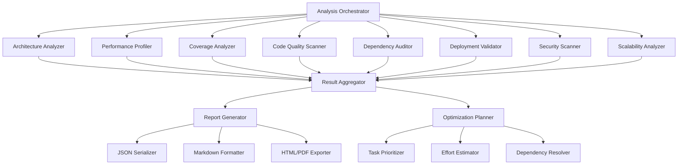

# Design Document: HistoCore Project Optimization Analysis System

## Overview

The HistoCore Project Optimization Analysis System is a comprehensive static analysis and profiling framework that evaluates the HistoCore computational pathology codebase across eight critical dimensions. The system generates actionable optimization recommendations with prioritized task lists, effort estimates, and implementation guides.

**Core Capabilities**:
- **Multi-Dimensional Analysis**: Architecture, Performance, Testing, Code Quality, Dependencies, Deployment, Security, Scalability
- **Automated Tool Integration**: Leverages industry-standard Python analysis tools (radon, pylint, bandit, safety, pytest-cov)
- **Actionable Reporting**: Generates prioritized task lists with effort estimates and implementation examples
- **CI/CD Integration**: Automated regression detection on every commit via GitHub Actions
- **Multiple Output Formats**: JSON (machine-readable), Markdown (human-readable), HTML/PDF (presentation-ready)

**Target Scope**:
- 16,555 Python files across src/, tests/, experiments/, scripts/, cloud/
- 275 test files with 55% baseline coverage
- Recent nnMIL architecture upgrade achieving 4-8x performance improvements
- Production deployment targets: Docker, Kubernetes, Azure/AWS cloud platforms

## Architecture

### System Components



### Component Responsibilities

**Analysis Orchestrator** (`src/analysis/orchestrator.py`):
- Coordinates execution of all 8 analyzer components
- Manages parallel execution for performance
- Handles error recovery and partial results
- Aggregates timing and resource usage metrics

**Architecture Analyzer** (`src/analysis/architecture.py`):
- Uses `radon` for cyclomatic complexity and maintainability index
- Detects circular dependencies via import graph analysis
- Measures coupling metrics (fan-in/fan-out) using AST parsing
- Identifies SOLID principle violations through pattern matching

**Performance Profiler** (`src/analysis/performance.py`):
- Integrates `cProfile`, `py-spy`, and `torch.profiler`
- Generates flame graphs using `flamegraph.pl` or `speedscope`
- Measures GPU utilization via `nvidia-smi` and `torch.cuda` APIs
- Identifies data loading bottlenecks through `torch.utils.data` profiling

**Coverage Analyzer** (`src/analysis/coverage.py`):
- Uses `pytest-cov` and `coverage.py` for line/branch coverage
- Identifies untested critical paths via AST analysis
- Detects missing property-based tests for data transformations
- Measures test quality metrics (assertion density, isolation)

**Code Quality Scanner** (`src/analysis/code_quality.py`):
- Integrates `pylint`, `flake8`, `mypy` for static analysis
- Detects code duplication using `radon` or custom AST comparison
- Measures documentation coverage (docstrings, type hints)
- Identifies PEP 8 violations and unused imports

**Dependency Auditor** (`src/analysis/dependencies.py`):
- Uses `pip-audit` and `safety` for CVE scanning
- Detects outdated packages via `pip list --outdated`
- Identifies dependency bloat through import usage analysis
- Validates license compatibility using `pip-licenses`

**Deployment Validator** (`src/analysis/deployment.py`):
- Validates Dockerfile best practices using `hadolint`
- Checks Kubernetes manifests with `kubeval` or `kube-score`
- Assesses CI/CD pipeline completeness via `.github/workflows/` analysis
- Verifies environment variable management and secrets handling

**Security Scanner** (`src/analysis/security.py`):
- Uses `bandit` for Python security vulnerability detection
- Detects SQL injection, command injection, hardcoded secrets
- Validates TLS/SSL configuration for PACS and federated learning
- Generates HIPAA compliance checklist with gap analysis

**Scalability Analyzer** (`src/analysis/scalability.py`):
- Verifies DistributedDataParallel (DDP) implementation correctness
- Measures communication overhead in distributed training
- Assesses large dataset handling (>1TB WSI collections)
- Identifies memory bottlenecks for gigapixel WSI processing

**Result Aggregator** (`src/analysis/aggregator.py`):
- Merges results from all 8 analyzers into unified data model
- Resolves conflicts and deduplicates findings
- Computes cross-dimensional metrics (overall health score)
- Maintains traceability to source files and line numbers

**Report Generator** (`src/analysis/reporting.py`):
- Formats aggregated results into multiple output formats
- Generates executive summaries with top 10 critical issues
- Creates visualizations (charts, graphs, heatmaps) using `matplotlib`/`plotly`
- Supports Markdown, HTML (via `pandoc`), PDF (via `weasyprint`), JSON

**Optimization Planner** (`src/analysis/planner.py`):
- Categorizes tasks by priority (P0: critical, P1: high, P2: medium, P3: low)
- Estimates effort using historical data and complexity metrics
- Identifies task dependencies and sequencing constraints
- Assigns tasks to roles (backend, ML, DevOps, security)

## Components and Interfaces

### Core Data Models

**AnalysisResult** (`src/analysis/models.py`):
```python
@dataclass
class AnalysisResult:
    """Unified analysis result from all dimensions."""
    timestamp: datetime
    project_path: str
    git_commit: str
    architecture: ArchitectureAnalysis
    performance: PerformanceAnalysis
    coverage: CoverageAnalysis
    code_quality: CodeQualityAnalysis
    dependencies: DependencyAnalysis
    deployment: DeploymentAnalysis
    security: SecurityAnalysis
    scalability: ScalabilityAnalysis
    overall_score: float  # 0-100
    critical_issues: List[Issue]
    
    def to_json(self) -> str:
        """Serialize to JSON format."""
        
    @classmethod
    def from_json(cls, json_str: str) -> 'AnalysisResult':
        """Deserialize from JSON format."""
```

**Issue** (`src/analysis/models.py`):
```python
@dataclass
class Issue:
    """Individual finding from analysis."""
    id: str  # Unique identifier
    dimension: str  # architecture, performance, etc.
    severity: str  # critical, high, medium, low
    category: str  # complexity, security, coverage, etc.
    title: str
    description: str
    file_path: str
    line_number: Optional[int]
    recommendation: str
    effort_hours: float
    priority: str  # P0, P1, P2, P3
    role: str  # backend, ml, devops, security
    references: List[str]  # URLs to documentation
```

**OptimizationPlan** (`src/analysis/models.py`):
```python
@dataclass
class OptimizationPlan:
    """Actionable task list with prioritization."""
    tasks: List[Task]
    dependencies: Dict[str, List[str]]  # task_id -> [dependency_ids]
    total_effort_hours: float
    estimated_completion_weeks: float
    
    def to_gantt_chart(self) -> str:
        """Generate Gantt chart visualization."""
```

### Analyzer Interfaces

All analyzers implement the `Analyzer` protocol:

```python
class Analyzer(Protocol):
    """Protocol for analysis components."""
    
    def analyze(self, project_path: str) -> AnalysisResult:
        """Run analysis and return results."""
        ...
    
    def get_recommendations(self, result: AnalysisResult) -> List[Issue]:
        """Extract actionable recommendations."""
        ...
```

### Tool Integration Layer

**Static Analysis Tools**:
- `radon cc -a -s src/` - Cyclomatic complexity
- `radon mi -s src/` - Maintainability index
- `pylint src/ --output-format=json` - Code quality
- `flake8 src/ --format=json` - Style violations
- `mypy src/ --json-report` - Type checking
- `bandit -r src/ -f json` - Security vulnerabilities

**Coverage Tools**:
- `pytest --cov=src --cov-report=json` - Line/branch coverage
- `coverage json` - Detailed coverage data
- `coverage html` - HTML coverage report

**Dependency Tools**:
- `pip-audit --format=json` - CVE scanning
- `safety check --json` - Known vulnerabilities
- `pip list --outdated --format=json` - Outdated packages
- `pip-licenses --format=json` - License compatibility

**Performance Tools**:
- `python -m cProfile -o profile.stats script.py` - CPU profiling
- `py-spy record -o flamegraph.svg -- python script.py` - Sampling profiler
- `torch.profiler` - GPU profiling with Chrome trace export

**Deployment Tools**:
- `hadolint Dockerfile --format=json` - Dockerfile linting
- `kubeval k8s/*.yaml` - Kubernetes manifest validation
- `kube-score score k8s/*.yaml` - K8s best practices

## Data Models

### JSON Schema for Analysis Results

```json
{
  "$schema": "http://json-schema.org/draft-07/schema#",
  "type": "object",
  "required": ["timestamp", "project_path", "git_commit", "architecture", "performance", "coverage", "code_quality", "dependencies", "deployment", "security", "scalability", "overall_score"],
  "properties": {
    "timestamp": {"type": "string", "format": "date-time"},
    "project_path": {"type": "string"},
    "git_commit": {"type": "string", "pattern": "^[0-9a-f]{40}$"},
    "architecture": {
      "type": "object",
      "properties": {
        "total_files": {"type": "integer", "minimum": 0},
        "large_files": {"type": "array", "items": {"$ref": "#/definitions/file_info"}},
        "circular_dependencies": {"type": "array", "items": {"type": "array", "items": {"type": "string"}}},
        "coupling_metrics": {"type": "object"},
        "solid_violations": {"type": "array", "items": {"$ref": "#/definitions/issue"}}
      }
    },
    "performance": {
      "type": "object",
      "properties": {
        "gpu_utilization": {"type": "number", "minimum": 0, "maximum": 100},
        "bottlenecks": {"type": "array", "items": {"$ref": "#/definitions/bottleneck"}},
        "flame_graph_path": {"type": "string"}
      }
    },
    "coverage": {
      "type": "object",
      "properties": {
        "line_coverage": {"type": "number", "minimum": 0, "maximum": 100},
        "branch_coverage": {"type": "number", "minimum": 0, "maximum": 100},
        "untested_critical_paths": {"type": "array", "items": {"type": "string"}},
        "missing_property_tests": {"type": "array", "items": {"type": "string"}}
      }
    },
    "code_quality": {
      "type": "object",
      "properties": {
        "average_complexity": {"type": "number", "minimum": 0},
        "high_complexity_functions": {"type": "array", "items": {"$ref": "#/definitions/function_info"}},
        "duplication_percentage": {"type": "number", "minimum": 0, "maximum": 100},
        "documentation_coverage": {"type": "number", "minimum": 0, "maximum": 100}
      }
    },
    "dependencies": {
      "type": "object",
      "properties": {
        "total_dependencies": {"type": "integer", "minimum": 0},
        "vulnerabilities": {"type": "array", "items": {"$ref": "#/definitions/vulnerability"}},
        "outdated_packages": {"type": "array", "items": {"type": "string"}},
        "license_issues": {"type": "array", "items": {"type": "string"}}
      }
    },
    "deployment": {
      "type": "object",
      "properties": {
        "dockerfile_score": {"type": "number", "minimum": 0, "maximum": 100},
        "k8s_readiness": {"type": "number", "minimum": 0, "maximum": 100},
        "ci_cd_completeness": {"type": "number", "minimum": 0, "maximum": 100}
      }
    },
    "security": {
      "type": "object",
      "properties": {
        "vulnerabilities": {"type": "array", "items": {"$ref": "#/definitions/security_issue"}},
        "hipaa_compliance_score": {"type": "number", "minimum": 0, "maximum": 100}
      }
    },
    "scalability": {
      "type": "object",
      "properties": {
        "ddp_correctness": {"type": "boolean"},
        "scaling_efficiency": {"type": "string", "enum": ["linear", "sub-linear", "super-linear"]},
        "memory_bottlenecks": {"type": "array", "items": {"type": "string"}}
      }
    },
    "overall_score": {"type": "number", "minimum": 0, "maximum": 100},
    "critical_issues": {"type": "array", "items": {"$ref": "#/definitions/issue"}}
  },
  "definitions": {
    "file_info": {
      "type": "object",
      "properties": {
        "path": {"type": "string"},
        "lines": {"type": "integer"},
        "complexity": {"type": "number"}
      }
    },
    "issue": {
      "type": "object",
      "required": ["id", "dimension", "severity", "title", "description"],
      "properties": {
        "id": {"type": "string"},
        "dimension": {"type": "string"},
        "severity": {"type": "string", "enum": ["critical", "high", "medium", "low"]},
        "category": {"type": "string"},
        "title": {"type": "string"},
        "description": {"type": "string"},
        "file_path": {"type": "string"},
        "line_number": {"type": "integer"},
        "recommendation": {"type": "string"},
        "effort_hours": {"type": "number"},
        "priority": {"type": "string", "enum": ["P0", "P1", "P2", "P3"]},
        "role": {"type": "string"},
        "references": {"type": "array", "items": {"type": "string"}}
      }
    },
    "bottleneck": {
      "type": "object",
      "properties": {
        "operation": {"type": "string"},
        "time_ms": {"type": "number"},
        "percentage": {"type": "number"}
      }
    },
    "function_info": {
      "type": "object",
      "properties": {
        "name": {"type": "string"},
        "file": {"type": "string"},
        "line": {"type": "integer"},
        "complexity": {"type": "number"}
      }
    },
    "vulnerability": {
      "type": "object",
      "properties": {
        "cve_id": {"type": "string"},
        "package": {"type": "string"},
        "severity": {"type": "string"},
        "cvss_score": {"type": "number"},
        "fix_version": {"type": "string"}
      }
    },
    "security_issue": {
      "type": "object",
      "properties": {
        "type": {"type": "string"},
        "severity": {"type": "string"},
        "file": {"type": "string"},
        "line": {"type": "integer"},
        "description": {"type": "string"}
      }
    }
  }
}
```

### Report Structure

**Markdown Report Template**:
```markdown
# HistoCore Optimization Analysis Report

**Generated**: {timestamp}
**Commit**: {git_commit}
**Overall Score**: {overall_score}/100

## Executive Summary

### Top 10 Critical Issues
1. [P0] {issue_title} - {effort_hours}h ({dimension})
2. ...

### Key Metrics
- **Test Coverage**: {coverage}% (target: 70%)
- **Security Vulnerabilities**: {vuln_count} (target: 0)
- **Code Quality Score**: {quality_score}/100
- **Deployment Readiness**: {deployment_score}/100

## Detailed Analysis

### 1. Architecture Quality ({score}/100)
- **Large Files**: {count} files >500 lines
- **Circular Dependencies**: {count} cycles detected
- **Coupling Metrics**: Average fan-out = {avg_fanout}

**Recommendations**:
- Refactor {file_path} (1,234 lines → split into 3 modules, 8h effort)
- Break circular dependency: {module_a} ↔ {module_b} (4h effort)

### 2. Performance ({score}/100)
...

### 3. Testing ({score}/100)
...

## Optimization Plan

### Phase 1: Critical Issues (P0) - 2 weeks
| Task | Effort | Owner | Dependencies |
|------|--------|-------|--------------|
| Fix CVE-2024-1234 in cryptography | 2h | DevOps | None |
| ...

### Phase 2: High Priority (P1) - 4 weeks
...

## Appendix

### Tool Versions
- radon: 5.1.0
- pylint: 2.17.0
- bandit: 1.7.5
- pytest-cov: 4.1.0

### References
- [nnMIL Architecture Upgrade](.kiro/specs/nnmil-architecture-upgrade/)
- [Python Security Best Practices](https://python.readthedocs.io/en/stable/library/security_warnings.html)
```

## Error Handling

### Error Categories

**Tool Execution Errors**:
- Missing dependencies (radon, pylint, bandit not installed)
- Tool version incompatibilities
- Subprocess timeouts (>5 minutes)
- Malformed tool output (invalid JSON)

**File System Errors**:
- Missing project files (requirements.txt, pyproject.toml)
- Permission denied (cannot read source files)
- Disk space exhausted (cannot write reports)

**Analysis Errors**:
- Circular import detection failures
- AST parsing errors (syntax errors in source files)
- Coverage data corruption
- Profiling data collection failures

### Error Handling Strategy

**Graceful Degradation**:
- If one analyzer fails, continue with remaining analyzers
- Report partial results with warnings
- Include error details in JSON output for debugging

**Retry Logic**:
- Retry subprocess calls up to 3 times with exponential backoff
- Use `tenacity` library for retry decorators
- Log all retry attempts for debugging

**Validation**:
- Validate tool output against expected JSON schema
- Sanitize file paths to prevent path traversal attacks
- Validate numeric ranges (coverage 0-100%, scores 0-100)

**Error Reporting**:
```python
@dataclass
class AnalysisError:
    """Error encountered during analysis."""
    analyzer: str  # Which component failed
    error_type: str  # tool_execution, file_system, analysis
    message: str
    traceback: str
    timestamp: datetime
    recoverable: bool  # Can analysis continue?
```

## Testing Strategy

### Unit Tests

**Parser and Serializer Tests** (`tests/analysis/test_serialization.py`):
- Test JSON serialization/deserialization for all data models
- Verify schema validation catches invalid data
- Test error handling for malformed JSON

**Analyzer Tests** (`tests/analysis/test_analyzers.py`):
- Mock tool outputs (radon, pylint, bandit) for deterministic testing
- Test result parsing and aggregation logic
- Verify recommendation generation

**Report Generation Tests** (`tests/analysis/test_reporting.py`):
- Test Markdown formatting with sample data
- Verify HTML/PDF export (if pandoc/weasyprint available)
- Test visualization generation (charts, graphs)

### Integration Tests

**End-to-End Analysis** (`tests/analysis/test_integration.py`):
- Run full analysis on small test project (10-20 files)
- Verify all 8 analyzers execute successfully
- Check report generation in all formats (JSON, Markdown, HTML)

**Tool Integration Tests** (`tests/analysis/test_tools.py`):
- Verify radon, pylint, bandit are installed and functional
- Test subprocess execution and output parsing
- Verify error handling for missing tools

### Property-Based Tests

This feature is **NOT suitable for property-based testing** because:
1. **External Tool Dependencies**: Analysis relies on external tools (radon, pylint, bandit) with non-deterministic output
2. **File System I/O**: Heavy file system operations make property tests slow and flaky
3. **Complex State**: Analysis results depend on entire codebase state, not pure functions
4. **Infrastructure Focus**: This is primarily an integration/orchestration system, not algorithmic logic

**Alternative Testing Approach**:
- **Snapshot Tests**: Capture expected analysis output for known codebases, detect regressions
- **Mock-Based Tests**: Mock tool outputs for fast, deterministic unit tests
- **Integration Tests**: Run on real (small) codebases to verify end-to-end functionality

### CI/CD Integration Tests

**Regression Detection** (`tests/analysis/test_regression.py`):
- Simulate coverage decrease (55% → 53%) and verify detection
- Simulate performance regression (10% slowdown) and verify detection
- Simulate new CVE introduction and verify detection

**GitHub Actions Integration** (`.github/workflows/analysis.yml`):
```yaml
name: Project Analysis
on: [push, pull_request]
jobs:
  analyze:
    runs-on: ubuntu-latest
    steps:
      - uses: actions/checkout@v3
      - name: Install dependencies
        run: pip install -r requirements-analysis.txt
      - name: Run analysis
        run: python -m analysis.orchestrator --output=analysis.json
      - name: Check for regressions
        run: python -m analysis.regression_detector --baseline=main --current=analysis.json
      - name: Post PR comment
        if: github.event_name == 'pull_request'
        uses: actions/github-script@v6
        with:
          script: |
            const fs = require('fs');
            const summary = fs.readFileSync('analysis_summary.md', 'utf8');
            github.rest.issues.createComment({
              issue_number: context.issue.number,
              owner: context.repo.owner,
              repo: context.repo.repo,
              body: summary
            });
```

## Implementation Notes

### Tool Installation

**Required Analysis Tools** (`requirements-analysis.txt`):
```
radon>=5.1.0          # Complexity and maintainability metrics
pylint>=2.17.0        # Code quality and style
flake8>=6.0.0         # Style violations
mypy>=1.0.0           # Type checking
bandit>=1.7.5         # Security vulnerabilities
safety>=2.3.0         # Dependency CVE scanning
pip-audit>=2.5.0      # Dependency vulnerability scanning
pip-licenses>=4.3.0   # License compatibility
pytest-cov>=4.1.0     # Test coverage
coverage>=7.2.0       # Coverage data processing
py-spy>=0.3.14        # Sampling profiler
hadolint-py>=2.12.0   # Dockerfile linting
matplotlib>=3.7.0     # Visualization
plotly>=5.14.0        # Interactive charts
pandas>=2.0.0         # Data processing
tabulate>=0.9.0       # Table formatting
jsonschema>=4.17.0    # JSON validation
tenacity>=8.2.0       # Retry logic
```

### Performance Considerations

**Parallel Execution**:
- Run independent analyzers in parallel using `concurrent.futures.ThreadPoolExecutor`
- Limit parallelism to `min(8, cpu_count())` to avoid resource exhaustion
- Use process pool for CPU-intensive tasks (AST parsing, complexity calculation)

**Caching**:
- Cache tool outputs to avoid redundant execution
- Use file modification timestamps to invalidate cache
- Store cache in `.analysis_cache/` directory

**Incremental Analysis**:
- For large codebases (>10,000 files), support incremental analysis
- Only re-analyze files changed since last run (use git diff)
- Merge incremental results with baseline

### Security Considerations

**Input Validation**:
- Sanitize file paths to prevent path traversal attacks
- Validate project_path is within allowed directories
- Limit file size for analysis (skip files >10MB)

**Subprocess Safety**:
- Use `subprocess.run()` with `shell=False` to prevent command injection
- Set timeouts for all subprocess calls (default: 5 minutes)
- Capture and sanitize subprocess output before logging

**Secrets Detection**:
- Use `bandit` to detect hardcoded secrets
- Scan for patterns: API keys, passwords, tokens, private keys
- Never include secret values in reports (redact with `***`)

### Deployment Integration

**Docker Support**:
```dockerfile
# Dockerfile.analysis
FROM python:3.11-slim
RUN apt-get update && apt-get install -y git hadolint
COPY requirements-analysis.txt .
RUN pip install -r requirements-analysis.txt
COPY src/analysis /app/analysis
WORKDIR /app
ENTRYPOINT ["python", "-m", "analysis.orchestrator"]
```

**Kubernetes CronJob**:
```yaml
apiVersion: batch/v1
kind: CronJob
metadata:
  name: histocore-analysis
spec:
  schedule: "0 2 * * *"  # Daily at 2 AM
  jobTemplate:
    spec:
      template:
        spec:
          containers:
          - name: analyzer
            image: histocore-analysis:latest
            args: ["--output=/reports/analysis.json"]
            volumeMounts:
            - name: reports
              mountPath: /reports
          volumes:
          - name: reports
            persistentVolumeClaim:
              claimName: analysis-reports
          restartPolicy: OnFailure
```

## References

### Analysis Tools Documentation
- [Radon Documentation](https://radon.readthedocs.io/) - Complexity metrics
- [Pylint Documentation](https://pylint.readthedocs.io/) - Code quality
- [Bandit Documentation](https://bandit.readthedocs.io/) - Security scanning
- [pytest-cov Documentation](https://pytest-cov.readthedocs.io/) - Coverage analysis
- [py-spy Documentation](https://github.com/benfred/py-spy) - Sampling profiler

### Best Practices
- [Google Python Style Guide](https://google.github.io/styleguide/pyguide.html)
- [PEP 8 – Style Guide for Python Code](https://peps.python.org/pep-0008/)
- [OWASP Python Security](https://owasp.org/www-project-python-security/)
- [Docker Best Practices](https://docs.docker.com/develop/dev-best-practices/)
- [Kubernetes Best Practices](https://kubernetes.io/docs/concepts/configuration/overview/)

### HistoCore Project Context
- [nnMIL Architecture Upgrade](.kiro/specs/nnmil-architecture-upgrade/)
- [nnMIL Performance Improvements](NNMIL_IMPROVEMENTS_COMPLETE.md)
- [Project Structure](README.md)
- [Testing Strategy](tests/README.md)
