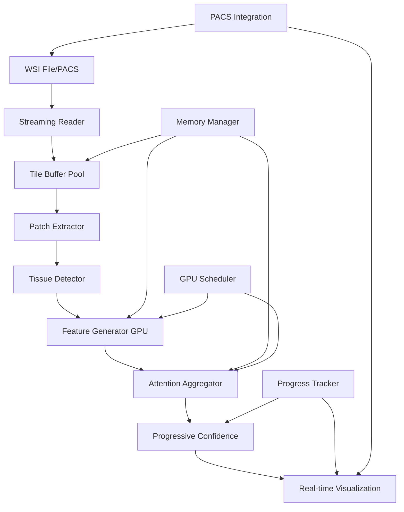
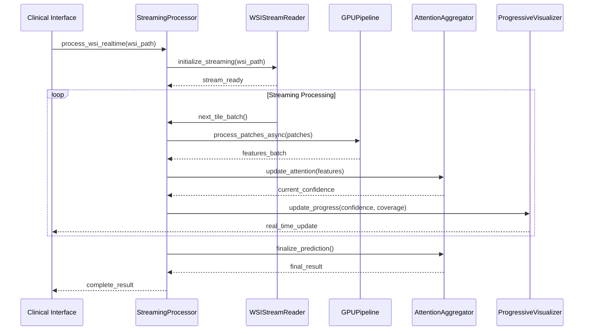
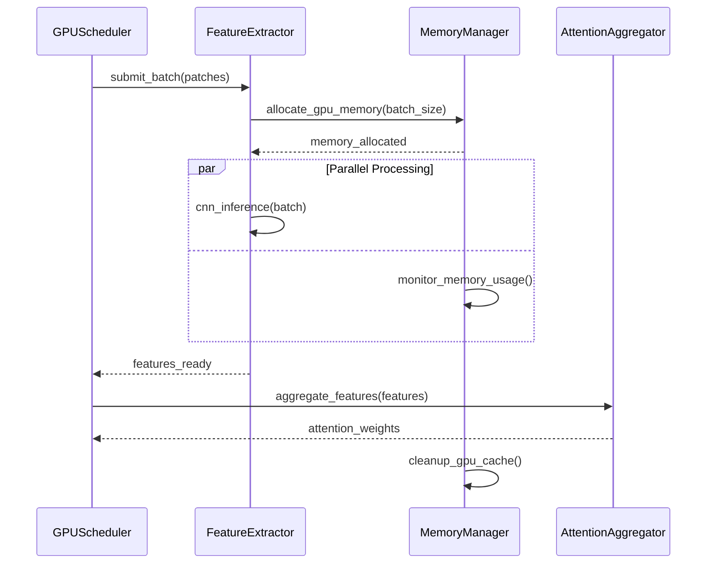

# Design Document: Real-Time WSI Streaming

## Overview

The Real-Time WSI Streaming system represents a breakthrough AI capability that will establish HistoCore as "the next big thing" in Medical AI. This system processes gigapixel whole-slide images in under 30 seconds through innovative streaming architecture, enabling live clinical demos and real-time pathology analysis that no competitor currently offers.

The system builds upon HistoCore's existing #1 performance (93.94% AUC), production PACS integration, federated learning framework, and complete WSI processing pipeline. The key innovation is streaming processing - analyzing WSI tiles as they load rather than waiting for full download, combined with GPU-accelerated parallel processing and progressive confidence building.

This breakthrough capability targets <30 seconds for 100K+ patch gigapixel slides with <2GB memory footprint while maintaining 95%+ accuracy versus batch processing, making it hospital demo-ready with real-time confidence visualization.

## Architecture

The system employs a multi-stage streaming pipeline with parallel processing and progressive result aggregation:



## Sequence Diagrams

### Main Processing Flow



### GPU Pipeline Flow



## Components and Interfaces

### Component 1: WSIStreamReader

**Purpose**: Streams WSI tiles progressively without loading entire slide into memory

**Interface**:
```python
class WSIStreamReader:
    def __init__(self, wsi_path: str, tile_size: int = 1024, buffer_size: int = 16):
        """Initialize streaming reader with configurable buffer."""
        pass
    
    def initialize_streaming(self) -> StreamingMetadata:
        """Setup streaming with slide metadata."""
        pass
    
    def stream_tiles(self) -> Iterator[TileBatch]:
        """Yield tile batches for processing."""
        pass
    
    def get_progress(self) -> StreamingProgress:
        """Get current streaming progress."""
        pass
    
    def estimate_total_patches(self) -> int:
        """Estimate total patches for progress tracking."""
        pass
```

**Responsibilities**:
- Progressive tile loading with configurable buffer sizes
- Memory-efficient streaming without full slide loading
- Adaptive tile sizing based on available memory
- Progress tracking and ETA estimation

### Component 2: GPUPipeline

**Purpose**: Parallel GPU processing of patch batches with memory optimization

**Interface**:
```python
class GPUPipeline:
    def __init__(self, model: nn.Module, batch_size: int = 64, gpu_ids: List[int] = None):
        """Initialize GPU pipeline with model and resource allocation."""
        pass
    
    async def process_batch_async(self, patches: torch.Tensor) -> torch.Tensor:
        """Asynchronously process patch batch through CNN."""
        pass
    
    def optimize_batch_size(self, memory_usage: float) -> int:
        """Dynamically adjust batch size based on memory."""
        pass
    
    def get_throughput_stats(self) -> ThroughputMetrics:
        """Get current processing throughput metrics."""
        pass
```

**Responsibilities**:
- Asynchronous GPU batch processing
- Dynamic memory management and batch size optimization
- Multi-GPU distribution for high throughput
- Performance monitoring and adaptive optimization

### Component 3: StreamingAttentionAggregator

**Purpose**: Progressive attention-based feature aggregation with real-time confidence updates

**Interface**:
```python
class StreamingAttentionAggregator:
    def __init__(self, attention_model: AttentionMIL, confidence_threshold: float = 0.95):
        """Initialize with attention model and confidence parameters."""
        pass
    
    def update_features(self, new_features: torch.Tensor, coordinates: np.ndarray) -> ConfidenceUpdate:
        """Add new features and update attention weights."""
        pass
    
    def get_current_prediction(self) -> PredictionResult:
        """Get current prediction with confidence."""
        pass
    
    def is_confident_enough(self) -> bool:
        """Check if current confidence meets threshold."""
        pass
    
    def finalize_prediction(self) -> FinalResult:
        """Generate final prediction result."""
        pass
```

**Responsibilities**:
- Progressive attention weight computation
- Real-time confidence estimation
- Early stopping when confidence threshold reached
- Memory-efficient feature accumulation

### Component 4: ProgressiveVisualizer

**Purpose**: Real-time visualization of processing progress and confidence building

**Interface**:
```python
class ProgressiveVisualizer:
    def __init__(self, visualization_config: VisualizationConfig):
        """Initialize with visualization parameters."""
        pass
    
    def update_heatmap(self, attention_weights: torch.Tensor, coordinates: np.ndarray) -> None:
        """Update attention heatmap visualization."""
        pass
    
    def update_confidence_plot(self, confidence_history: List[float]) -> None:
        """Update confidence progression plot."""
        pass
    
    def generate_real_time_report(self) -> VisualizationReport:
        """Generate current visualization state."""
        pass
```

**Responsibilities**:
- Real-time attention heatmap updates
- Confidence progression visualization
- Processing statistics dashboard
- Export capabilities for clinical reports

## Data Models

### Model 1: StreamingMetadata

```python
@dataclass
class StreamingMetadata:
    slide_id: str
    dimensions: Tuple[int, int]
    estimated_patches: int
    tile_size: int
    memory_budget_gb: float
    target_processing_time: float
    confidence_threshold: float
```

**Validation Rules**:
- dimensions must be positive integers
- estimated_patches must be > 0
- memory_budget_gb must be between 0.5 and 32.0
- target_processing_time must be between 5.0 and 300.0 seconds

### Model 2: TileBatch

```python
@dataclass
class TileBatch:
    tiles: torch.Tensor  # [batch_size, channels, height, width]
    coordinates: np.ndarray  # [batch_size, 2]
    batch_id: int
    total_batches: int
    processing_priority: float
```

**Validation Rules**:
- tiles tensor must have 4 dimensions
- coordinates must match batch size
- batch_id must be <= total_batches
- processing_priority must be between 0.0 and 1.0

### Model 3: ConfidenceUpdate

```python
@dataclass
class ConfidenceUpdate:
    current_confidence: float
    confidence_delta: float
    patches_processed: int
    estimated_remaining: int
    attention_weights: torch.Tensor
    early_stop_recommended: bool
```

**Validation Rules**:
- current_confidence must be between 0.0 and 1.0
- patches_processed must be >= 0
- attention_weights must sum to 1.0 across patches

## Algorithmic Pseudocode

### Main Processing Algorithm

```python
def process_wsi_realtime(wsi_path: str, config: StreamingConfig) -> StreamingResult:
    """
    Main real-time WSI processing algorithm.
    
    Preconditions:
    - wsi_path exists and is readable
    - config is validated
    - GPU memory >= config.min_memory_gb
    
    Postconditions:
    - Processing completes within config.target_time or reaches confidence threshold
    - Memory usage stays below config.memory_budget_gb
    - Final confidence >= config.min_confidence or all patches processed
    """
    
    # Initialize components
    reader = WSIStreamReader(wsi_path, config.tile_size, config.buffer_size)
    gpu_pipeline = GPUPipeline(config.model, config.batch_size, config.gpu_ids)
    aggregator = StreamingAttentionAggregator(config.attention_model, config.confidence_threshold)
    visualizer = ProgressiveVisualizer(config.visualization_config)
    
    # Setup streaming
    metadata = reader.initialize_streaming()
    start_time = time.time()
    
    # Main processing loop with early stopping
    for tile_batch in reader.stream_tiles():
        # Check time and memory constraints
        elapsed_time = time.time() - start_time
        if elapsed_time > config.target_time:
            break
            
        memory_usage = get_gpu_memory_usage()
        if memory_usage > config.memory_budget_gb:
            gpu_pipeline.optimize_batch_size(memory_usage)
        
        # Process batch asynchronously
        features = await gpu_pipeline.process_batch_async(tile_batch.tiles)
        
        # Update attention and confidence
        confidence_update = aggregator.update_features(features, tile_batch.coordinates)
        
        # Update visualization
        visualizer.update_heatmap(confidence_update.attention_weights, tile_batch.coordinates)
        visualizer.update_confidence_plot([confidence_update.current_confidence])
        
        # Early stopping check
        if confidence_update.early_stop_recommended:
            break
    
    # Finalize results
    final_result = aggregator.finalize_prediction()
    final_report = visualizer.generate_real_time_report()
    
    return StreamingResult(
        prediction=final_result,
        processing_time=time.time() - start_time,
        patches_processed=confidence_update.patches_processed,
        final_confidence=final_result.confidence,
        visualization_report=final_report
    )
```

### Streaming Attention Algorithm

```python
def update_streaming_attention(
    current_features: torch.Tensor,
    new_features: torch.Tensor,
    attention_model: AttentionMIL
) -> Tuple[torch.Tensor, float]:
    """
    Incrementally update attention weights with new features.
    
    Preconditions:
    - current_features and new_features have same feature dimension
    - attention_model is initialized and in eval mode
    - Feature tensors are on same device
    
    Postconditions:
    - Updated attention weights sum to 1.0
    - Confidence is between 0.0 and 1.0
    - Memory usage is bounded by max_features limit
    
    Loop Invariants:
    - All processed features maintain consistent dimensionality
    - Attention weights remain normalized throughout updates
    """
    
    # Concatenate features
    if current_features is not None:
        all_features = torch.cat([current_features, new_features], dim=0)
    else:
        all_features = new_features
    
    # Memory management: keep only most recent features if exceeding limit
    max_features = 10000  # Configurable limit
    if all_features.shape[0] > max_features:
        # Keep most recent features
        all_features = all_features[-max_features:]
    
    # Compute attention weights
    with torch.no_grad():
        # Reshape for attention model: [1, num_patches, feature_dim]
        features_batch = all_features.unsqueeze(0)
        
        # Get attention weights and prediction
        logits, attention_weights = attention_model(
            features_batch, 
            return_attention=True
        )
        
        # Extract attention weights: [num_patches]
        attention_weights = attention_weights.squeeze(0)
        
        # Compute confidence from logits
        probabilities = torch.softmax(logits, dim=1)
        confidence = torch.max(probabilities).item()
    
    return attention_weights, confidence
```

### Memory-Optimized GPU Processing

```python
def process_batch_with_memory_optimization(
    patches: torch.Tensor,
    model: nn.Module,
    initial_batch_size: int,
    memory_limit_gb: float
) -> torch.Tensor:
    """
    Process patches with dynamic batch size optimization.
    
    Preconditions:
    - patches tensor is valid and on correct device
    - model is initialized and in eval mode
    - initial_batch_size > 0
    - memory_limit_gb > 0
    
    Postconditions:
    - All patches are processed exactly once
    - GPU memory usage stays below memory_limit_gb
    - Output features maintain batch order
    """
    
    device = patches.device
    num_patches = patches.shape[0]
    current_batch_size = initial_batch_size
    processed_features = []
    
    batch_start = 0
    while batch_start < num_patches:
        try:
            # Determine batch end
            batch_end = min(batch_start + current_batch_size, num_patches)
            batch_patches = patches[batch_start:batch_end]
            
            # Check memory before processing
            memory_before = torch.cuda.memory_allocated(device) / (1024**3)
            
            # Process batch
            with torch.no_grad():
                batch_features = model(batch_patches)
            
            # Check memory after processing
            memory_after = torch.cuda.memory_allocated(device) / (1024**3)
            memory_used = memory_after - memory_before
            
            # Store results
            processed_features.append(batch_features.cpu())
            
            # Adaptive batch size adjustment
            if memory_after > memory_limit_gb * 0.8:  # 80% threshold
                # Reduce batch size
                current_batch_size = max(1, current_batch_size // 2)
            elif memory_after < memory_limit_gb * 0.4:  # 40% threshold
                # Increase batch size (conservative)
                current_batch_size = min(initial_batch_size, int(current_batch_size * 1.2))
            
            # Clear GPU cache periodically
            if (batch_start // current_batch_size) % 10 == 0:
                torch.cuda.empty_cache()
            
            batch_start = batch_end
            
        except RuntimeError as e:
            if "out of memory" in str(e).lower():
                # Emergency memory cleanup
                torch.cuda.empty_cache()
                
                # Reduce batch size significantly
                current_batch_size = max(1, current_batch_size // 4)
                
                # Retry with smaller batch
                continue
            else:
                raise e
    
    # Concatenate all processed features
    return torch.cat(processed_features, dim=0).to(device)
```

## Key Functions with Formal Specifications

### Function 1: initialize_streaming()

```python
def initialize_streaming(wsi_path: str, config: StreamingConfig) -> StreamingMetadata:
    """Initialize WSI streaming with memory and performance optimization."""
    pass
```

**Preconditions:**
- `wsi_path` exists and is a valid WSI file format
- `config` is validated with all required parameters
- Available GPU memory >= config.min_memory_gb
- OpenSlide library is available and functional

**Postconditions:**
- StreamingMetadata contains accurate slide dimensions and patch estimates
- Memory budget is allocated and reserved
- Tile buffer is initialized with optimal size
- Processing pipeline is ready for streaming

**Loop Invariants:** N/A (initialization function)

### Function 2: stream_tiles()

```python
def stream_tiles(self) -> Iterator[TileBatch]:
    """Stream WSI tiles progressively with memory management."""
    pass
```

**Preconditions:**
- WSI file is open and accessible
- Streaming is initialized with valid metadata
- Buffer pool has available memory slots

**Postconditions:**
- Each yielded TileBatch contains valid tiles and coordinates
- Memory usage stays within allocated buffer limits
- All slide regions are covered exactly once
- Tile order optimizes spatial locality for attention computation

**Loop Invariants:**
- Buffer memory usage remains below allocated limit
- Tile coordinates are unique and non-overlapping
- Batch sizes adapt to available memory

### Function 3: update_features()

```python
def update_features(self, new_features: torch.Tensor, coordinates: np.ndarray) -> ConfidenceUpdate:
    """Update attention aggregation with new patch features."""
    pass
```

**Preconditions:**
- `new_features` tensor has correct shape [batch_size, feature_dim]
- `coordinates` array matches batch size
- Attention model is initialized and in evaluation mode
- Feature dimensions match existing accumulated features

**Postconditions:**
- Attention weights are updated and normalized (sum to 1.0)
- Confidence value is between 0.0 and 1.0
- Memory usage for feature storage is bounded
- Early stopping recommendation is accurate based on confidence

**Loop Invariants:**
- Feature accumulation maintains spatial coordinate mapping
- Attention normalization is preserved across updates
- Memory bounds are respected during feature concatenation

## Example Usage

```python
# Example 1: Basic real-time processing
config = StreamingConfig(
    tile_size=1024,
    batch_size=32,
    memory_budget_gb=2.0,
    target_time=30.0,
    confidence_threshold=0.95
)

processor = RealTimeWSIProcessor(config)
result = processor.process_wsi_realtime("gigapixel_slide.svs")

print(f"Processing completed in {result.processing_time:.1f}s")
print(f"Final confidence: {result.final_confidence:.3f}")
print(f"Patches processed: {result.patches_processed}")

# Example 2: PACS integration with real-time updates
pacs_config = PACSStreamingConfig(
    pacs_endpoint="https://hospital-pacs.example.com",
    study_id="STUDY123",
    series_id="SERIES456"
)

async def process_pacs_study():
    async with PACSStreamingProcessor(pacs_config) as processor:
        async for update in processor.stream_wsi_analysis():
            print(f"Progress: {update.progress:.1%}, Confidence: {update.confidence:.3f}")
            
            # Update clinical dashboard
            await update_clinical_dashboard(update)
            
            # Early stopping for high confidence
            if update.confidence > 0.98:
                break
        
        final_result = await processor.get_final_result()
        await send_to_clinical_system(final_result)

# Example 3: Multi-GPU high-throughput processing
gpu_config = StreamingConfig(
    batch_size=128,
    gpu_ids=[0, 1, 2, 3],  # Use 4 GPUs
    memory_budget_gb=8.0,
    parallel_streams=4
)

processor = RealTimeWSIProcessor(gpu_config)
results = await processor.process_batch_realtime([
    "slide1.svs", "slide2.svs", "slide3.svs", "slide4.svs"
])

for slide_id, result in results.items():
    print(f"{slide_id}: {result.processing_time:.1f}s, confidence: {result.final_confidence:.3f}")
```

## Correctness Properties

The Real-Time WSI Streaming system must satisfy these universal correctness properties:

**Property 1: Processing Time Bound**
```python
∀ wsi_file, config: 
    result = process_wsi_realtime(wsi_file, config) 
    ⟹ result.processing_time ≤ config.target_time ∨ result.final_confidence ≥ config.confidence_threshold
```

**Property 2: Memory Usage Bound**
```python
∀ processing_step ∈ streaming_pipeline:
    gpu_memory_usage(processing_step) ≤ config.memory_budget_gb
```

**Property 3: Attention Weight Normalization**
```python
∀ attention_update ∈ streaming_updates:
    |sum(attention_update.attention_weights) - 1.0| < ε  where ε = 1e-6
```

**Property 4: Confidence Monotonicity**
```python
∀ t1, t2 where t1 < t2:
    confidence(t1) ≤ confidence(t2) ∨ |confidence(t2) - confidence(t1)| < δ
    where δ accounts for numerical precision
```

**Property 5: Spatial Coverage Completeness**
```python
∀ wsi_file:
    processed_coordinates = ⋃ batch.coordinates for batch in stream_tiles(wsi_file)
    ⟹ covers_tissue_regions(processed_coordinates, wsi_file) ≥ config.min_coverage
```

**Property 6: Feature Consistency**
```python
∀ patch_features ∈ streaming_features:
    feature_dim(patch_features) = config.expected_feature_dim ∧
    is_finite(patch_features) ∧ 
    not is_nan(patch_features)
```

## Error Handling

### Error Scenario 1: GPU Out of Memory

**Condition**: GPU memory allocation fails during batch processing
**Response**: 
- Immediately clear GPU cache and reduce batch size by 50%
- Retry processing with smaller batches
- If still failing, fall back to CPU processing with warning
**Recovery**: 
- Monitor memory usage and gradually increase batch size
- Log memory optimization events for performance tuning

### Error Scenario 2: WSI File Corruption

**Condition**: OpenSlide fails to read tiles or returns corrupted data
**Response**:
- Skip corrupted tiles and log coordinates
- Continue processing with remaining valid tiles
- Mark result with data quality warning
**Recovery**:
- Attempt alternative tile reading strategies
- Provide partial results with confidence adjusted for missing data

### Error Scenario 3: Network Interruption (PACS)

**Condition**: PACS connection drops during streaming
**Response**:
- Pause streaming and attempt reconnection with exponential backoff
- Cache processed results to avoid recomputation
- Switch to local file processing if available
**Recovery**:
- Resume streaming from last successful tile batch
- Merge cached and new results seamlessly

### Error Scenario 4: Confidence Convergence Failure

**Condition**: Confidence does not reach threshold within time limit
**Response**:
- Return current best prediction with confidence warning
- Provide uncertainty quantification and recommendation for manual review
- Log case for model improvement analysis
**Recovery**:
- Allow extended processing time if resources permit
- Suggest additional sampling strategies for difficult cases

## Testing Strategy

### Unit Testing Approach

Focus on individual component correctness with synthetic data:
- **WSIStreamReader**: Test tile streaming with mock WSI files of various sizes
- **GPUPipeline**: Verify batch processing correctness and memory management
- **StreamingAttentionAggregator**: Test attention weight updates and confidence computation
- **ProgressiveVisualizer**: Validate visualization updates and report generation

**Key Test Cases**:
- Memory limit enforcement under various batch sizes
- Attention weight normalization across streaming updates
- Confidence monotonicity with synthetic feature sequences
- Error recovery scenarios with controlled failures

### Property-Based Testing Approach

Use Hypothesis library to generate diverse test scenarios:

**Property Test Library**: Hypothesis (Python)

**Property Tests**:
1. **Memory Bound Property**: Generate random WSI dimensions and verify memory usage stays within limits
2. **Processing Time Property**: Test with various slide sizes and verify time bounds or early stopping
3. **Attention Normalization Property**: Generate random feature sequences and verify attention weights sum to 1.0
4. **Confidence Convergence Property**: Test that confidence increases or stabilizes over time

```python
from hypothesis import given, strategies as st
import hypothesis.extra.numpy as hnp

@given(
    slide_dims=st.tuples(st.integers(1000, 50000), st.integers(1000, 50000)),
    batch_size=st.integers(1, 128),
    memory_limit=st.floats(0.5, 8.0)
)
def test_memory_usage_property(slide_dims, batch_size, memory_limit):
    """Property test: memory usage stays within limits."""
    config = StreamingConfig(
        batch_size=batch_size,
        memory_budget_gb=memory_limit
    )
    
    # Create synthetic WSI
    synthetic_wsi = create_synthetic_wsi(slide_dims)
    
    # Process with memory monitoring
    with MemoryMonitor() as monitor:
        result = process_wsi_realtime(synthetic_wsi, config)
    
    # Verify memory bound property
    assert monitor.peak_memory_gb <= memory_limit * 1.1  # 10% tolerance
```

### Integration Testing Approach

Test end-to-end workflows with realistic data:
- **PACS Integration**: Test with hospital PACS systems using anonymized data
- **Multi-GPU Processing**: Verify scaling across multiple GPUs
- **Clinical Workflow**: Test integration with existing clinical systems
- **Performance Benchmarking**: Validate <30 second processing time on target hardware

**Integration Test Scenarios**:
- Process 100K+ patch gigapixel slides within time limits
- Handle network interruptions during PACS streaming
- Verify accuracy maintenance (95%+ vs batch processing)
- Test real-time visualization updates under load

## Performance Considerations

**Target Performance Metrics**:
- **Processing Time**: <30 seconds for 100K+ patch gigapixel slides
- **Memory Footprint**: <2GB RAM usage during processing
- **Accuracy Maintenance**: 95%+ accuracy compared to batch processing
- **Throughput**: >3000 patches/second on modern GPU hardware
- **Latency**: <100ms for real-time confidence updates

**Optimization Strategies**:
1. **Streaming Buffer Management**: Optimize tile buffer sizes based on available memory
2. **GPU Memory Pooling**: Reuse GPU memory allocations to reduce overhead
3. **Attention Computation Caching**: Cache attention computations for spatial locality
4. **Progressive Sampling**: Prioritize high-information regions for faster convergence
5. **Model Quantization**: Use FP16 precision for 2x memory reduction with minimal accuracy loss

**Scalability Considerations**:
- Horizontal scaling across multiple GPUs with data parallelism
- Vertical scaling with larger memory configurations
- Cloud deployment with auto-scaling based on demand
- Edge deployment optimization for resource-constrained environments

## Security Considerations

**Data Privacy**:
- All WSI data processing occurs locally or in secure cloud environments
- No patient data transmitted to external services without explicit consent
- Encryption in transit for PACS communications using TLS 1.3
- Secure deletion of temporary processing files

**Access Control**:
- Role-based access control for clinical users
- API authentication using OAuth 2.0 with JWT tokens
- Audit logging for all processing requests and results
- Integration with hospital identity management systems

**Model Security**:
- Model weights stored in encrypted format
- Secure model loading with integrity verification
- Protection against adversarial attacks through input validation
- Regular security updates and vulnerability assessments

**Compliance**:
- HIPAA compliance for US healthcare environments
- GDPR compliance for European deployments
- FDA 510(k) pathway preparation for clinical deployment
- SOC 2 Type II certification for cloud services

## Dependencies

**Core Dependencies**:
- **PyTorch >= 2.0**: Deep learning framework with CUDA support
- **OpenSlide >= 1.2.0**: WSI file reading and tile extraction
- **NumPy >= 1.21**: Numerical computing and array operations
- **Pillow >= 9.0**: Image processing and format conversion
- **H5py >= 3.7**: HDF5 file format for feature caching
- **asyncio**: Asynchronous programming for concurrent processing

**GPU Dependencies**:
- **CUDA >= 11.8**: GPU computing platform
- **cuDNN >= 8.6**: Deep neural network library
- **NVIDIA Driver >= 520**: GPU driver with CUDA support
- **torch.cuda**: PyTorch CUDA extensions

**Clinical Integration Dependencies**:
- **pydicom >= 2.3**: DICOM file format support
- **pynetdicom >= 2.0**: DICOM networking for PACS integration
- **HL7 FHIR Client**: Healthcare interoperability standards
- **FastAPI >= 0.100**: Web API framework for clinical interfaces

**Visualization Dependencies**:
- **Matplotlib >= 3.6**: Plotting and visualization
- **Plotly >= 5.15**: Interactive web-based visualizations
- **OpenCV >= 4.8**: Computer vision and image processing
- **Bokeh >= 3.0**: Real-time dashboard components

**Development Dependencies**:
- **Pytest >= 7.0**: Testing framework
- **Hypothesis >= 6.75**: Property-based testing
- **Black >= 23.0**: Code formatting
- **mypy >= 1.4**: Static type checking
- **pre-commit >= 3.3**: Git hooks for code quality

**Optional Dependencies**:
- **TensorRT >= 8.6**: NVIDIA inference optimization
- **ONNX >= 1.14**: Model interoperability
- **Triton >= 2.0**: Model serving infrastructure
- **Redis >= 7.0**: Caching and session management