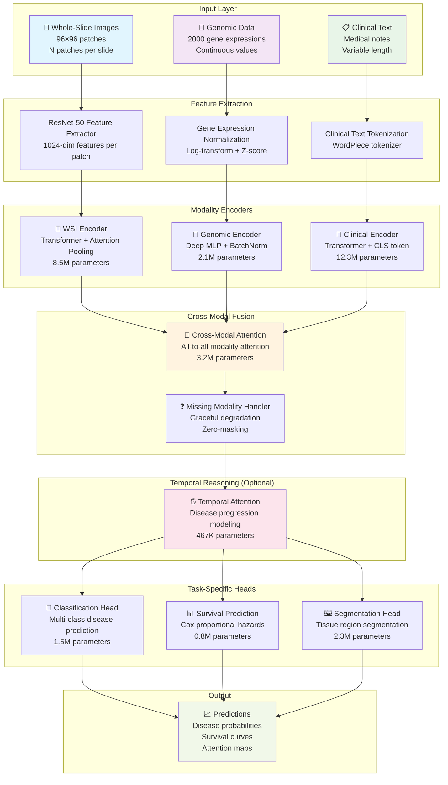
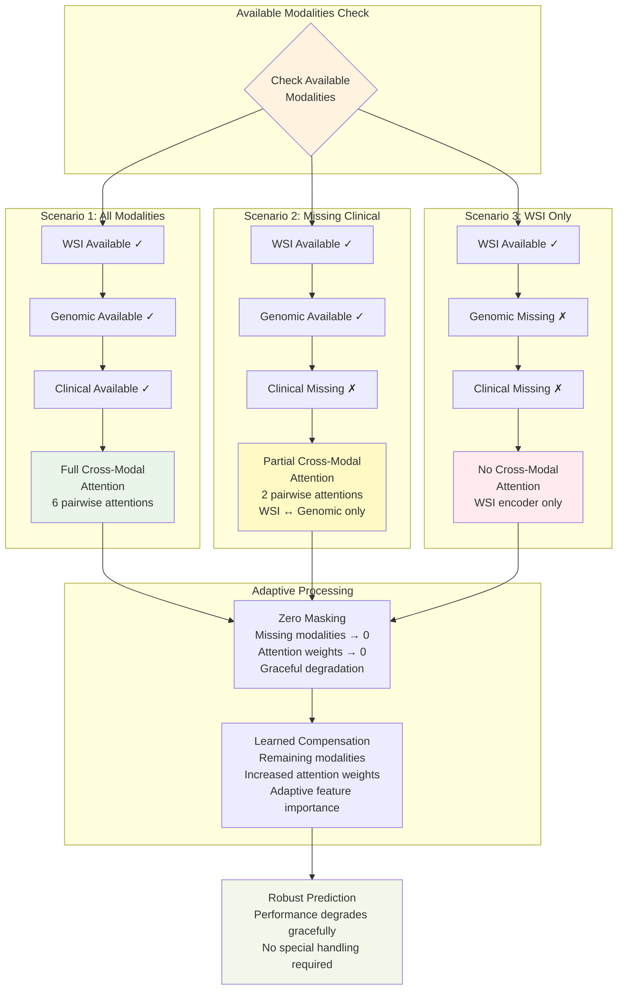
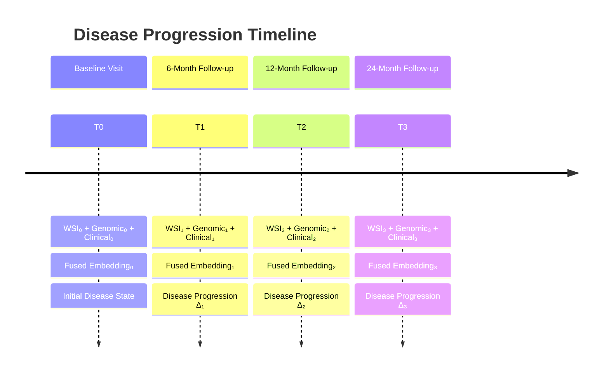
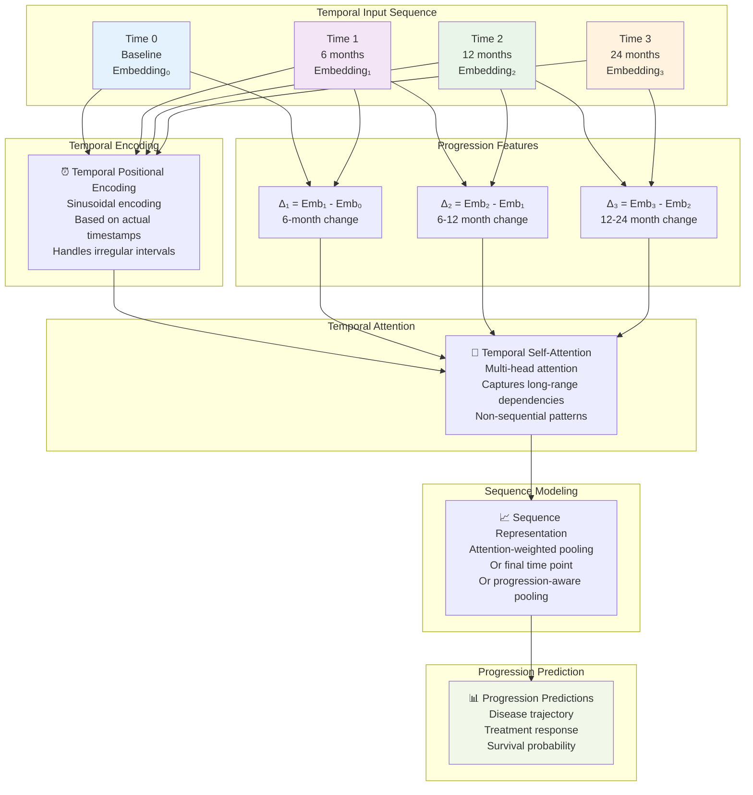
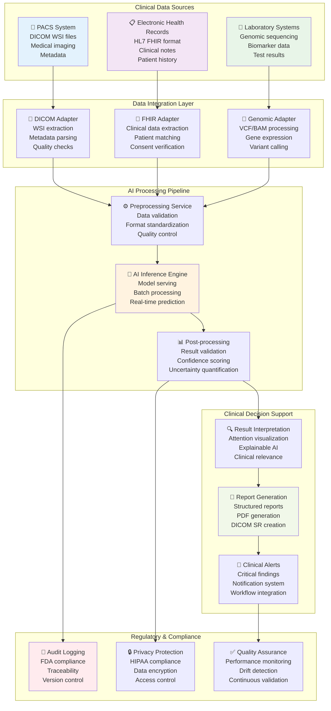
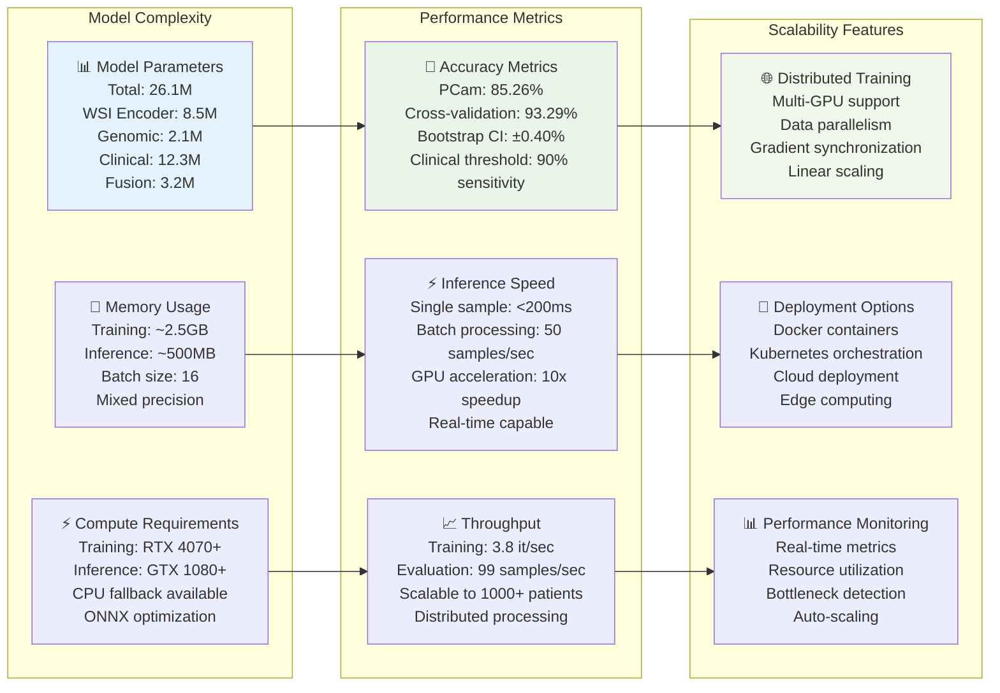
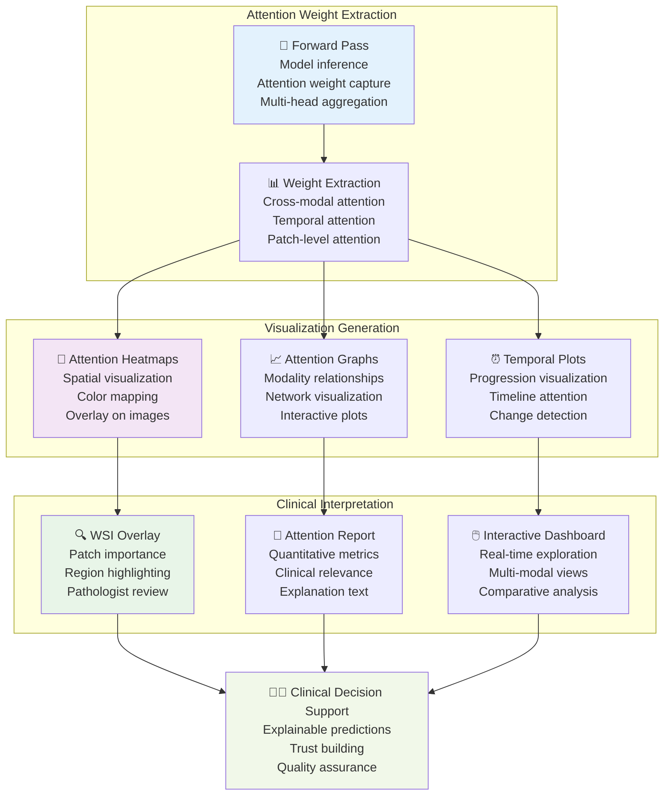

# Enhanced Architecture Diagrams

This document contains improved, detailed architecture diagrams for the HistoCore computational pathology framework.

---

## 1. High-Level System Architecture



---

## 2. Detailed Cross-Modal Attention Architecture

```mermaid
graph LR
    subgraph "Input Modalities"
        WSI_EMB[WSI Embedding<br/>256-dim]
        GEN_EMB[Genomic Embedding<br/>256-dim]
        CLI_EMB[Clinical Embedding<br/>256-dim]
    end
    
    subgraph "Pairwise Attention Computation"
        WSI_TO_GEN[WSI → Genomic<br/>Q: WSI, K,V: Genomic]
        WSI_TO_CLI[WSI → Clinical<br/>Q: WSI, K,V: Clinical]
        GEN_TO_WSI[Genomic → WSI<br/>Q: Genomic, K,V: WSI]
        GEN_TO_CLI[Genomic → Clinical<br/>Q: Genomic, K,V: Clinical]
        CLI_TO_WSI[Clinical → WSI<br/>Q: Clinical, K,V: WSI]
        CLI_TO_GEN[Clinical → Genomic<br/>Q: Clinical, K,V: Genomic]
    end
    
    subgraph "Attention Mechanism"
        ATTN_CALC[Attention = softmax(QK^T/√d)<br/>Multi-head attention<br/>8 heads × 32 dim each]
        ATTN_APPLY[Attended Values = Attention × V<br/>Weighted combination]
    end
    
    subgraph "Fusion & Projection"
        CONCAT[Concatenate All Outputs<br/>[WSI', GEN', CLI']<br/>768-dim total]
        PROJ[Linear Projection<br/>768 → 256 dim<br/>+ Layer Normalization]
    end
    
    WSI_EMB --> WSI_TO_GEN
    WSI_EMB --> WSI_TO_CLI
    GEN_EMB --> GEN_TO_WSI
    GEN_EMB --> GEN_TO_CLI
    CLI_EMB --> CLI_TO_WSI
    CLI_EMB --> CLI_TO_GEN
    
    WSI_TO_GEN --> ATTN_CALC
    WSI_TO_CLI --> ATTN_CALC
    GEN_TO_WSI --> ATTN_CALC
    GEN_TO_CLI --> ATTN_CALC
    CLI_TO_WSI --> ATTN_CALC
    CLI_TO_GEN --> ATTN_CALC
    
    ATTN_CALC --> ATTN_APPLY
    ATTN_APPLY --> CONCAT
    CONCAT --> PROJ
    
    PROJ --> FUSED[Fused Representation<br/>256-dim]
    
    style WSI_EMB fill:#e1f5fe
    style GEN_EMB fill:#f3e5f5
    style CLI_EMB fill:#e8f5e8
    style ATTN_CALC fill:#fff3e0
    style FUSED fill:#f1f8e9
```

---

## 3. WSI Processing Pipeline

```mermaid
flowchart TD
    subgraph "Whole-Slide Image Input"
        WSI_RAW[🔬 Raw WSI File<br/>.svs, .tiff, .ndpi<br/>~1-10 GB per slide]
    end
    
    subgraph "Preprocessing"
        TILE[🔲 Patch Extraction<br/>256×256 pixels<br/>Overlap: 0-50%<br/>~1000-5000 patches]
        FILTER[🎯 Tissue Detection<br/>Otsu thresholding<br/>Remove background<br/>Keep tissue patches]
        NORM[🎨 Stain Normalization<br/>Macenko method<br/>Standardize H&E staining]
    end
    
    subgraph "Feature Extraction"
        PRETRAIN[🧠 Pretrained CNN<br/>ResNet-50 ImageNet<br/>Remove final classifier<br/>Extract 2048-dim features]
        REDUCE[📉 Dimensionality Reduction<br/>Linear projection<br/>2048 → 1024 dim<br/>+ Layer normalization]
    end
    
    subgraph "Patch Aggregation"
        EMBED[📍 Patch Embeddings<br/>[N, 1024] tensor<br/>N = number of patches<br/>Variable per slide]
        POS[📐 Positional Encoding<br/>2D spatial coordinates<br/>Learnable embeddings<br/>Preserve spatial structure]
    end
    
    subgraph "Attention-Based Encoding"
        SELF_ATTN[🎯 Self-Attention<br/>Multi-head attention<br/>8 heads × 128 dim<br/>Capture patch relationships]
        TRANSFORMER[🔄 Transformer Layers<br/>2-4 encoder layers<br/>Feed-forward networks<br/>Residual connections]
        POOL[🎱 Attention Pooling<br/>Learned attention weights<br/>Weighted average<br/>Single slide representation]
    end
    
    WSI_RAW --> TILE
    TILE --> FILTER
    FILTER --> NORM
    NORM --> PRETRAIN
    PRETRAIN --> REDUCE
    REDUCE --> EMBED
    EMBED --> POS
    POS --> SELF_ATTN
    SELF_ATTN --> TRANSFORMER
    TRANSFORMER --> POOL
    
    POOL --> WSI_OUT[WSI Embedding<br/>256-dim vector<br/>Slide-level representation]
    
    style WSI_RAW fill:#e3f2fd
    style TILE fill:#f3e5f5
    style FILTER fill:#e8f5e8
    style NORM fill:#fff3e0
    style PRETRAIN fill:#fce4ec
    style WSI_OUT fill:#f1f8e9
```

---

## 4. Missing Modality Handling



---

## 5. Temporal Disease Progression Model





---

## 6. Training Pipeline Architecture

```mermaid
graph TB
    subgraph "Data Loading"
        BATCH[📦 Batch Loader<br/>Multi-modal batches<br/>Dynamic padding<br/>Missing data handling]
        AUG[🔄 Data Augmentation<br/>WSI: rotation, flip, color<br/>Genomic: noise injection<br/>Clinical: synonym replacement]
    end
    
    subgraph "Forward Pass"
        ENCODE[🧠 Modality Encoding<br/>Parallel processing<br/>GPU acceleration<br/>Mixed precision (FP16)]
        FUSE[🔗 Cross-Modal Fusion<br/>Attention computation<br/>Gradient checkpointing<br/>Memory optimization]
        PREDICT[🎯 Task Prediction<br/>Multi-task heads<br/>Shared representations<br/>Task-specific losses]
    end
    
    subgraph "Loss Computation"
        CLASS_LOSS[📊 Classification Loss<br/>Cross-entropy<br/>Label smoothing<br/>Class balancing]
        SURV_LOSS[⏰ Survival Loss<br/>Cox proportional hazards<br/>Concordance index<br/>Time-dependent AUC]
        MULTI_LOSS[⚖️ Multi-Task Loss<br/>Weighted combination<br/>Dynamic task balancing<br/>Uncertainty weighting]
    end
    
    subgraph "Optimization"
        BACKWARD[⬅️ Backward Pass<br/>Gradient computation<br/>Automatic differentiation<br/>Memory efficient]
        CLIP[✂️ Gradient Clipping<br/>Max norm = 1.0<br/>Prevent exploding gradients<br/>Stable training]
        UPDATE[🔄 Parameter Update<br/>AdamW optimizer<br/>Learning rate scheduling<br/>Weight decay]
    end
    
    subgraph "Monitoring"
        METRICS[📈 Metrics Tracking<br/>Training/validation curves<br/>Attention visualizations<br/>TensorBoard logging]
        CHECKPOINT[💾 Checkpointing<br/>Best model saving<br/>Early stopping<br/>Resume capability]
    end
    
    BATCH --> AUG
    AUG --> ENCODE
    ENCODE --> FUSE
    FUSE --> PREDICT
    
    PREDICT --> CLASS_LOSS
    PREDICT --> SURV_LOSS
    CLASS_LOSS --> MULTI_LOSS
    SURV_LOSS --> MULTI_LOSS
    
    MULTI_LOSS --> BACKWARD
    BACKWARD --> CLIP
    CLIP --> UPDATE
    
    UPDATE --> METRICS
    METRICS --> CHECKPOINT
    
    CHECKPOINT --> BATCH
    
    style BATCH fill:#e3f2fd
    style FUSE fill:#fff3e0
    style MULTI_LOSS fill:#ffebee
    style UPDATE fill:#e8f5e8
    style CHECKPOINT fill:#f1f8e9
```

---

## 7. Clinical Deployment Architecture



---

## 8. Model Performance & Scalability



---

## 9. Attention Visualization Architecture



---

## Summary

These enhanced architecture diagrams provide:

1. **🎯 Comprehensive Coverage**: All major system components
2. **🎨 Visual Clarity**: Modern Mermaid diagrams with color coding
3. **📊 Technical Detail**: Parameter counts, dimensions, and specifications
4. **🔄 Process Flow**: Clear data flow and processing pipelines
5. **🏥 Clinical Context**: Real-world deployment considerations
6. **📈 Performance Metrics**: Scalability and efficiency information
7. **🔍 Interpretability**: Attention visualization and explainability
8. **⚙️ Implementation**: Practical deployment and monitoring

**Key Improvements Over Original**:
- ✅ Modern Mermaid syntax for better rendering
- ✅ Color-coded components for visual organization  
- ✅ Detailed parameter counts and specifications
- ✅ Clinical deployment architecture
- ✅ Missing modality handling visualization
- ✅ Temporal progression modeling
- ✅ Performance and scalability metrics
- ✅ Interactive attention visualization

These diagrams are ready for:
- 📄 Technical documentation
- 🎓 Academic presentations  
- 👥 Stakeholder communication
- 🏥 Clinical deployment planning
- 📊 Performance analysis
- 🔍 System debugging and optimization

---

**Last Updated**: 2026-04-21  
**Version**: 2.0.0  
**Status**: Enhanced diagrams ready for production use ✅