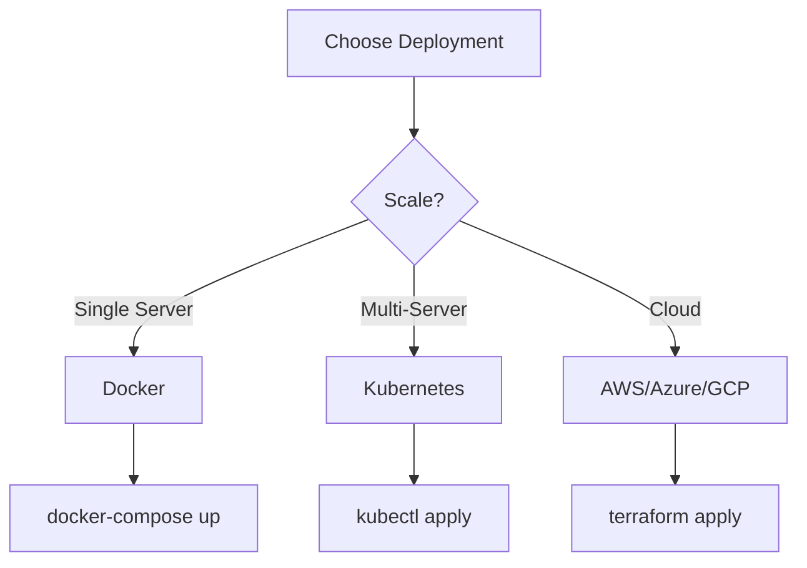

# HistoCore Deployment Guide

Complete guide for deploying HistoCore Real-Time WSI Streaming in production.

## Table of Contents

- [Overview](#overview)
- [Prerequisites](#prerequisites)
- [Deployment Options](#deployment-options)
- [Docker Deployment](#docker-deployment)
- [Kubernetes Deployment](#kubernetes-deployment)
- [Cloud Deployment](#cloud-deployment)
- [Configuration](#configuration)
- [Security](#security)
- [Monitoring](#monitoring)
- [Troubleshooting](#troubleshooting)

## Overview

HistoCore supports multiple deployment strategies:

| Deployment | Use Case | Complexity | Scalability |
|------------|----------|------------|-------------|
| **Docker** | Development, single server | Low | Limited |
| **Kubernetes** | Production, multi-server | Medium | High |
| **Cloud** | Enterprise, managed infrastructure | High | Very High |

**Recommended**: Kubernetes for production deployments.

## Prerequisites

### Hardware Requirements

**Minimum (Development)**:
- CPU: 4 cores
- RAM: 16GB
- GPU: NVIDIA GPU with 8GB VRAM (RTX 3080 or better)
- Storage: 100GB SSD
- Network: 1 Gbps

**Recommended (Production)**:
- CPU: 16+ cores
- RAM: 64GB+
- GPU: NVIDIA GPU with 16GB+ VRAM (RTX 4090, A100)
- Storage: 500GB+ NVMe SSD
- Network: 10 Gbps

### Software Requirements

- **Operating System**: Linux (Ubuntu 20.04+, RHEL 8+) or Windows Server 2019+
- **Docker**: 20.10+ with NVIDIA Docker runtime
- **Kubernetes**: 1.20+ (for K8s deployment)
- **NVIDIA Driver**: 520+ with CUDA 12.1+
- **Python**: 3.9+ (for local development)

### Network Requirements

**Inbound Ports**:
- 8000: Web dashboard
- 8001: REST API
- 8002: Prometheus metrics
- 3000: Grafana (optional)

**Outbound**:
- 443: HTTPS (PACS, cloud services)
- 104: DICOM (PACS integration)

## Deployment Options

### Quick Comparison



### Decision Matrix

| Factor | Docker | Kubernetes | Cloud |
|--------|--------|------------|-------|
| Setup Time | 15 min | 1-2 hours | 2-4 hours |
| Maintenance | Manual | Automated | Managed |
| Cost | Low | Medium | High |
| Scalability | 1 server | 100+ servers | Unlimited |
| HA | No | Yes | Yes |
| Auto-scaling | No | Yes | Yes |

## Docker Deployment

### Quick Start

```bash
# Clone repository
git clone https://github.com/histocore/histocore.git
cd histocore

# Build image
./scripts/docker-build.sh

# Start services
docker-compose up -d

# Verify
curl http://localhost:8000/health
```

### Production Configuration

1. **Edit environment file**:

```bash
# docker/production.env
HISTOCORE_ENV=production
HISTOCORE_LOG_LEVEL=INFO
HISTOCORE_MAX_MEMORY_GB=8
HISTOCORE_BATCH_SIZE=32
CUDA_VISIBLE_DEVICES=0

# Redis
REDIS_URL=redis://redis:6379
REDIS_PASSWORD=change_me_in_production

# Monitoring
PROMETHEUS_ENABLED=true
GRAFANA_ADMIN_PASSWORD=change_me_in_production

# Security
JWT_SECRET_KEY=generate_random_secret_here
API_RATE_LIMIT=100
```

2. **Start with production config**:

```bash
docker-compose -f docker-compose.yml -f docker-compose.prod.yml up -d
```

3. **Verify deployment**:

```bash
# Check services
docker-compose ps

# Check logs
docker-compose logs -f histocore-streaming

# Test API
curl -H "Authorization: Bearer <token>" \
  http://localhost:8001/health/detailed
```

### GPU Configuration

**Linux**:
```bash
# Install NVIDIA Docker
distribution=$(. /etc/os-release;echo $ID$VERSION_ID)
curl -s -L https://nvidia.github.io/nvidia-docker/gpgkey | sudo apt-key add -
curl -s -L https://nvidia.github.io/nvidia-docker/$distribution/nvidia-docker.list | \
  sudo tee /etc/apt/sources.list.d/nvidia-docker.list
sudo apt-get update && sudo apt-get install -y nvidia-docker2
sudo systemctl restart docker

# Verify
docker run --rm --gpus all nvidia/cuda:12.1-base nvidia-smi
```

**Windows WSL2**:
```powershell
# Install Docker Desktop with WSL2 backend
# Enable GPU support in Docker Desktop settings
# Verify
docker run --rm --gpus all nvidia/cuda:12.1-base nvidia-smi
```

### Scaling with Docker

**Multiple GPUs**:
```yaml
# docker-compose.override.yml
services:
  histocore-streaming:
    environment:
      - CUDA_VISIBLE_DEVICES=0,1,2,3
    deploy:
      resources:
        reservations:
          devices:
            - driver: nvidia
              count: 4
```

**Multiple Instances**:
```bash
# Scale to 3 instances
docker-compose up -d --scale histocore-streaming=3

# Add load balancer
docker-compose -f docker-compose.yml -f docker-compose.lb.yml up -d
```

## Kubernetes Deployment

### Quick Start

```bash
# Navigate to k8s directory
cd k8s

# Deploy everything
./deploy.sh

# Verify
kubectl get pods -n histocore
kubectl port-forward -n histocore svc/histocore-streaming 8000:8000
```

### Step-by-Step Deployment

1. **Prepare cluster**:

```bash
# Label GPU nodes
kubectl label nodes <node-name> accelerator=nvidia-tesla-k80

# Install NVIDIA device plugin
kubectl apply -f https://raw.githubusercontent.com/NVIDIA/k8s-device-plugin/main/nvidia-device-plugin.yml

# Verify GPU availability
kubectl get nodes -o json | jq '.items[].status.allocatable."nvidia.com/gpu"'
```

2. **Configure deployment**:

```bash
# Edit configmap.yaml
kubectl edit configmap histocore-config -n histocore

# Edit secrets (base64 encoded)
echo -n "your-secret" | base64
kubectl edit secret histocore-secrets -n histocore
```

3. **Deploy services**:

```bash
# Create namespace
kubectl apply -f namespace.yaml

# Deploy configuration
kubectl apply -f configmap.yaml
kubectl apply -f secret.yaml

# Deploy storage
kubectl apply -f redis.yaml

# Deploy application
kubectl apply -f streaming.yaml

# Deploy monitoring
kubectl apply -f monitoring.yaml

# Deploy ingress
kubectl apply -f ingress.yaml

# Enable autoscaling
kubectl apply -f hpa.yaml
```

4. **Verify deployment**:

```bash
# Check pods
kubectl get pods -n histocore

# Check services
kubectl get svc -n histocore

# Check logs
kubectl logs -f deployment/histocore-streaming -n histocore

# Test API
kubectl port-forward -n histocore svc/histocore-streaming 8000:8000
curl http://localhost:8000/health
```

### Production Configuration

**Resource Limits**:
```yaml
# streaming.yaml
resources:
  requests:
    memory: "4Gi"
    cpu: "2000m"
    nvidia.com/gpu: 1
  limits:
    memory: "8Gi"
    cpu: "4000m"
    nvidia.com/gpu: 1
```

**High Availability**:
```yaml
# streaming.yaml
replicas: 3

affinity:
  podAntiAffinity:
    requiredDuringSchedulingIgnoredDuringExecution:
    - labelSelector:
        matchExpressions:
        - key: app
          operator: In
          values:
          - histocore-streaming
      topologyKey: kubernetes.io/hostname
```

**Autoscaling**:
```yaml
# hpa.yaml
apiVersion: autoscaling/v2
kind: HorizontalPodAutoscaler
metadata:
  name: histocore-hpa
spec:
  scaleTargetRef:
    apiVersion: apps/v1
    kind: Deployment
    name: histocore-streaming
  minReplicas: 2
  maxReplicas: 10
  metrics:
  - type: Resource
    resource:
      name: cpu
      target:
        type: Utilization
        averageUtilization: 70
  - type: Resource
    resource:
      name: memory
      target:
        type: Utilization
        averageUtilization: 80
```

### Storage Configuration

**Persistent Volumes**:
```yaml
# pvc.yaml
apiVersion: v1
kind: PersistentVolumeClaim
metadata:
  name: histocore-data
spec:
  accessModes:
    - ReadWriteMany
  storageClassName: fast-ssd
  resources:
    requests:
      storage: 100Gi
```

**Storage Classes**:
```bash
# List available storage classes
kubectl get storageclass

# Use fast SSD for data
# Use standard for logs
```

## Cloud Deployment

### AWS Deployment

**Prerequisites**:
- AWS CLI configured
- Terraform installed
- AWS credentials with appropriate permissions

**Deploy**:
```bash
cd cloud/aws

# Configure
export AWS_REGION=us-west-2
export ENVIRONMENT=production

# Deploy infrastructure
./deploy.sh production us-west-2

# Outputs
terraform output -json > outputs.json
```

**Architecture**:
- EKS cluster with CPU and GPU node groups
- ElastiCache Redis for caching
- S3 bucket for data storage
- Application Load Balancer
- VPC with public/private subnets
- IAM roles for secure access

**Costs** (estimated):
- EKS cluster: $73/month
- GPU nodes (p3.2xlarge): $3.06/hour per node
- ElastiCache: $50/month
- S3 storage: $0.023/GB/month
- Data transfer: $0.09/GB

### Azure Deployment

**Prerequisites**:
- Azure CLI configured
- Terraform installed
- Azure subscription

**Deploy**:
```bash
cd cloud/azure

# Login
az login

# Deploy
./deploy.sh production "East US"

# Outputs
terraform output -json > outputs.json
```

**Architecture**:
- AKS cluster with system, CPU, and GPU node pools
- Azure Cache for Redis
- Azure Storage Account
- Azure Load Balancer
- Virtual Network with subnets
- Key Vault for secrets

**Costs** (estimated):
- AKS cluster: $73/month
- GPU nodes (NC6s_v3): $3.06/hour per node
- Azure Cache: $50/month
- Storage: $0.02/GB/month
- Data transfer: $0.087/GB

### GCP Deployment

**Prerequisites**:
- Google Cloud SDK configured
- Terraform installed
- GCP project with billing

**Deploy**:
```bash
cd cloud/gcp

# Authenticate
gcloud auth login
gcloud auth application-default login

# Deploy
./deploy.sh my-project-id production us-central1

# Outputs
terraform output -json > outputs.json
```

**Architecture**:
- GKE cluster with system, CPU, and GPU node pools
- Cloud Memorystore Redis
- Cloud Storage buckets
- Cloud Load Balancer
- VPC network with subnets
- Cloud KMS for encryption

**Costs** (estimated):
- GKE cluster: $73/month
- GPU nodes (n1-standard-4 + T4): $0.95/hour per node
- Memorystore: $50/month
- Storage: $0.02/GB/month
- Data transfer: $0.12/GB

## Configuration

### Environment Variables

**Core Settings**:
```bash
# Application
HISTOCORE_ENV=production
HISTOCORE_LOG_LEVEL=INFO
HISTOCORE_WORKERS=4

# GPU
CUDA_VISIBLE_DEVICES=0
HISTOCORE_MAX_MEMORY_GB=8
HISTOCORE_BATCH_SIZE=32

# Processing
HISTOCORE_TILE_SIZE=1024
HISTOCORE_TARGET_TIME=30
HISTOCORE_CONFIDENCE_THRESHOLD=0.95

# Cache
REDIS_URL=redis://redis:6379
REDIS_PASSWORD=secret
HISTOCORE_CACHE_TTL=3600

# Monitoring
PROMETHEUS_ENABLED=true
METRICS_PORT=8002
JAEGER_ENABLED=true

# Security
JWT_SECRET_KEY=generate_random_secret
API_RATE_LIMIT=100
ENABLE_CORS=false
```

### Configuration Files

**config.yaml**:
```yaml
streaming:
  tile_size: 1024
  batch_size: 32
  memory_budget_gb: 8.0
  target_time: 30.0
  confidence_threshold: 0.95

gpu:
  device_ids: [0]
  enable_amp: true
  memory_fraction: 0.9

pacs:
  enabled: true
  ae_title: HISTOCORE
  port: 104
  timeout: 30

monitoring:
  prometheus:
    enabled: true
    port: 8002
  jaeger:
    enabled: true
    endpoint: http://jaeger:14268/api/traces
  logging:
    level: INFO
    format: json

security:
  jwt_secret: ${JWT_SECRET_KEY}
  rate_limit: 100
  cors_enabled: false
  tls_enabled: true
```

### Hot Reload

Update configuration without restart:

```bash
# Update config
kubectl edit configmap histocore-config -n histocore

# Trigger reload
curl -X POST http://localhost:8001/admin/config/reload \
  -H "Authorization: Bearer <admin_token>"
```

## Security

### TLS/SSL Configuration

**Generate certificates**:
```bash
# Self-signed (development)
openssl req -x509 -nodes -days 365 -newkey rsa:2048 \
  -keyout tls.key -out tls.crt

# Let's Encrypt (production)
certbot certonly --standalone -d api.histocore.ai
```

**Configure Kubernetes**:
```bash
# Create secret
kubectl create secret tls histocore-tls \
  --cert=tls.crt --key=tls.key -n histocore

# Update ingress
kubectl apply -f ingress-tls.yaml
```

### Authentication

**OAuth 2.0 Setup**:
```yaml
# auth-config.yaml
oauth:
  issuer: https://auth.histocore.ai
  client_id: histocore-api
  client_secret: ${OAUTH_CLIENT_SECRET}
  scopes:
    - read:wsi
    - write:wsi
    - admin:config
```

### Network Security

**Firewall Rules**:
```bash
# Allow API traffic
sudo ufw allow 8000/tcp
sudo ufw allow 8001/tcp

# Allow monitoring
sudo ufw allow 8002/tcp
sudo ufw allow 3000/tcp

# Allow DICOM
sudo ufw allow 104/tcp
```

**Network Policies** (Kubernetes):
```yaml
apiVersion: networking.k8s.io/v1
kind: NetworkPolicy
metadata:
  name: histocore-netpol
spec:
  podSelector:
    matchLabels:
      app: histocore-streaming
  policyTypes:
  - Ingress
  - Egress
  ingress:
  - from:
    - podSelector:
        matchLabels:
          app: nginx-ingress
    ports:
    - protocol: TCP
      port: 8000
  egress:
  - to:
    - podSelector:
        matchLabels:
          app: redis
    ports:
    - protocol: TCP
      port: 6379
```

## Monitoring

### Prometheus Setup

**Scrape Configuration**:
```yaml
# prometheus.yml
scrape_configs:
  - job_name: 'histocore'
    static_configs:
      - targets: ['histocore-streaming:8002']
    scrape_interval: 15s
```

### Grafana Dashboards

**Import dashboards**:
```bash
# Copy dashboards
kubectl create configmap grafana-dashboards \
  --from-file=monitoring/grafana/dashboards/ \
  -n histocore

# Restart Grafana
kubectl rollout restart deployment/grafana -n histocore
```

### Alerting

**Configure Alertmanager**:
```yaml
# alertmanager.yml
route:
  receiver: 'team-email'
  group_by: ['alertname', 'severity']
  group_wait: 30s
  group_interval: 5m
  repeat_interval: 4h

receivers:
  - name: 'team-email'
    email_configs:
      - to: 'ops@histocore.ai'
        from: 'alerts@histocore.ai'
        smarthost: 'smtp.gmail.com:587'
        auth_username: 'alerts@histocore.ai'
        auth_password: '${SMTP_PASSWORD}'
```

## Troubleshooting

### Common Issues

**1. GPU Not Detected**

```bash
# Check NVIDIA drivers
nvidia-smi

# Check Docker GPU support
docker run --rm --gpus all nvidia/cuda:12.1-base nvidia-smi

# Check Kubernetes GPU
kubectl get nodes -o json | jq '.items[].status.allocatable."nvidia.com/gpu"'
```

**2. Out of Memory**

```bash
# Check memory usage
docker stats histocore-streaming

# Reduce batch size
export HISTOCORE_BATCH_SIZE=16
docker-compose restart histocore-streaming

# Or in Kubernetes
kubectl set env deployment/histocore-streaming HISTOCORE_BATCH_SIZE=16 -n histocore
```

**3. Slow Processing**

```bash
# Check GPU utilization
nvidia-smi

# Check metrics
curl http://localhost:8002/metrics | grep histocore_processing

# Enable profiling
export HISTOCORE_PROFILE=true
docker-compose restart histocore-streaming
```

**4. Connection Refused**

```bash
# Check service status
docker-compose ps
kubectl get pods -n histocore

# Check logs
docker-compose logs histocore-streaming
kubectl logs deployment/histocore-streaming -n histocore

# Check network
curl -v http://localhost:8000/health
```

### Debug Mode

**Enable debug logging**:
```bash
# Docker
export HISTOCORE_LOG_LEVEL=DEBUG
docker-compose restart histocore-streaming

# Kubernetes
kubectl set env deployment/histocore-streaming HISTOCORE_LOG_LEVEL=DEBUG -n histocore
```

### Performance Profiling

**Enable profiling**:
```bash
# Start with profiling
export HISTOCORE_PROFILE=true
docker-compose up -d

# Generate profile
curl -X POST http://localhost:8001/admin/profile/start
# ... run workload ...
curl -X POST http://localhost:8001/admin/profile/stop

# Download profile
curl http://localhost:8001/admin/profile/download > profile.prof

# Analyze
python -m pstats profile.prof
```

## Next Steps

1. **Configure monitoring alerts** - Set up Alertmanager notifications
2. **Set up backups** - Configure automated backup procedures
3. **Implement CI/CD** - Automate deployment pipeline
4. **Load testing** - Validate performance under load
5. **Security audit** - Review security configuration
6. **Documentation** - Document custom configurations

## Support

- **Documentation**: [docs/](../)
- **API Reference**: [docs/api/](../api/)
- **GitHub Issues**: https://github.com/histocore/histocore/issues
- **Email**: support@histocore.ai
