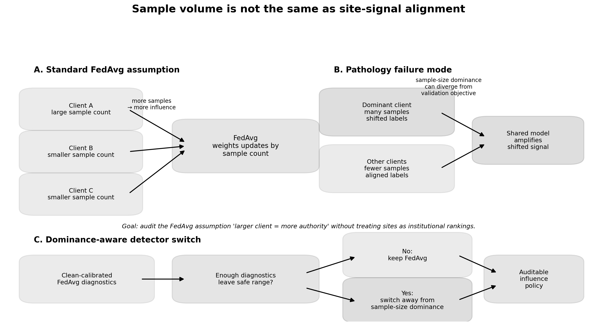

# When More Data Is Less Trustworthy

## Site-signal alignment failure modes in federated computational pathology

**Matthew Vaishnav**  
Independent technical report / working paper draft  
Research-only. Not clinically validated. Not diagnostic software.

---

## Abstract

Federated learning is often proposed for medical AI because institutions can collaborate without centralizing raw patient data. A common aggregation baseline, FedAvg, weights client updates by sample count. This is convenient, but in computational pathology it can silently encode a risky assumption: more samples should imply more aggregation authority.

This report studies that failure mode using simulated federations over PANDA-derived Phikon feature representations for prostate cancer grading. Validation labels are kept clean while the largest simulated client's training signal is perturbed through dominant-site label corruption and systematic ordinal threshold shift.

The strongest result is a fixed detector-switch rule calibrated under dominant-site label-noise stress and evaluated on conservative ordinal threshold-shift stress. The rule keeps clean-regime switching low at 13.3% and produces statistically positive improvements at 35% and 45% conservative shift across global QWK, macro-F1, and worst-site QWK. Diagnostic analysis shows that detector triggers are mainly driven by ordinal-error increase and QWK degradation, not by a single site-spread heuristic. Leave-one-diagnostic-family-out ablation shows that removing the most frequent diagnostic, mean absolute ordinal error, reduces trigger rate but does not collapse the positive 35% / 45% transfer result. Calibration-sensitivity analysis finds that 29 of 36 nearby detector settings preserve low clean-regime switching and positive 35% / 45% gains across global QWK, macro-F1, and worst-site QWK.

These results do not establish clinical readiness or real hospital deployment performance. They support a narrower claim: in simulated federated pathology experiments over real pathology-derived features, raw sample count is not equivalent to task-specific site-signal alignment, and sample-size dominance should be treated as an auditable modeling assumption rather than an automatic guarantee of aggregation safety.

---

## Primary figures

**Figure 1.** Standard FedAvg uses sample count as aggregation authority. In computational pathology, a high-volume client can have a training-label process that is less aligned with the declared validation objective.

**Figure 2.** Dominant-site stress overview across label-noise and conservative threshold-shift settings.

**Figure 3.** A fixed detector rule calibrated under dominant-site label-noise stress transfers to conservative ordinal threshold-shift stress.

**Figure 4.** Detector triggers are driven primarily by ordinal-error increase and QWK degradation. The result does not collapse under leave-one-diagnostic-family-out ablation and remains stable across nearby calibration settings.

---

## Full report

[Read the full technical report](./research/dominant-site-federated-pathology-paper)

[View figure index](./research/dominant-site-generated-figures)

[View source repository](https://github.com/matthewvaishnav/computational-pathology-research)

---

## Claim boundary

This is a simulated-federation research result over pathology-derived feature vectors. It is not clinical validation, not diagnostic software, not hospital deployment evidence, and not an institutional ranking system.
