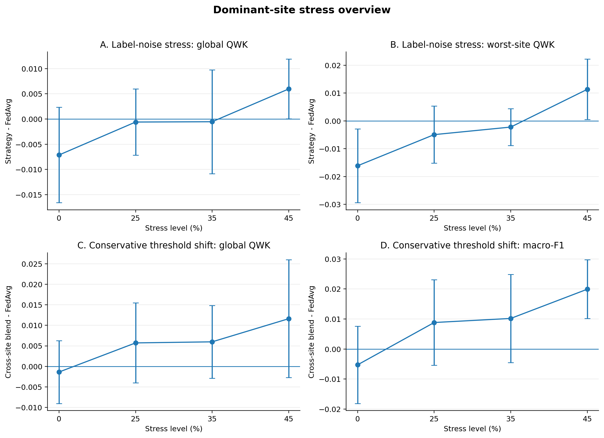
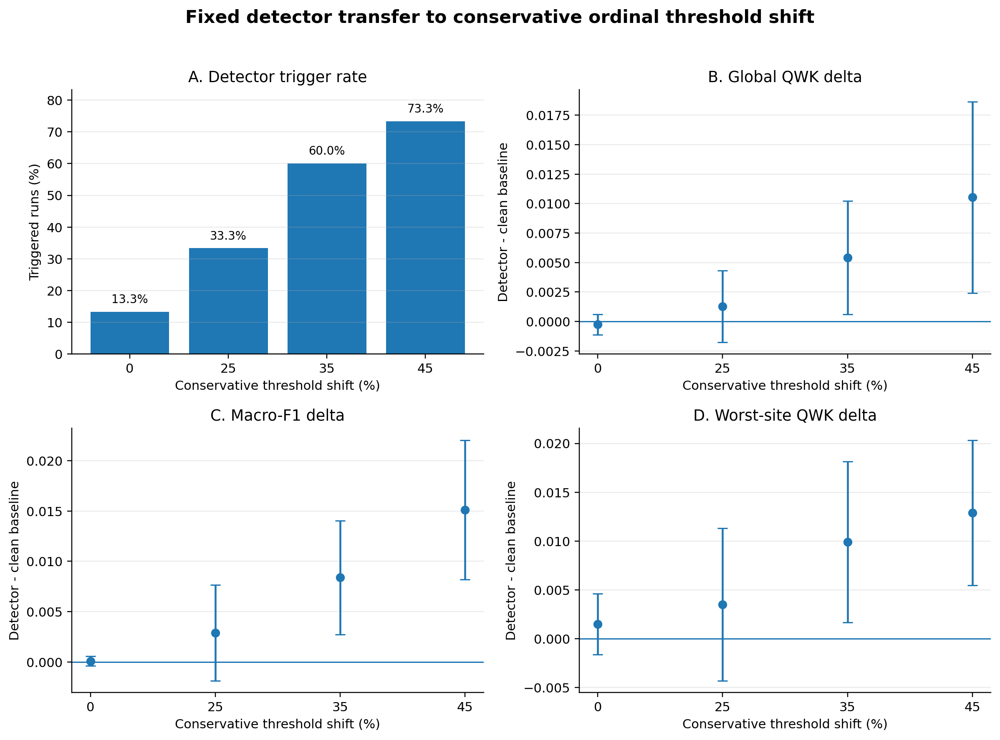
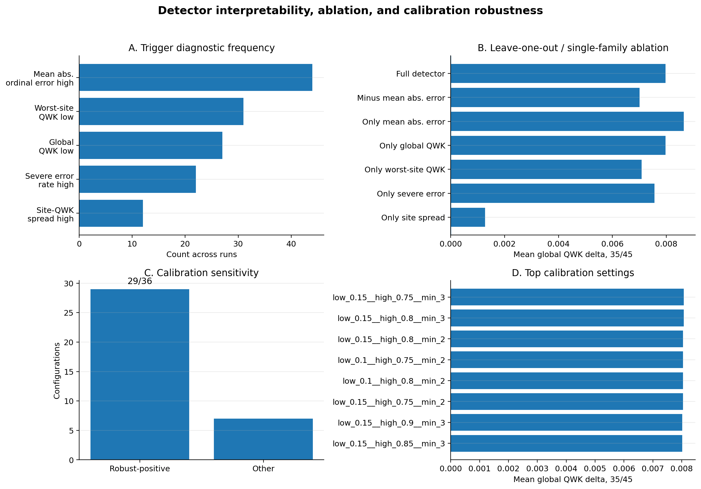

# Generated Dominant-Site Paper Figures

**Status:** generated figure index for the dominant-site federated pathology paper draft  
**Clinical status:** research-only; not clinically validated; not diagnostic software; not intended for patient-care use

---

## Figure 2: Dominant-site stress overview



**Source data:**

```text
results/threshold_shift_panda_all_conservative_0_15seed_aggregate/aggregate_summary.csv
results/threshold_shift_panda_all_conservative_25_15seed_aggregate/aggregate_summary.csv
results/threshold_shift_panda_all_conservative_35_15seed_aggregate/aggregate_summary.csv
results/threshold_shift_panda_all_conservative_45_15seed_aggregate/aggregate_summary.csv
results/ordinal_harm_fair_weights_h_panda_all_noise_0_aggregate/aggregate_summary.csv
results/ordinal_harm_fair_weights_h_panda_all_noise_25_aggregate/aggregate_summary.csv
results/ordinal_harm_fair_weights_h_panda_all_noise_35_aggregate/aggregate_summary.csv
results/ordinal_harm_fair_weights_h_panda_all_noise_45_aggregate/aggregate_summary.csv
```

**Caption draft:**

Dominant-site stress overview across label-noise and conservative threshold-shift settings. The figure summarizes strategy performance relative to FedAvg across perturbation levels, highlighting the conditional nature of the result: cross-site or adaptive alternatives are not automatically superior in clean regimes, but become useful when dominant-site training-signal misalignment is present.

---

## Figure 3: Fixed detector transfer result



**Source data:**

```text
results/threshold_shift_detector_conservative_fixed_labelnoise_rule_15seed/best_detector_summary.csv
```

**Caption draft:**

A fixed detector rule calibrated under dominant-site label-noise stress transferred to conservative ordinal threshold-shift stress. Clean-regime switching remained low at 13.3%, while 35% and 45% conservative shift produced statistically positive improvements across global QWK, macro-F1, and worst-site QWK.

---

## Figure 4: Detector interpretability, ablation, and calibration robustness



**Source data:**

```text
results/threshold_shift_detector_conservative_fixed_labelnoise_rule_15seed_diagnostic_summary/diagnostic_frequency_by_stress.csv
results/threshold_shift_detector_conservative_fixed_labelnoise_rule_15seed_leave_one_out/diagnostic_ablation_headline_35_45.csv
results/threshold_shift_detector_conservative_fixed_labelnoise_rule_15seed_calibration_sensitivity/calibration_sensitivity_headline.csv
```

**Caption draft:**

Detector triggers were driven primarily by ordinal-error increase and QWK degradation. Removing the most frequent diagnostic family, mean absolute ordinal error, reduced trigger rate but did not collapse the 35% / 45% transfer result. A calibration-sensitivity sweep found that 29 of 36 nearby detector settings preserved low clean-regime switching and positive 35% / 45% gains.

---

## Interpretation

These figures support the paper's dominant-site result stack:

1. dominant-site stress can expose FedAvg vulnerability when sample-size dominance and site-signal alignment diverge;
2. the fixed detector transfers to conservative threshold shift;
3. clean-regime switching remains low;
4. 35% and 45% shift gains are statistically positive;
5. detector diagnostics are interpretable;
6. the result does not collapse when the strongest diagnostic family is removed;
7. the result is stable across nearby calibration settings.

---

## Next figure work

The remaining primary figure is:

```text
Figure 1: problem schematic
```

Figure 1 should be a schematic rather than a metric plot. It should explain the core mechanism: FedAvg weights by sample count, but a dominant high-volume site can have a training signal that is less aligned with the declared validation objective.
