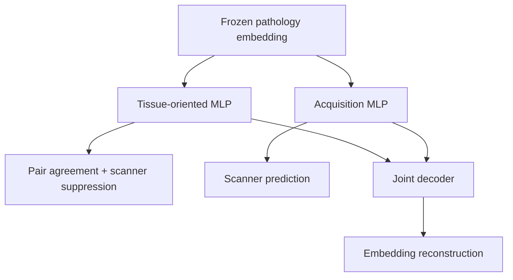

# Paired-Acquisition Neural Factorization

## Research-engineering brief

### Problem

Digital-pathology neural networks do not encode tissue biology alone. Frozen
representations can also preserve scanner optics, colour response, compression,
staining, and institutional workflow. A model may therefore appear accurate
while relying on acquisition structure that changes across scanners or sites.

Ordinary unpaired domain comparisons cannot cleanly identify this effect because
different scanners often observe different tissue. SCORPION provides a stronger
design: five scanners image the same 480 tissue regions from 48 original H&E
slides. The biology is held approximately fixed within each matched region while
the acquisition condition changes.

### Method

I developed **Paired-Acquisition Neural Factorization**, a neural representation
model that maps each frozen pathology embedding into:

- a tissue-oriented branch trained to agree across matched scanner views while
  reducing scanner recoverability;
- an acquisition branch trained to retain scanner information;
- a joint decoder that reconstructs the original embedding so that the model is
  pressured to reorganize information rather than merely discard it.

The full objective also includes variance controls, biological covariance
regularization, biological/acquisition cross-covariance control, and a direct
scanner-dependence penalty. The claim is **partial structured separation under
the tested protocol**, not perfect disentanglement or pure biology.

### Corrected evidence

The central SCORPION experiment contains 2,400 patches from 480 matched regions,
48 original slides, and five scanners. Evaluation is blocked by original slide,
not by patch.

The latest capacity-matched campaign used seven registered neural variants,
five folds, and five seeds: **175/175 fits completed and validated**. The full
model was compared with a true equal-capacity two-branch control rather than
only with the smaller historical one-branch reference.

| Registered result | Estimate | Fold-aware 95% interval | Interpretation |
|---|---:|---:|---|
| Biological-branch scanner balanced accuracy, full minus equal-capacity control | -0.3108 | [-0.3346, -0.2858] | Lower in all five folds |
| Average paired cosine, full minus equal-capacity control | +0.0364 | [+0.0335, +0.0395] | Geometric agreement increased |
| Average retrieval, full minus equal-capacity control | +0.00004 | [-0.00009, +0.00026] | Preserved within the 0.02 margin |
| Acquisition-branch scanner accuracy, full minus chance | +0.6565 | [+0.6239, +0.6872] | Scanner information retained |

These results indicate that the effect is not explained solely by adding a
second branch or more parameters. They do not prove biological preservation:
same-region retrieval and cosine agreement are bounded representation metrics,
not diagnostic labels.

### Negative results and corrections

The project is intentionally documented as a scientific-audit case study rather
than a collection of favourable numbers.

- A linear centroid/QR baseline removed linearly recoverable scanner information
  more aggressively than the neural tissue-oriented branch on the corrected
  canine audit.
- The adversarial objective was not supported as necessary for biological-branch
  scanner suppression in the capacity-matched SCORPION campaign and may be
  counterproductive for that endpoint.
- The acquisition classifier increased acquisition-branch scanner recovery but
  was not supported as necessary for biological-branch suppression.
- Cross-covariance control produced small geometric changes but was not supported
  as necessary for scanner suppression.
- Historical slide-independent inference, changing category estimands,
  leakage-prone neighbourhood metrics, and unsupported clinical language were
  withdrawn rather than defended.

This is part of the contribution: the repository shows how I detect invalid
estimands, leakage, pseudoreplication, architectural mismatches, incomplete
provenance, and claims that exceed their evidence.

### FEATMAP and the remaining scientific question

[FEATMAP](https://www.biorxiv.org/content/10.64898/2026.07.02.736184v1)
independently uses paired acquisitions to learn global affine corrections
between medical foundation-model embedding conditions. It is a close
harmonization competitor, but it produces a different object:

\[
z_{\text{source}}\rightarrow z_{\text{reference}}
\]

whereas this project attempts:

\[
z\rightarrow(z_{\text{tissue}},z_{\text{acquisition}}).
\]

The next prospective comparison therefore includes translation, orthogonal
Procrustes, unregularized affine, and ridge-affine mappings on the exact frozen
SCORPION folds. Every scanner is used as the reference in turn, and reference
conditions are averaged within slide to avoid pseudoreplication.

If the affine method wins at raw scanner removal, that result will be reported
directly. The neural method is scientifically useful only if the explicit
acquisition representation, reconstruction, leakage auditing, bottleneck
control, or intervention capability adds information that a corrected embedding
does not provide.

### Reproducibility engineering

The current experiment system includes:

- source- and configuration-bound deterministic run identities;
- exact hashes for frozen feature and split inputs;
- append-only run ledgers and unique attempt directories;
- atomic result records and artifact hashes;
- checkpoint and corruption validation;
- strict finite-loss and finite-gradient checks;
- fail-closed resume behaviour;
- separation of one-epoch smoke outputs from evidence-eligible fits;
- prospective analysis specifications;
- fold-aware bootstrap inference;
- forward-valid evidence releases with independent validators.

The published capacity campaign records 175 pending, 175 running, and 175
completed events with zero failed or invalid cells.

The separate canine SCC dimensionality × cross-covariance campaign also
completed all **450/450 registered cells**. It found no stable fold-intersection
Pareto condition and no universal dimensionality effect. Cross-covariance
regularization consistently reduced measured branch cross-covariance without a
uniform scanner/category benefit. That negative result prevents presenting a
single bottleneck size or regularization weight as a generally optimal setting.

### What this demonstrates professionally

This work demonstrates my ability to:

- formulate a neural representation-learning question from a real biomedical
  confounding problem;
- exploit paired experimental structure rather than relying on unpaired domain
  labels;
- implement multi-objective PyTorch models and controlled ablations;
- distinguish harmonization from factorization;
- design leakage-resistant, biological-sample-blocked evaluation;
- build resumable and provenance-bound experiment infrastructure;
- report negative results and narrow claims when simpler methods win;
- respond to a close concurrent paper with a direct baseline rather than an
  ownership claim.

My intended role is research engineering in computational pathology, medical
imaging, or biomedical machine learning: building technically rigorous neural
experiments, identifying confounding and validation failures, and converting
ambiguous research questions into reproducible evidence.

### Current boundary

The work does not establish clinical utility, diagnostic improvement, patient
benefit, deployment readiness, pure biological factors, complete scanner
invariance, or universal superiority. The public manuscript remains on audit
hold until its tables and claims are rebuilt from the corrected forward-valid
evidence and the paired affine comparison is completed.
