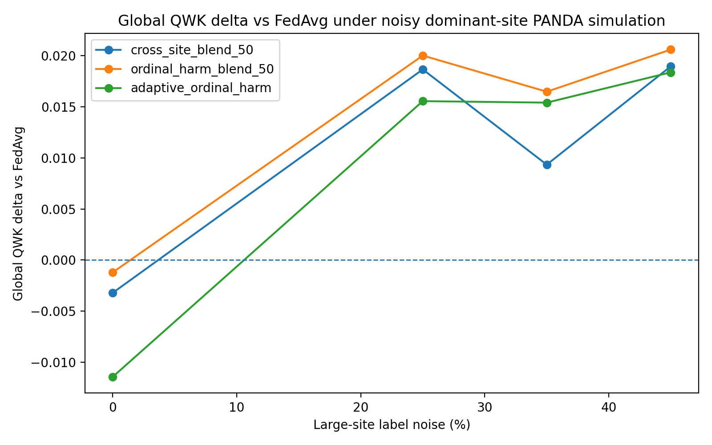
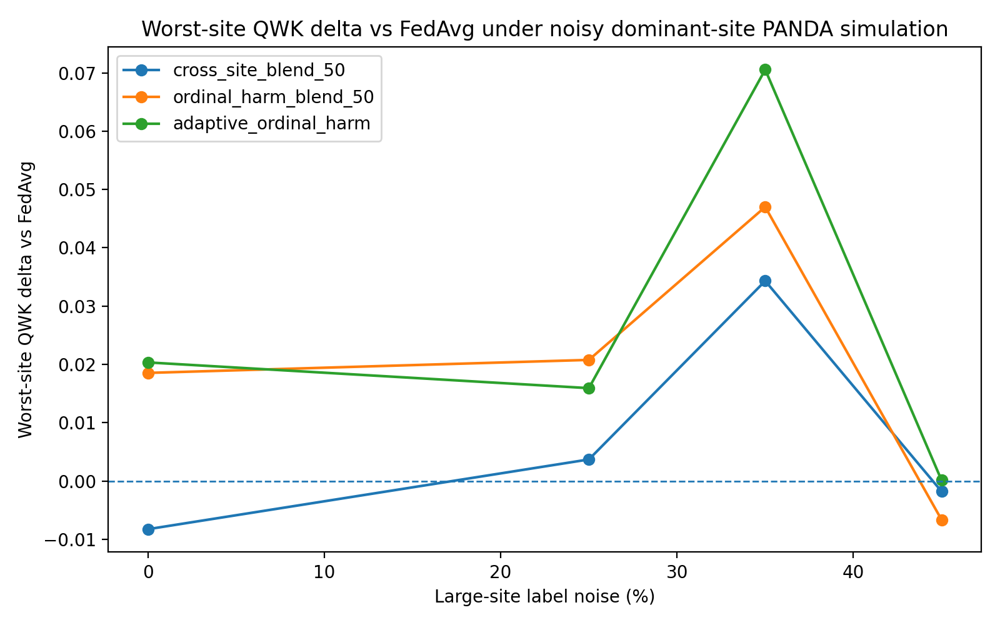

# FedAvg Failure Modes in Ordinal Pathology Grading

## Summary

This experiment tests a specific failure mode in federated pathology learning:

> When the largest simulated institution becomes label-corrupted, FedAvg's sample-size weighting can become less reliable for ordinal pathology grading.

Using PANDA-derived Phikon slide feature vectors, the experiment compares FedAvg against cross-site and ordinal-harm-aware aggregation strategies under increasing label noise applied to the largest simulated site.

The result is not that FedAvg is universally weak. FedAvg remains the strongest global baseline when the federation is clean. The important signal is regime-dependent:

> Under noisy large-site dominance, ordinal-harm-aware aggregation improves global QWK across all corrupted settings, while adaptive ordinal-harm weighting substantially improves worst-site QWK at 35% large-site label noise.

This suggests a pathology-specific safety problem: in clinical federations, sample volume alone is not always a sufficient proxy for update trustworthiness.

---

## Experimental setup

- Dataset source: PANDA-derived slide-level feature cache
- Feature representation: Phikon pooled slide vectors
- Cache size: 3,000 requested slides; 2,999 loaded valid slide vectors
- Task: ISUP grade prediction, 6 ordinal classes
- Metric focus: quadratic weighted kappa (QWK), global accuracy, macro-F1, worst-site QWK, mean-site QWK
- Federation: five simulated sites
- Corruption model: label flipping applied only to the largest simulated site
- Noise levels: 0%, 25%, 35%, 45%
- Seeds: 42, 123, 2025, 7, 99
- Rounds per run: 5

Strategies compared:

- `fedavg`
- `cross_site_blend_50`
- `ordinal_harm_blend_50`
- `adaptive_ordinal_harm`

---

## Main aggregate results

| Large-site label noise | FedAvg global QWK | Best global-QWK strategy | Best global QWK | Delta vs FedAvg | Best worst-site strategy | Best worst-site QWK | Delta vs FedAvg |
|---:|---:|---|---:|---:|---|---:|---:|
| 0% | 0.6656 | `fedavg` | 0.6656 | 0.0000 | `adaptive_ordinal_harm` | 0.5766 | +0.0203 |
| 25% | 0.6296 | `ordinal_harm_blend_50` | 0.6496 | +0.0200 | `ordinal_harm_blend_50` | 0.5443 | +0.0208 |
| 35% | 0.6216 | `ordinal_harm_blend_50` | 0.6381 | +0.0165 | `adaptive_ordinal_harm` | 0.5575 | +0.0706 |
| 45% | 0.6075 | `ordinal_harm_blend_50` | 0.6281 | +0.0206 | `adaptive_ordinal_harm` | 0.5259 | +0.0001 |

---

## Delta vs FedAvg

The following figures show how each non-FedAvg strategy changes performance relative to FedAvg at each dominant-site noise level.



**Figure 1.** Global QWK delta relative to FedAvg. `ordinal_harm_blend_50` is nearly neutral under clean conditions and improves global QWK at every corrupted dominant-site noise level.



**Figure 2.** Worst-site QWK delta relative to FedAvg. The strongest robustness signal appears at 35% dominant-site label noise, where `adaptive_ordinal_harm` improves worst-site QWK by +0.0706.

Raw figure data: [`delta_vs_fedavg_by_noise.csv`](../../results/ordinal_harm_fair_weights_h_3000_forensics/delta_vs_fedavg_by_noise.csv)

---

## Full strategy means

### 0% large-site label noise

| Strategy | Global QWK | Worst-site QWK | Mean-site QWK | Global accuracy | Macro-F1 |
|---|---:|---:|---:|---:|---:|
| `adaptive_ordinal_harm` | 0.6541 | 0.5766 | 0.6605 | 0.4749 | 0.4668 |
| `cross_site_blend_50` | 0.6624 | 0.5479 | 0.6649 | 0.4815 | 0.4708 |
| `fedavg` | 0.6656 | 0.5562 | 0.6654 | 0.4855 | 0.4759 |
| `ordinal_harm_blend_50` | 0.6644 | 0.5748 | 0.6676 | 0.4832 | 0.4751 |

Interpretation: FedAvg remains best on global QWK, global accuracy, and macro-F1 under clean conditions. Ordinal-harm blending is nearly neutral in global QWK, trailing FedAvg by only 0.0012.

### 25% large-site label noise

| Strategy | Global QWK | Worst-site QWK | Mean-site QWK | Global accuracy | Macro-F1 |
|---|---:|---:|---:|---:|---:|
| `adaptive_ordinal_harm` | 0.6451 | 0.5395 | 0.6523 | 0.4539 | 0.4419 |
| `cross_site_blend_50` | 0.6482 | 0.5272 | 0.6496 | 0.4669 | 0.4538 |
| `fedavg` | 0.6296 | 0.5235 | 0.6380 | 0.4536 | 0.4387 |
| `ordinal_harm_blend_50` | 0.6496 | 0.5443 | 0.6529 | 0.4622 | 0.4499 |

Interpretation: At moderate dominant-site label noise, ordinal-harm blending is best on both global QWK and worst-site QWK.

### 35% large-site label noise

| Strategy | Global QWK | Worst-site QWK | Mean-site QWK | Global accuracy | Macro-F1 |
|---|---:|---:|---:|---:|---:|
| `adaptive_ordinal_harm` | 0.6370 | 0.5575 | 0.6468 | 0.4556 | 0.4432 |
| `cross_site_blend_50` | 0.6309 | 0.5213 | 0.6362 | 0.4609 | 0.4474 |
| `fedavg` | 0.6216 | 0.4869 | 0.6241 | 0.4459 | 0.4290 |
| `ordinal_harm_blend_50` | 0.6381 | 0.5340 | 0.6441 | 0.4566 | 0.4448 |

Interpretation: At 35% dominant-site label noise, `ordinal_harm_blend_50` gives the best global QWK, while `adaptive_ordinal_harm` gives the strongest worst-site QWK. The worst-site QWK improvement of `adaptive_ordinal_harm` over FedAvg is +0.0706, the strongest robustness signal in this sweep.

### 45% large-site label noise

| Strategy | Global QWK | Worst-site QWK | Mean-site QWK | Global accuracy | Macro-F1 |
|---|---:|---:|---:|---:|---:|
| `adaptive_ordinal_harm` | 0.6259 | 0.5259 | 0.6313 | 0.4476 | 0.4337 |
| `cross_site_blend_50` | 0.6265 | 0.5240 | 0.6284 | 0.4542 | 0.4420 |
| `fedavg` | 0.6075 | 0.5258 | 0.6114 | 0.4359 | 0.4204 |
| `ordinal_harm_blend_50` | 0.6281 | 0.5192 | 0.6337 | 0.4489 | 0.4367 |

Interpretation: At high dominant-site label noise, `ordinal_harm_blend_50` again gives the best global QWK. Worst-site QWK is essentially tied between FedAvg and adaptive ordinal harm, but FedAvg has the weakest global QWK, mean-site QWK, global accuracy, and macro-F1 among the compared methods.

---

## Key findings

### 1. FedAvg is strongest when the federation is clean

At 0% label noise, FedAvg achieves the best global QWK:

```text
FedAvg global QWK: 0.6656
Ordinal-harm blend global QWK: 0.6644
Delta: -0.0012
```

This matters because the proposed ordinal-harm direction should not be framed as universally superior. The evidence instead supports a conditional claim: FedAvg is a strong clean-regime baseline.

### 2. Ordinal-harm-aware aggregation improves global QWK under corrupted large-site dominance

`ordinal_harm_blend_50` improves global QWK at every nonzero noise level:

```text
25% noise: +0.0200 QWK over FedAvg
35% noise: +0.0165 QWK over FedAvg
45% noise: +0.0206 QWK over FedAvg
```

This is the central empirical signal. The method appears most useful when the largest simulated institution is no longer fully trustworthy.

### 3. Adaptive ordinal harm gives the strongest worst-site robustness signal

At 35% large-site label noise:

```text
FedAvg worst-site QWK: 0.4869
Adaptive ordinal-harm worst-site QWK: 0.5575
Delta: +0.0706
```

This suggests that adaptive ordinal-harm weighting may be most valuable as a safety/robustness mechanism rather than as a universal global-QWK maximizer.

### 4. Sample size is not equivalent to trustworthiness

FedAvg assigns influence by client sample count. In a clean federation, this is often a useful prior. In this experiment, when the largest site receives label corruption, that same prior becomes less reliable.

The pathology-specific issue is that ordinal grading errors are not interchangeable. A prediction error of ISUP 0 to 5 is not clinically equivalent to a prediction error of ISUP 2 to 3. Aggregation strategies for federated pathology should therefore consider ordinal harm and cross-site degradation, not only client volume.

---

## Research claim boundary

Supported by this experiment:

> In PANDA-derived simulated federated ISUP grading, FedAvg performs best under clean conditions, but under noisy large-site dominance, ordinal-harm-aware aggregation improves global QWK by roughly +0.016 to +0.021 across corrupted settings. Adaptive ordinal-harm weighting also improves worst-site QWK by +0.0706 at 35% large-site label noise.

Not supported yet:

- This does not prove superiority on real hospital federations.
- This does not establish clinical validity.
- This does not prove that ordinal-harm aggregation beats FedAvg universally.
- This does not yet test Camelyon17 real multi-center data.
- This does not yet include external validation by another lab.

Best current framing:

> These results identify a plausible FedAvg failure mode in ordinal pathology grading and provide early evidence that ordinal-harm-aware aggregation can act as a targeted remedy when dominant-site label noise makes sample-size weighting unsafe.

---

## Reproduction commands

Run the 3,000-slide ordinal-harm sweep:

```powershell
foreach ($noise in 0,25,35,45) {
  foreach ($s in 42,123,2025,7,99) {
    python scripts\experiments\run_fair_weights_h_panda_feature_stress.py `
      --feature-cache C:\panda_cache\panda_phikon_mean_features_3000.npz `
      --output-dir "results\ordinal_harm_fair_weights_h_3000_noise_$noise`_seed_$s" `
      --rounds 5 `
      --large-site-label-flip ([double]$noise / 100.0) `
      --seed $s `
      --device cuda `
      --strategies fedavg cross_site_blend_50 ordinal_harm_blend_50 adaptive_ordinal_harm `
      --save-predictions
  }
}
```

Aggregate by noise level:

```powershell
foreach ($noise in 0,25,35,45) {
  python scripts\experiments\aggregate_fair_weights_h_results.py `
    --pattern "results\ordinal_harm_fair_weights_h_3000_noise_$noise`_seed_*\summary.csv" `
    --output-dir "results\ordinal_harm_fair_weights_h_3000_noise_$noise`_aggregate" `
    --baseline fedavg
}
```

Print aggregate strategy means:

```powershell
foreach ($noise in 0,25,35,45) {
  Write-Host "`nNOISE $noise"
  Import-Csv "results\ordinal_harm_fair_weights_h_3000_noise_$noise`_aggregate\aggregate_summary.csv" |
    Select-Object strategy,global_qwk_mean,worst_site_qwk_mean,mean_site_qwk_mean,global_accuracy_mean,macro_f1_mean |
    Format-Table -AutoSize
}
```

Run failure-mode analysis on saved predictions:

```powershell
python scripts\experiments\analyze_panda_fedavg_failure_modes.py `
  --pattern "results\ordinal_harm_fair_weights_h_3000_noise_*_seed_*\predictions.csv" `
  --output-dir results\ordinal_harm_fair_weights_h_3000_forensics
```

---

## Suggested next experiments

1. Add confidence intervals or bootstrap intervals for deltas across seeds.
2. Add explicit ordinal harm metrics: mean absolute ISUP error, severe error rate `|prediction - truth| >= 3`, overgrading, and undergrading.
3. Test whether an automatic switch can choose FedAvg at 0% noise and ordinal-harm aggregation under noisy dominant-site conditions.
4. Repeat with the full readable PANDA Phikon feature set if compute permits.
5. Validate on Camelyon17 or another real multi-center pathology federation.
