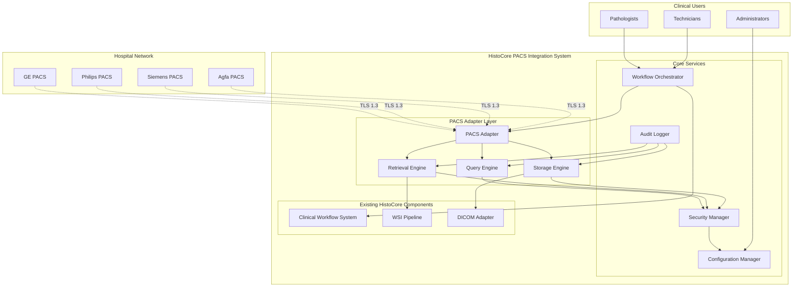
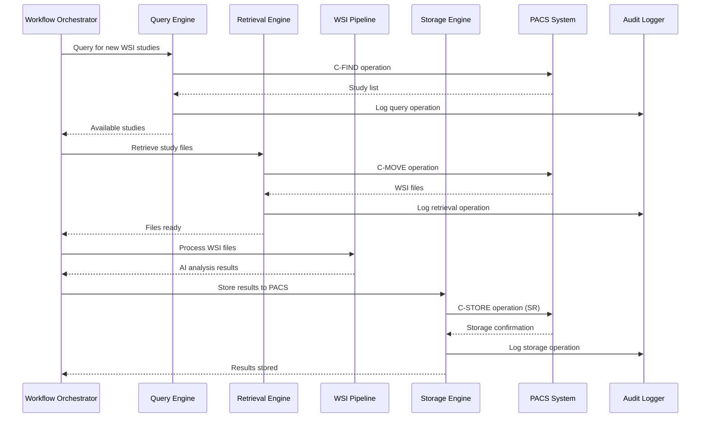

# PACS Integration System Design

## Overview

The PACS Integration System extends HistoCore's clinical capabilities by providing seamless integration with hospital Picture Archiving and Communication Systems (PACS). This system enables automated query, retrieval, processing, and storage of Whole Slide Images (WSI) and AI analysis results, supporting real-time clinical workflows in hospital environments.

The system is built around the existing HistoCore clinical workflow infrastructure, extending the current DICOM adapter with comprehensive PACS networking capabilities. It leverages the pynetdicom library for robust DICOM protocol implementation and integrates with existing components including the clinical workflow system, WSI processing pipeline, and audit logging infrastructure.

### Key Design Principles

- **Clinical-Grade Reliability**: Hospital-grade error handling, retry logic, and failover mechanisms
- **Security-First**: End-to-end encryption, certificate management, and comprehensive audit logging
- **Vendor Agnostic**: Abstraction layer supporting multiple PACS vendors with vendor-specific optimizations
- **Scalable Architecture**: Support for concurrent operations and horizontal scaling
- **Seamless Integration**: Extends existing HistoCore components without disrupting current workflows

## Architecture

### System Architecture Overview



### Component Interaction Flow



## Components and Interfaces

### PACS Adapter Layer

#### Query Engine
**Purpose**: Executes DICOM C-FIND operations to search for WSI studies in PACS systems.

**Key Interfaces**:
```python
class QueryEngine:
    def query_studies(
        self, 
        patient_id: Optional[str] = None,
        study_date_range: Optional[Tuple[datetime, datetime]] = None,
        modality: str = "SM",  # Slide Microscopy
        max_results: int = 1000
    ) -> List[StudyInfo]
    
    def query_series(
        self, 
        study_instance_uid: str
    ) -> List[SeriesInfo]
    
    def validate_query_parameters(
        self, 
        query_params: Dict[str, Any]
    ) -> ValidationResult
```

**Integration Points**:
- Extends existing `DICOMAdapter.query_pacs()` method
- Uses `SecurityManager` for encrypted connections
- Logs operations via `AuditLogger`
- Configured via `ConfigurationManager`

#### Retrieval Engine
**Purpose**: Executes DICOM C-MOVE operations to download WSI files from PACS systems.

**Key Interfaces**:
```python
class RetrievalEngine:
    def retrieve_study(
        self, 
        study_instance_uid: str,
        destination_path: Path,
        concurrent_series: int = 5
    ) -> RetrievalResult
    
    def retrieve_series(
        self, 
        series_instance_uid: str,
        destination_path: Path
    ) -> SeriesRetrievalResult
    
    def validate_retrieved_files(
        self, 
        file_paths: List[Path]
    ) -> ValidationResult
```

**Integration Points**:
- Extends existing `DICOMAdapter.retrieve_from_pacs()` method
- Integrates with WSI Pipeline for automatic processing
- Uses connection pooling for concurrent operations
- Implements disk space monitoring and throttling

#### Storage Engine
**Purpose**: Executes DICOM C-STORE operations to upload AI analysis results as Structured Reports.

**Key Interfaces**:
```python
class StorageEngine:
    def store_analysis_results(
        self, 
        analysis_results: AnalysisResults,
        original_study_uid: str
    ) -> StorageResult
    
    def generate_structured_report(
        self, 
        analysis_results: AnalysisResults,
        template: SRTemplate = TID1500
    ) -> Dataset
    
    def validate_sr_compliance(
        self, 
        sr_dataset: Dataset
    ) -> ComplianceResult
```

**Integration Points**:
- Extends existing `DICOMAdapter.write_structured_report()` method
- Receives results from Clinical Workflow System
- Uses DICOM TID 1500 (Measurement Report) template
- Implements retry logic with dead letter queue

### Core Services

#### Security Manager
**Purpose**: Manages TLS encryption, certificate validation, and authentication for all PACS communications.

**Key Interfaces**:
```python
class SecurityManager:
    def establish_secure_connection(
        self, 
        pacs_endpoint: PACSEndpoint
    ) -> SecureConnection
    
    def validate_certificate(
        self, 
        certificate: X509Certificate,
        ca_bundle: Path
    ) -> CertificateValidationResult
    
    def rotate_credentials(
        self, 
        endpoint_id: str
    ) -> CredentialRotationResult
```

**Security Features**:
- TLS 1.3 encryption for all DICOM communications
- X.509 certificate validation against configured CA
- Mutual authentication support with client certificates
- Automatic credential rotation based on hospital policies
- Comprehensive security event logging

#### Configuration Manager
**Purpose**: Manages PACS connection settings, environment profiles, and configuration validation.

**Key Interfaces**:
```python
class ConfigurationManager:
    def load_configuration(
        self, 
        profile: str = "default"
    ) -> PACSConfiguration
    
    def validate_configuration(
        self, 
        config: PACSConfiguration
    ) -> ValidationResult
    
    def update_endpoint_settings(
        self, 
        endpoint_id: str,
        settings: EndpointSettings
    ) -> UpdateResult
```

**Configuration Structure**:
```yaml
profiles:
  production:
    pacs_endpoints:
      primary:
        ae_title: "HISTOCORE_PROD"
        host: "pacs.hospital.org"
        port: 11112
        vendor: "GE"
        security:
          tls_enabled: true
          certificate_path: "/etc/ssl/certs/pacs.crt"
          client_cert_path: "/etc/ssl/private/histocore.crt"
      backup:
        ae_title: "HISTOCORE_BACKUP"
        host: "pacs-backup.hospital.org"
        port: 11112
    
    performance:
      max_concurrent_studies: 50
      connection_pool_size: 10
      query_timeout: 30
      retrieval_timeout: 300
    
    storage:
      local_cache_path: "/var/histocore/cache"
      max_cache_size_gb: 500
      cleanup_threshold_gb: 50
```

#### Workflow Orchestrator
**Purpose**: Coordinates automated processing workflows and integrates with existing Clinical Workflow System.

**Key Interfaces**:
```python
class WorkflowOrchestrator:
    def start_automated_polling(
        self, 
        poll_interval: timedelta = timedelta(minutes=5)
    ) -> None
    
    def process_new_studies(
        self, 
        studies: List[StudyInfo]
    ) -> List[ProcessingResult]
    
    def handle_processing_failure(
        self, 
        study_uid: str,
        error: Exception
    ) -> RecoveryAction
```

**Integration with Clinical Workflow System**:
- Extends existing `ClinicalWorkflowSystem.process_case()` method
- Implements priority queuing based on DICOM priority tags
- Provides real-time status updates via web dashboard
- Coordinates with existing audit and compliance logging

## Data Models

### Core Data Structures

#### Study Information
```python
@dataclass
class StudyInfo:
    study_instance_uid: str
    patient_id: str
    patient_name: str
    study_date: datetime
    study_description: str
    modality: str
    series_count: int
    priority: DicomPriority
    
    def to_dicom_query(self) -> Dict[str, str]:
        """Convert to DICOM query parameters"""
        
    def validate_for_processing(self) -> ValidationResult:
        """Validate study is suitable for AI processing"""
```

#### PACS Endpoint Configuration
```python
@dataclass
class PACSEndpoint:
    endpoint_id: str
    ae_title: str
    host: str
    port: int
    vendor: PACSVendor
    security_config: SecurityConfig
    performance_config: PerformanceConfig
    
    def create_association_parameters(self) -> AssociationParameters:
        """Create pynetdicom association parameters"""
        
    def supports_transfer_syntax(self, syntax_uid: str) -> bool:
        """Check if endpoint supports specific transfer syntax"""
```

#### Analysis Results Structure
```python
@dataclass
class AnalysisResults:
    study_instance_uid: str
    series_instance_uid: str
    algorithm_name: str
    algorithm_version: str
    confidence_score: float
    detected_regions: List[DetectedRegion]
    diagnostic_recommendations: List[DiagnosticRecommendation]
    processing_timestamp: datetime
    
    def to_structured_report(self) -> Dataset:
        """Convert to DICOM Structured Report"""
        
    def validate_clinical_thresholds(self) -> ValidationResult:
        """Validate results meet clinical acceptance criteria"""
```

### DICOM Data Handling

#### Enhanced DICOM Metadata
Extends existing `DICOMMetadata` class with PACS-specific fields:

```python
@dataclass
class PACSMetadata(DICOMMetadata):
    source_pacs_ae_title: str
    retrieval_timestamp: datetime
    original_transfer_syntax: str
    compression_ratio: Optional[float]
    network_transfer_time: timedelta
    
    def calculate_quality_metrics(self) -> QualityMetrics:
        """Calculate image quality metrics for clinical validation"""
```

#### Structured Report Templates
Implementation of DICOM TID 1500 (Measurement Report) for AI analysis results:

```python
class StructuredReportBuilder:
    def build_measurement_report(
        self, 
        analysis_results: AnalysisResults
    ) -> Dataset:
        """Build TID 1500 compliant Structured Report"""
        
    def add_ai_algorithm_identification(
        self, 
        sr_dataset: Dataset,
        algorithm_info: AlgorithmInfo
    ) -> None:
        """Add AI algorithm identification sequence"""
        
    def add_measurement_groups(
        self, 
        sr_dataset: Dataset,
        measurements: List[Measurement]
    ) -> None:
        """Add measurement groups with confidence intervals"""
```

## Error Handling

### Comprehensive Error Recovery Strategy

#### Network Error Handling
```python
class NetworkErrorHandler:
    def handle_connection_timeout(
        self, 
        endpoint: PACSEndpoint,
        operation: DicomOperation
    ) -> RecoveryAction:
        """Implement exponential backoff with jitter"""
        
    def handle_association_failure(
        self, 
        endpoint: PACSEndpoint,
        failure_reason: AssociationFailureReason
    ) -> RecoveryAction:
        """Switch to backup endpoint or retry with different parameters"""
        
    def handle_transfer_interruption(
        self, 
        partial_data: PartialTransfer
    ) -> RecoveryAction:
        """Resume transfer from last successful chunk"""
```

#### DICOM Protocol Error Handling
```python
class DicomErrorHandler:
    def handle_c_find_error(
        self, 
        status_code: int,
        error_comment: str
    ) -> QueryRecoveryAction:
        """Handle C-FIND specific errors with appropriate recovery"""
        
    def handle_c_move_error(
        self, 
        status_code: int,
        failed_instances: List[str]
    ) -> RetrievalRecoveryAction:
        """Handle C-MOVE errors with partial retry capability"""
        
    def handle_c_store_error(
        self, 
        status_code: int,
        rejected_instances: List[str]
    ) -> StorageRecoveryAction:
        """Handle C-STORE errors with format validation and retry"""
```

#### Dead Letter Queue Implementation
```python
class DeadLetterQueue:
    def enqueue_failed_operation(
        self, 
        operation: FailedOperation,
        max_retries: int = 5
    ) -> None:
        """Queue failed operations for manual review"""
        
    def process_queued_operations(self) -> List[ProcessingResult]:
        """Attempt to reprocess queued operations"""
        
    def generate_failure_report(self) -> FailureReport:
        """Generate detailed failure analysis for administrators"""
```

### Failover and High Availability

#### Multi-Endpoint Failover
```python
class FailoverManager:
    def select_optimal_endpoint(
        self, 
        operation_type: DicomOperationType,
        endpoints: List[PACSEndpoint]
    ) -> PACSEndpoint:
        """Select best endpoint based on performance metrics and availability"""
        
    def handle_endpoint_failure(
        self, 
        failed_endpoint: PACSEndpoint,
        ongoing_operations: List[Operation]
    ) -> FailoverResult:
        """Gracefully failover ongoing operations to backup endpoints"""
```

## Testing Strategy

### Dual Testing Approach

The PACS Integration System requires comprehensive testing covering both unit-level correctness and integration-level reliability:

#### Unit Testing Strategy
- **DICOM Protocol Testing**: Validate C-FIND, C-MOVE, and C-STORE operations with mock PACS servers
- **Security Component Testing**: Test TLS negotiation, certificate validation, and authentication flows
- **Configuration Validation**: Test configuration parsing, validation, and error handling
- **Error Recovery Testing**: Test retry logic, exponential backoff, and failover mechanisms

#### Property-Based Testing Strategy
Property-based testing is highly applicable to this system due to the universal properties that should hold across all DICOM operations and data transformations. The system includes parsers (DICOM), serializers (Structured Reports), data transformations (metadata extraction), and business logic (workflow orchestration) - all ideal candidates for property-based testing.

**Property Testing Library**: Use Hypothesis for Python property-based testing
**Test Configuration**: Minimum 100 iterations per property test
**Test Tagging**: Each property test references its design document property using format: **Feature: pacs-integration-system, Property {number}: {property_text}**

#### Integration Testing Strategy
- **Multi-Vendor PACS Testing**: Test against GE, Philips, Siemens, and Agfa PACS simulators
- **Performance Testing**: Validate concurrent operation limits and throughput requirements
- **Security Integration Testing**: Test end-to-end encrypted communication flows
- **Clinical Workflow Integration**: Test integration with existing HistoCore clinical components

#### Compliance Testing Strategy
- **DICOM Conformance Testing**: Validate compliance with DICOM Part 4 (Service Class Specifications)
- **Security Compliance Testing**: Validate HIPAA audit logging and data protection requirements
- **Clinical Validation Testing**: Test with realistic clinical datasets and workflows

### Test Environment Setup
```python
class PACSTestEnvironment:
    def setup_mock_pacs_server(
        self, 
        vendor: PACSVendor,
        test_data: TestDataSet
    ) -> MockPACSServer:
        """Setup vendor-specific mock PACS server for testing"""
        
    def generate_test_wsi_studies(
        self, 
        count: int,
        complexity: StudyComplexity
    ) -> List[TestStudy]:
        """Generate realistic WSI test studies with proper DICOM structure"""
```

## Correctness Properties

*A property is a characteristic or behavior that should hold true across all valid executions of a system-essentially, a formal statement about what the system should do. Properties serve as the bridge between human-readable specifications and machine-verifiable correctness guarantees.*

After analyzing all acceptance criteria through prework analysis and performing property reflection to eliminate redundancy, the following correctness properties capture the essential universal behaviors that must hold across all valid inputs and operations:

### Property 1: DICOM Query Parameter Translation

*For any* valid query parameters (patient ID, date range, modality), the Query Engine SHALL generate C-FIND operations containing the correct corresponding DICOM tags and values.

**Validates: Requirements 1.1, 1.2, 1.3**

### Property 2: Query Result Completeness

*For any* successful query operation, all returned study results SHALL contain the required DICOM fields: Study Instance UID, Series Instance UID, and patient demographics.

**Validates: Requirements 1.4**

### Property 3: Date Range Filtering Correctness

*For any* query with date range parameters, all returned studies SHALL have study dates that fall within the specified range boundaries.

**Validates: Requirements 1.2**

### Property 4: Retrieval Operation Completeness

*For any* valid Study Instance UID, the Retrieval Engine SHALL execute C-MOVE operations for all associated WSI series within that study.

**Validates: Requirements 2.1**

### Property 5: File Integrity Validation

*For any* retrieved DICOM file, checksum validation SHALL correctly identify files with corrupted data versus files with intact data.

**Validates: Requirements 2.2**

### Property 6: File Storage Naming Convention

*For any* successfully retrieved WSI file, the storage location and filename SHALL conform to the configured naming convention and directory structure.

**Validates: Requirements 2.3**

### Property 7: Workflow Notification Completeness

*For any* completed retrieval operation, notifications to the Workflow Orchestrator SHALL include all retrieved file paths and associated metadata.

**Validates: Requirements 2.5**

### Property 8: Structured Report Generation Compliance

*For any* AI analysis results, the generated DICOM Structured Report SHALL conform to the TID 1500 (Measurement Report) template specification.

**Validates: Requirements 3.1, 10.3**

### Property 9: DICOM Relationship Association

*For any* generated Structured Report, proper DICOM relationship tags SHALL associate the SR with its originating WSI study.

**Validates: Requirements 3.3**

### Property 10: Analysis Result Content Completeness

*For any* AI analysis results, the generated Structured Report SHALL include all analysis components: confidence scores, detected regions, and diagnostic recommendations.

**Validates: Requirements 3.6**

### Property 11: Multi-Algorithm SR Generation

*For any* slide analyzed by multiple AI algorithms, separate Structured Reports SHALL be generated for each analysis type with proper study relationships.

**Validates: Requirements 3.7**

### Property 12: DICOM Conformance Negotiation

*For any* PACS connection attempt, the highest common DICOM conformance level SHALL be negotiated between the client and server capabilities.

**Validates: Requirements 4.5**

### Property 13: Vendor Tag Normalization

*For any* vendor-specific DICOM data, tag variations SHALL be handled transparently and normalized to standard representations.

**Validates: Requirements 4.6**

### Property 14: Vendor-Specific Optimization Selection

*For any* identified PACS vendor, appropriate vendor-specific optimizations SHALL be automatically applied based on the vendor identification.

**Validates: Requirements 4.7**

### Property 15: TLS Encryption Enforcement

*For any* DICOM communication attempt, TLS 1.3 encrypted connections SHALL be established and maintained throughout the operation.

**Validates: Requirements 5.1**

### Property 16: Certificate Validation Correctness

*For any* server certificate, validation against the configured Certificate Authority SHALL correctly identify valid versus invalid certificates.

**Validates: Requirements 5.2**

### Property 17: Client Certificate Presentation

*For any* mutual authentication requirement, appropriate client certificates SHALL be presented for verification.

**Validates: Requirements 5.3**

### Property 18: Security Event Logging

*For any* connection attempt or authentication event, comprehensive audit logs SHALL be generated with all required security details.

**Validates: Requirements 5.4**

### Property 19: End-to-End Encryption Maintenance

*For any* patient data transmission, end-to-end encryption SHALL be maintained throughout the entire communication pipeline.

**Validates: Requirements 5.7**

### Property 20: Configuration Loading and Decryption

*For any* encrypted configuration file, the Configuration Manager SHALL successfully load and decrypt the settings when the file is valid.

**Validates: Requirements 6.1**

### Property 21: Multi-Endpoint Configuration Support

*For any* configuration with multiple PACS endpoints, all endpoints SHALL be loaded and made available for redundancy operations.

**Validates: Requirements 6.2**

### Property 22: Configuration Validation Completeness

*For any* configuration change, validation SHALL identify and report all invalid settings with detailed error information.

**Validates: Requirements 6.3, 6.6**

### Property 23: Endpoint Configuration Completeness

*For any* PACS endpoint configuration, all required fields (AE_Title, IP address, port, security settings) SHALL be stored and retrievable.

**Validates: Requirements 6.4**

### Property 24: Profile-Based Configuration Loading

*For any* environment profile selection, the correct profile-specific settings SHALL be loaded and applied.

**Validates: Requirements 6.5**

### Property 25: Dead Letter Queue Management

*For any* operation that fails after all retry attempts, the operation SHALL be queued in the dead letter queue for manual review.

**Validates: Requirements 7.2**

### Property 26: Comprehensive Error Logging

*For any* error condition, detailed logging SHALL include all relevant information: DICOM status codes, network error details, and operation context.

**Validates: Requirements 7.4**

### Property 27: Automatic Operation Resumption

*For any* service recovery from error conditions, previously queued operations SHALL be automatically resumed without manual intervention.

**Validates: Requirements 7.7**

### Property 28: Automatic Study Queuing

*For any* newly detected WSI studies, they SHALL be automatically queued for retrieval and processing without manual intervention.

**Validates: Requirements 8.2**

### Property 29: Workflow Operation Sequencing

*For any* workflow execution, operations SHALL occur in the correct sequence: query, retrieve, analyze, store.

**Validates: Requirements 8.3**

### Property 30: Status Tracking Completeness

*For any* processing completion, study status updates SHALL be recorded in the local database with accurate state information.

**Validates: Requirements 8.4**

### Property 31: Priority-Based Processing Order

*For any* set of studies with different DICOM priority tags, urgent studies SHALL be processed before lower-priority studies.

**Validates: Requirements 8.5**

### Property 32: Connection Pool Utilization

*For any* multiple DICOM operations, connections SHALL be pooled and reused to minimize association overhead.

**Validates: Requirements 9.4**

### Property 33: Performance Metrics Collection

*For any* system operations, performance metrics (throughput, latency, error rates) SHALL be collected and made available for reporting.

**Validates: Requirements 9.7**

### Property 34: DICOM Round-Trip Integrity

*For any* valid DICOM object, parsing then formatting then parsing SHALL produce equivalent metadata (explicit round-trip property).

**Validates: Requirements 10.4**

### Property 35: DICOM Error Reporting Completeness

*For any* invalid DICOM data, error messages SHALL include descriptive information with specific tag details.

**Validates: Requirements 10.2**

### Property 36: Transfer Syntax Handling

*For any* DICOM data with explicit or implicit VR transfer syntaxes, parsing SHALL correctly handle both syntax types.

**Validates: Requirements 10.5**

### Property 37: Compression Codec Support

*For any* pixel data, compression SHALL be supported using both JPEG 2000 and JPEG-LS codecs.

**Validates: Requirements 10.6**

### Property 38: SR Content Sequence Completeness

*For any* AI analysis results, generated Structured Reports SHALL include proper content sequences for all analysis data and confidence metrics.

**Validates: Requirements 10.7**

### Property 39: Multi-Channel Notification Delivery

*For any* notification event, alerts SHALL be delivered through all configured channels (email, SMS, HL7).

**Validates: Requirements 11.2**

### Property 40: Critical Finding Escalation

*For any* critical findings detection, notifications SHALL be escalated with higher priority than standard notifications.

**Validates: Requirements 11.3**

### Property 41: Notification Content Completeness

*For any* generated notification, it SHALL include all required information: study identifiers, analysis summary, and direct result links.

**Validates: Requirements 11.4**

### Property 42: Notification Delivery Tracking

*For any* notification attempt, delivery status SHALL be tracked and failed deliveries SHALL be retried according to configured policies.

**Validates: Requirements 11.6**

### Property 43: DICOM Operation Audit Completeness

*For any* DICOM operation, comprehensive audit logs SHALL be recorded with timestamps, user identifiers, and operation details.

**Validates: Requirements 12.1**

### Property 44: HIPAA Audit Message Formatting

*For any* patient access event, audit logs SHALL be formatted according to DICOM Audit Message format for HIPAA compliance.

**Validates: Requirements 12.2**

### Property 45: PHI Access Detail Logging

*For any* Protected Health Information access, audit logs SHALL record the specific data elements that were viewed or modified.

**Validates: Requirements 12.3**

### Property 46: Tamper-Evident Log Integrity

*For any* audit log entry, cryptographic signatures SHALL provide tamper-evident storage and integrity verification.

**Validates: Requirements 12.4**

### Property 47: Configurable Retention Period Support

*For any* configured retention period (1-10 years), audit logs SHALL be retained for the specified duration.

**Validates: Requirements 12.5**

### Property 48: Audit Search and Reporting Accuracy

*For any* audit log search or report request, results SHALL accurately reflect the queried criteria and time ranges.

**Validates: Requirements 12.7**

## Error Handling

### Comprehensive Error Recovery Strategy

The PACS Integration System implements a multi-layered error handling approach designed for clinical-grade reliability:

#### Network Error Handling
- **Exponential Backoff**: All network operations implement exponential backoff with jitter to prevent thundering herd problems
- **Connection Pooling**: Maintains persistent connections to reduce association overhead and improve reliability
- **Failover Logic**: Automatic failover to backup PACS endpoints when primary systems are unavailable
- **Circuit Breaker Pattern**: Prevents cascading failures by temporarily disabling failing endpoints

#### DICOM Protocol Error Handling
- **Status Code Interpretation**: Comprehensive handling of all DICOM status codes with appropriate recovery actions
- **Partial Transfer Recovery**: Resume interrupted transfers from the last successful chunk
- **Association Management**: Graceful handling of association failures with automatic renegotiation
- **Transfer Syntax Fallback**: Automatic fallback to supported transfer syntaxes when negotiation fails

#### Dead Letter Queue Implementation
- **Failed Operation Queuing**: Operations that fail after all retries are queued for manual review
- **Failure Analysis**: Detailed failure reports help administrators identify systemic issues
- **Batch Reprocessing**: Support for batch reprocessing of queued operations after issue resolution
- **Escalation Policies**: Automatic escalation to administrators when queue sizes exceed thresholds

#### Clinical Workflow Error Handling
- **Processing State Management**: Maintains processing state to enable recovery from any workflow stage
- **Data Integrity Checks**: Comprehensive validation at each stage prevents corrupted data propagation
- **Rollback Capabilities**: Ability to rollback partially completed operations when errors occur
- **Notification Reliability**: Guaranteed delivery of critical error notifications to clinical staff

## Testing Strategy

### Dual Testing Approach

The PACS Integration System requires comprehensive testing covering both unit-level correctness and integration-level reliability:

#### Unit Testing Strategy
- **DICOM Protocol Testing**: Validate C-FIND, C-MOVE, and C-STORE operations with mock PACS servers
- **Security Component Testing**: Test TLS negotiation, certificate validation, and authentication flows
- **Configuration Validation**: Test configuration parsing, validation, and error handling
- **Error Recovery Testing**: Test retry logic, exponential backoff, and failover mechanisms

#### Property-Based Testing Strategy
Property-based testing is highly applicable to this system due to the universal properties that should hold across all DICOM operations and data transformations. The system includes parsers (DICOM), serializers (Structured Reports), data transformations (metadata extraction), and business logic (workflow orchestration) - all ideal candidates for property-based testing.

**Property Testing Library**: Use Hypothesis for Python property-based testing
**Test Configuration**: Minimum 100 iterations per property test
**Test Tagging**: Each property test references its design document property using format: **Feature: pacs-integration-system, Property {number}: {property_text}**

#### Integration Testing Strategy
- **Multi-Vendor PACS Testing**: Test against GE, Philips, Siemens, and Agfa PACS simulators
- **Performance Testing**: Validate concurrent operation limits and throughput requirements
- **Security Integration Testing**: Test end-to-end encrypted communication flows
- **Clinical Workflow Integration**: Test integration with existing HistoCore clinical components

#### Compliance Testing Strategy
- **DICOM Conformance Testing**: Validate compliance with DICOM Part 4 (Service Class Specifications)
- **Security Compliance Testing**: Validate HIPAA audit logging and data protection requirements
- **Clinical Validation Testing**: Test with realistic clinical datasets and workflows

### Test Environment Setup

The testing environment includes:
- **Mock PACS Servers**: Vendor-specific simulators for each supported PACS type
- **Certificate Authority**: Test CA for security testing with valid and invalid certificates
- **Load Generation**: Tools for generating realistic clinical workloads and stress testing
- **Monitoring Infrastructure**: Comprehensive monitoring of test execution and performance metrics