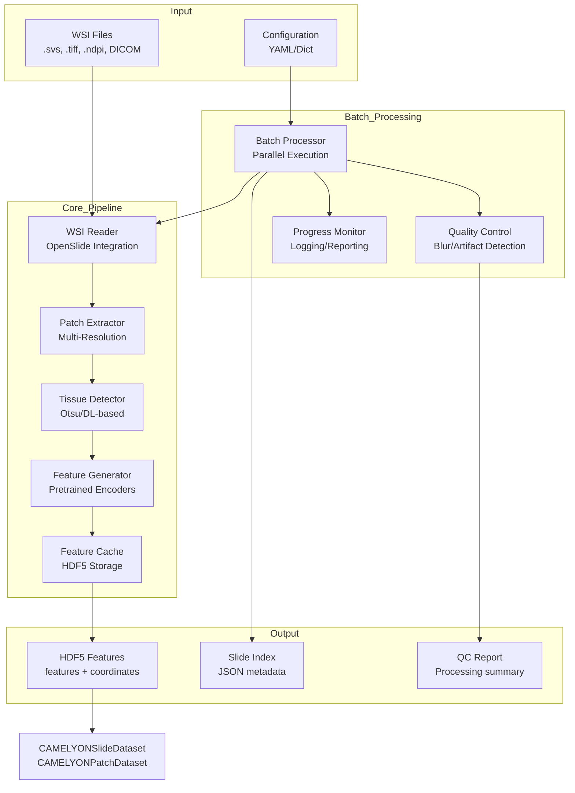

# Design Document: WSI Processing Pipeline

## Overview

The WSI Processing Pipeline is a comprehensive system for processing Whole Slide Images (WSI) in clinical formats (.svs, .tiff, .ndpi, DICOM) for computational pathology applications. This pipeline bridges the gap between raw hospital slides from PACS systems and the feature-cache baseline currently used in HistoCore.

### Purpose

Enable HistoCore to process real hospital slides directly by:
- Reading WSI files in multiple clinical formats using OpenSlide
- Extracting patches at configurable sizes and magnification levels
- Detecting tissue regions and filtering background
- Generating feature embeddings using pretrained encoders
- Caching processed features in HDF5 format for reuse
- Supporting batch processing of multiple slides with parallel execution

### Key Design Principles

1. **Memory Efficiency**: Stream patches on-demand without loading entire gigapixel images into memory
2. **Compatibility**: Generate HDF5 feature files compatible with existing CAMELYONSlideDataset and CAMELYONPatchDataset classes
3. **Extensibility**: Support pluggable tissue detectors, feature extractors, and patch sampling strategies
4. **Robustness**: Handle corrupted files, missing metadata, and hardware constraints gracefully
5. **Clinical Readiness**: Preserve patient metadata while supporting PHI anonymization

## Architecture

### Component Diagram



### Data Flow

1. **Slide Loading**: WSIReader opens slide file and extracts metadata (dimensions, magnification, MPP, pyramid levels)
2. **Patch Sampling**: PatchExtractor generates grid coordinates and extracts patches at specified level
3. **Tissue Filtering**: TissueDetector evaluates each patch and filters background regions
4. **Feature Extraction**: FeatureGenerator processes tissue patches in batches through pretrained encoder
5. **Caching**: FeatureCache stores features, coordinates, and metadata in HDF5 format
6. **Batch Orchestration**: BatchProcessor coordinates pipeline execution across multiple slides with parallel workers

## Components and Interfaces

### 1. WSIReader

**Responsibility**: Read WSI files using OpenSlide and provide access to slide metadata and regions.

**Interface**:
```python
class WSIReader:
    def __init__(self, wsi_path: str):
        """Initialize reader for a WSI file."""
        
    @property
    def dimensions(self) -> Tuple[int, int]:
        """Get slide dimensions at level 0 (width, height)."""
        
    @property
    def level_count(self) -> int:
        """Get number of pyramid levels."""
        
    @property
    def level_dimensions(self) -> List[Tuple[int, int]]:
        """Get dimensions for all pyramid levels."""
        
    @property
    def level_downsamples(self) -> List[float]:
        """Get downsample factors for all pyramid levels."""
        
    @property
    def properties(self) -> Dict[str, str]:
        """Get slide properties/metadata."""
        
    def read_region(
        self,
        location: Tuple[int, int],
        level: int,
        size: Tuple[int, int]
    ) -> np.ndarray:
        """Read a region from the slide as RGB numpy array."""
        
    def get_thumbnail(self, size: Tuple[int, int]) -> Image.Image:
        """Get thumbnail of the slide."""
        
    def close(self) -> None:
        """Close the slide and release resources."""
```

**Key Design Decisions**:
- Extend existing `openslide_utils.WSIReader` with additional format support
- Add DICOM WSI support through `wsidicom` library
- Implement context manager protocol for automatic resource cleanup
- Cache metadata on initialization to avoid repeated OpenSlide calls

### 2. PatchExtractor

**Responsibility**: Extract patches from WSI at specified coordinates, sizes, and pyramid levels.

**Interface**:
```python
class PatchExtractor:
    def __init__(
        self,
        patch_size: int = 256,
        stride: Optional[int] = None,
        level: int = 0,
        target_mpp: Optional[float] = None
    ):
        """Initialize patch extractor with sampling parameters."""
        
    def generate_coordinates(
        self,
        slide_dimensions: Tuple[int, int],
        tissue_mask: Optional[np.ndarray] = None
    ) -> List[Tuple[int, int]]:
        """Generate grid coordinates for patch extraction."""
        
    def extract_patch(
        self,
        reader: WSIReader,
        location: Tuple[int, int]
    ) -> np.ndarray:
        """Extract a single patch at specified location."""
        
    def extract_patches_streaming(
        self,
        reader: WSIReader,
        coordinates: List[Tuple[int, int]]
    ) -> Iterator[Tuple[np.ndarray, Tuple[int, int]]]:
        """Stream patches without loading all into memory."""
```

**Key Design Decisions**:
- Support both grid-based and coordinate-based sampling
- Implement streaming extraction to avoid memory accumulation
- Handle coordinate conversion between pyramid levels
- Support target MPP for resolution-independent extraction

### 3. TissueDetector

**Responsibility**: Identify tissue regions and filter background patches.

**Interface**:
```python
class TissueDetector:
    def __init__(
        self,
        method: str = "otsu",
        tissue_threshold: float = 0.5,
        thumbnail_level: int = -1
    ):
        """Initialize tissue detector."""
        
    def generate_tissue_mask(
        self,
        reader: WSIReader
    ) -> np.ndarray:
        """Generate binary tissue mask at thumbnail level."""
        
    def is_tissue_patch(
        self,
        patch: np.ndarray,
        threshold: Optional[float] = None
    ) -> bool:
        """Determine if patch contains sufficient tissue."""
        
    def calculate_tissue_percentage(
        self,
        patch: np.ndarray
    ) -> float:
        """Calculate percentage of tissue pixels in patch."""
```

**Supported Methods**:
- **Otsu Thresholding**: Fast, parameter-free method for basic tissue detection
- **Deep Learning**: Pretrained tissue segmentation model for complex cases
- **Hybrid**: Otsu for initial filtering, DL for refinement

**Key Design Decisions**:
- Generate tissue mask at low resolution for efficiency
- Support configurable tissue percentage thresholds
- Implement both patch-level and slide-level tissue detection
- Cache tissue masks to avoid recomputation

### 4. FeatureGenerator

**Responsibility**: Generate feature embeddings from patches using pretrained encoders.

**Interface**:
```python
class FeatureGenerator:
    def __init__(
        self,
        encoder_name: str = "resnet50",
        pretrained: bool = True,
        device: str = "auto",
        batch_size: int = 32
    ):
        """Initialize feature generator with pretrained encoder."""
        
    def extract_features(
        self,
        patches: torch.Tensor
    ) -> torch.Tensor:
        """Extract features from batch of patches."""
        
    def extract_features_streaming(
        self,
        patch_iterator: Iterator[np.ndarray]
    ) -> Iterator[torch.Tensor]:
        """Stream feature extraction for memory efficiency."""
        
    @property
    def feature_dim(self) -> int:
        """Get feature dimension of encoder."""
```

**Supported Encoders**:
- ResNet-50 (2048-dim features)
- DenseNet-121 (1024-dim features)
- EfficientNet-B0 (1280-dim features)
- Custom encoders via torchvision/timm

**Key Design Decisions**:
- Extract features from penultimate layer (before classification head)
- Support both GPU and CPU processing with automatic device selection
- Implement batch processing for GPU efficiency
- Use mixed precision (FP16) when available for speed

### 5. FeatureCache

**Responsibility**: Store and retrieve processed features in HDF5 format.

**Interface**:
```python
class FeatureCache:
    def __init__(
        self,
        cache_dir: Union[str, Path],
        compression: str = "gzip"
    ):
        """Initialize feature cache."""
        
    def save_features(
        self,
        slide_id: str,
        features: np.ndarray,
        coordinates: np.ndarray,
        metadata: Dict[str, Any]
    ) -> Path:
        """Save features and metadata to HDF5 file."""
        
    def load_features(
        self,
        slide_id: str
    ) -> Dict[str, Union[np.ndarray, Dict]]:
        """Load features and metadata from HDF5 file."""
        
    def exists(self, slide_id: str) -> bool:
        """Check if cached features exist for slide."""
        
    def validate(self, slide_id: str) -> bool:
        """Validate HDF5 file structure and integrity."""
```

**HDF5 Structure**:
```
slide_id.h5
├── features [num_patches, feature_dim] (float32)
├── coordinates [num_patches, 2] (int32)
└── attributes:
    ├── slide_id: str
    ├── patient_id: str
    ├── scan_date: str
    ├── scanner_model: str
    ├── magnification: float
    ├── mpp: float
    ├── patch_size: int
    ├── stride: int
    ├── level: int
    ├── encoder_name: str
    ├── encoder_version: str
    ├── processing_timestamp: str
    └── num_patches: int
```

**Key Design Decisions**:
- Use gzip compression (level 4) for 2-3x size reduction
- Store coordinates as int32 to save space
- Include processing parameters for reproducibility
- Implement validation to detect corrupted files
- Support metadata anonymization for PHI compliance

### 6. BatchProcessor

**Responsibility**: Orchestrate pipeline execution across multiple slides with parallel processing.

**Interface**:
```python
class BatchProcessor:
    def __init__(
        self,
        config: Union[Dict, str],
        num_workers: int = 4,
        gpu_ids: Optional[List[int]] = None
    ):
        """Initialize batch processor with configuration."""
        
    def process_slide(
        self,
        wsi_path: str,
        output_dir: str
    ) -> Dict[str, Any]:
        """Process a single slide through the pipeline."""
        
    def process_batch(
        self,
        wsi_paths: List[str],
        output_dir: str
    ) -> Dict[str, Any]:
        """Process multiple slides in parallel."""
        
    def generate_slide_index(
        self,
        output_dir: str,
        split_ratios: Tuple[float, float, float] = (0.7, 0.15, 0.15)
        ) -> Path:
        """Generate slide index JSON compatible with CAMELYONSlideIndex."""
```

**Key Design Decisions**:
- Use multiprocessing for CPU-bound tasks (patch extraction, tissue detection)
- Distribute slides across GPUs for feature extraction
- Implement retry logic with exponential backoff for transient failures
- Generate progress reports and ETA estimates
- Create slide index compatible with existing HistoCore datasets

### 7. QualityControl

**Responsibility**: Detect and report quality issues in processed slides.

**Interface**:
```python
class QualityControl:
    def __init__(
        self,
        blur_threshold: float = 100.0,
        min_tissue_coverage: float = 0.1
    ):
        """Initialize quality control checker."""
        
    def calculate_blur_score(
        self,
        patch: np.ndarray
    ) -> float:
        """Calculate Laplacian variance blur score."""
        
    def detect_artifacts(
        self,
        patch: np.ndarray
    ) -> Dict[str, bool]:
        """Detect common artifacts (pen marks, bubbles, folds)."""
        
    def generate_qc_report(
        self,
        slide_id: str,
        patches: List[np.ndarray],
        features: np.ndarray
    ) -> Dict[str, Any]:
        """Generate quality control report for slide."""
```

**Quality Metrics**:
- Blur score (Laplacian variance)
- Tissue coverage percentage
- Artifact detection (pen marks, bubbles, folds)
- Feature distribution statistics
- Patch dimension validation

## Data Models

### SlideMetadata

```python
@dataclass
class SlideMetadata:
    slide_id: str
    patient_id: str
    file_path: str
    label: int
    split: str
    annotation_path: Optional[str] = None
    width: Optional[int] = None
    height: Optional[int] = None
    magnification: Optional[float] = None
    mpp: Optional[float] = None
    scanner_model: Optional[str] = None
    scan_date: Optional[str] = None
    processing_timestamp: Optional[str] = None
```

### ProcessingConfig

```python
@dataclass
class ProcessingConfig:
    # Patch extraction
    patch_size: int = 256
    stride: Optional[int] = None
    level: int = 0
    target_mpp: Optional[float] = None
    
    # Tissue detection
    tissue_method: str = "otsu"
    tissue_threshold: float = 0.5
    
    # Feature extraction
    encoder_name: str = "resnet50"
    encoder_pretrained: bool = True
    batch_size: int = 32
    
    # Caching
    cache_dir: str = "features"
    compression: str = "gzip"
    
    # Batch processing
    num_workers: int = 4
    gpu_ids: Optional[List[int]] = None
    max_retries: int = 3
    
    # Quality control
    blur_threshold: float = 100.0
    min_tissue_coverage: float = 0.1
```

### ProcessingResult

```python
@dataclass
class ProcessingResult:
    slide_id: str
    success: bool
    feature_file: Optional[Path] = None
    num_patches: int = 0
    processing_time: float = 0.0
    error_message: Optional[str] = None
    qc_metrics: Optional[Dict[str, Any]] = None
```

## Error Handling

### Error Categories

1. **File Errors**:
   - File not found
   - Unsupported format
   - Corrupted file
   - Insufficient permissions

2. **Resource Errors**:
   - Insufficient disk space
   - GPU memory exhaustion
   - CPU memory exhaustion

3. **Processing Errors**:
   - OpenSlide read failure
   - Feature extraction failure
   - HDF5 write failure

4. **Validation Errors**:
   - Invalid configuration
   - Missing metadata
   - Dimension mismatch

### Error Handling Strategy

```python
class WSIProcessingError(Exception):
    """Base exception for WSI processing errors."""
    pass

class FileFormatError(WSIProcessingError):
    """Raised when file format is unsupported or corrupted."""
    pass

class ResourceError(WSIProcessingError):
    """Raised when system resources are insufficient."""
    pass

class ProcessingError(WSIProcessingError):
    """Raised when processing step fails."""
    pass
```

**Retry Logic**:
- Transient errors (network, temporary file locks): Retry with exponential backoff
- Resource errors (GPU OOM): Fall back to CPU or reduce batch size
- Permanent errors (corrupted file): Log and skip slide

## Testing Strategy

### Unit Tests

Test individual components in isolation:

1. **WSIReader Tests**:
   - Test reading different file formats (.svs, .tiff, .ndpi)
   - Test metadata extraction
   - Test pyramid level access
   - Test region reading at different levels
   - Test error handling for corrupted files

2. **PatchExtractor Tests**:
   - Test coordinate generation for different grid configurations
   - Test patch extraction at different pyramid levels
   - Test coordinate conversion between levels
   - Test streaming extraction memory usage

3. **TissueDetector Tests**:
   - Test Otsu thresholding on synthetic images
   - Test tissue percentage calculation
   - Test tissue mask generation
   - Test different tissue thresholds

4. **FeatureGenerator Tests**:
   - Test feature extraction with different encoders
   - Test batch processing
   - Test GPU/CPU device handling
   - Test feature dimension validation

5. **FeatureCache Tests**:
   - Test HDF5 file creation and structure
   - Test feature saving and loading
   - Test compression
   - Test metadata storage
   - Test file validation

6. **BatchProcessor Tests**:
   - Test single slide processing
   - Test batch processing with multiple slides
   - Test parallel execution
   - Test error handling and retry logic
   - Test slide index generation

7. **QualityControl Tests**:
   - Test blur score calculation
   - Test artifact detection
   - Test QC report generation

### Integration Tests

Test component interactions:

1. **End-to-End Pipeline Test**:
   - Process a small test slide through complete pipeline
   - Verify HDF5 output structure and content
   - Verify compatibility with CAMELYONSlideDataset

2. **Multi-Format Test**:
   - Process slides in different formats (.svs, .tiff, .ndpi)
   - Verify consistent output format

3. **Batch Processing Test**:
   - Process multiple slides in parallel
   - Verify all slides processed correctly
   - Verify slide index generation

4. **Memory Efficiency Test**:
   - Process large slide (100k x 100k pixels)
   - Monitor memory usage stays below threshold
   - Verify streaming extraction works correctly

5. **GPU/CPU Fallback Test**:
   - Simulate GPU OOM
   - Verify fallback to CPU processing
   - Verify results are consistent

### Performance Tests

Verify performance requirements:

1. **Processing Speed Test**:
   - Measure patches per second for extraction
   - Measure features per second for generation
   - Verify meets requirements (100 patches/sec extraction, 500 patches/sec GPU feature extraction)

2. **Throughput Test**:
   - Process 40x magnification slide
   - Verify completes within 10 minutes
   - Process 100k x 100k pixel slide
   - Verify completes within 15 minutes

3. **Scalability Test**:
   - Process batch of 100 slides
   - Measure total processing time
   - Verify linear scaling with number of workers

### Property-Based Tests

This feature is NOT suitable for property-based testing because:

1. **External Dependencies**: The pipeline heavily relies on external libraries (OpenSlide, PyTorch) and file I/O operations that are not pure functions
2. **Side Effects**: Core operations involve reading files, writing HDF5 files, and GPU/CPU resource management
3. **Infrastructure**: The pipeline is primarily infrastructure code for data processing, not algorithmic logic with universal properties
4. **Integration Focus**: The main value is in correct integration of components, not mathematical properties

Instead, we will use:
- **Example-based unit tests** for specific scenarios and edge cases
- **Integration tests** with real WSI files to verify end-to-end functionality
- **Snapshot tests** for HDF5 output structure validation
- **Mock-based tests** for error handling and retry logic

## Performance Optimization

### Memory Optimization

1. **Streaming Extraction**: Extract and process patches one at a time or in small batches
2. **Lazy Loading**: Load slide metadata without reading pixel data
3. **Batch Size Tuning**: Automatically adjust batch size based on available GPU memory
4. **Resource Cleanup**: Explicitly close file handles and clear GPU cache

### Speed Optimization

1. **Parallel Processing**: Use multiprocessing for CPU-bound tasks
2. **GPU Acceleration**: Batch feature extraction on GPU
3. **Mixed Precision**: Use FP16 for feature extraction when supported
4. **Tissue Mask Caching**: Generate tissue mask once at low resolution
5. **Coordinate Pre-computation**: Generate all coordinates before extraction

### Storage Optimization

1. **HDF5 Compression**: Use gzip compression (level 4) for 2-3x size reduction
2. **Int32 Coordinates**: Store coordinates as int32 instead of float64
3. **Chunked Storage**: Use HDF5 chunking for efficient partial reads

## Integration with Existing HistoCore Components

### Compatibility Requirements

1. **HDF5 Format**: Generate files compatible with existing `CAMELYONSlideDataset` and `CAMELYONPatchDataset`
2. **Slide Index**: Generate JSON index compatible with `CAMELYONSlideIndex`
3. **Feature Format**: Store features as float32 tensors with shape [num_patches, feature_dim]
4. **Coordinate Format**: Store coordinates as int32 tensors with shape [num_patches, 2]

### Integration Points

1. **Training Scripts**: `train_camelyon.py` should work without modification
2. **Evaluation Scripts**: `evaluate_camelyon.py` should work without modification
3. **Dataset Classes**: `CAMELYONSlideDataset` and `CAMELYONPatchDataset` should load processed features
4. **MIL Models**: `AttentionMIL`, `CLAM`, `TransMIL` should work with processed features

### Migration Path

1. **Phase 1**: Implement core pipeline components (WSIReader, PatchExtractor, TissueDetector)
2. **Phase 2**: Implement feature generation and caching (FeatureGenerator, FeatureCache)
3. **Phase 3**: Implement batch processing and QC (BatchProcessor, QualityControl)
4. **Phase 4**: Integration testing with existing HistoCore components
5. **Phase 5**: Documentation and example scripts

## Configuration

### YAML Configuration Example

```yaml
# WSI Processing Pipeline Configuration

# Input/Output
input_dir: "data/raw_slides"
output_dir: "data/processed_features"
slide_pattern: "*.svs"

# Patch Extraction
patch_extraction:
  patch_size: 256
  stride: 256  # null for non-overlapping (stride = patch_size)
  level: 0
  target_mpp: null  # null to use native resolution

# Tissue Detection
tissue_detection:
  method: "otsu"  # "otsu", "deep_learning", "hybrid"
  tissue_threshold: 0.5
  thumbnail_level: -1  # -1 for lowest resolution

# Feature Extraction
feature_extraction:
  encoder_name: "resnet50"  # "resnet50", "densenet121", "efficientnet_b0"
  pretrained: true
  batch_size: 32
  device: "auto"  # "auto", "cuda", "cpu"

# Caching
caching:
  cache_dir: "features"
  compression: "gzip"
  compression_level: 4

# Batch Processing
batch_processing:
  num_workers: 4
  gpu_ids: [0]  # null for all available GPUs
  max_retries: 3
  retry_delay: 5  # seconds

# Quality Control
quality_control:
  blur_threshold: 100.0
  min_tissue_coverage: 0.1
  detect_artifacts: true

# Metadata
metadata:
  anonymize_phi: false
  extract_patient_id: true
  extract_scan_date: true
  extract_scanner_model: true

# Slide Index
slide_index:
  output_path: "slide_index.json"
  split_ratios: [0.7, 0.15, 0.15]  # train, val, test
  split_seed: 42
```

## Deployment Considerations

### Hardware Requirements

**Minimum**:
- CPU: 4 cores
- RAM: 16 GB
- Storage: 100 GB
- GPU: Optional (CPU fallback available)

**Recommended**:
- CPU: 8+ cores
- RAM: 32 GB
- Storage: 500 GB SSD
- GPU: NVIDIA GPU with 8+ GB VRAM

### Software Dependencies

```
# Core dependencies
openslide-python>=1.2.0
wsidicom>=0.9.0  # For DICOM WSI support
torch>=2.0.0
torchvision>=0.15.0
h5py>=3.8.0
numpy>=1.24.0
Pillow>=9.0.0
scikit-image>=0.20.0
tqdm>=4.65.0
pyyaml>=6.0

# Optional dependencies
timm>=0.9.0  # For additional pretrained encoders
opencv-python>=4.7.0  # For advanced tissue detection
```

### Docker Deployment

```dockerfile
FROM pytorch/pytorch:2.0.0-cuda11.7-cudnn8-runtime

# Install OpenSlide
RUN apt-get update && apt-get install -y \
    openslide-tools \
    python3-openslide \
    && rm -rf /var/lib/apt/lists/*

# Install Python dependencies
COPY requirements.txt .
RUN pip install --no-cache-dir -r requirements.txt

# Copy application code
COPY src/ /app/src/
WORKDIR /app

# Set entrypoint
ENTRYPOINT ["python", "-m", "src.data.wsi_pipeline"]
```

## Security and Privacy

### PHI Handling

1. **Metadata Anonymization**: Support removing patient identifiers from HDF5 attributes
2. **Audit Logging**: Log all file access and processing operations
3. **Access Control**: Implement file permissions for processed features
4. **Encryption**: Support encryption at rest for HDF5 files

### HIPAA Compliance

1. **Data Minimization**: Only extract necessary metadata
2. **Secure Storage**: Store processed features in secure directories
3. **Audit Trail**: Maintain processing logs for compliance
4. **Data Retention**: Support configurable retention policies

## Future Enhancements

### Phase 2 Features

1. **Multi-Resolution Feature Extraction**: Extract features at multiple magnification levels
2. **Annotation Integration**: Support reading annotation XML files for supervised learning
3. **Stain Normalization**: Implement Macenko or Reinhard stain normalization
4. **Adaptive Sampling**: Sample more patches from tumor regions based on annotations
5. **Cloud Storage**: Support reading WSI files from S3/Azure Blob Storage
6. **Distributed Processing**: Support distributed processing across multiple machines
7. **Real-time Processing**: Support streaming processing for PACS integration
8. **Advanced QC**: Implement deep learning-based quality control models

### Research Directions

1. **Self-Supervised Learning**: Support feature extraction with self-supervised models (SimCLR, DINO)
2. **Foundation Models**: Integrate pathology foundation models (UNI, Virchow)
3. **Multi-Modal Fusion**: Support combining WSI features with clinical data
4. **Explainability**: Generate attention heatmaps overlaid on WSI thumbnails

## References

1. OpenSlide: https://openslide.org/
2. CAMELYON Challenge: https://camelyon17.grand-challenge.org/
3. Bandi et al. (2019), "From Detection of Individual Metastases to Classification of Lymph Node Status at the Patient Level", IEEE TMI 38(2), 550-560
4. Ilse et al. (2018), "Attention-based Deep Multiple Instance Learning", ICML 2018
5. Lu et al. (2021), "Data-efficient and weakly supervised computational pathology on whole-slide images", Nature Biomedical Engineering
6. HDF5 Format: https://www.hdfgroup.org/solutions/hdf5/

---

**Document Version**: 1.0  
**Last Updated**: 2026-01-08  
**Status**: Ready for Implementation
