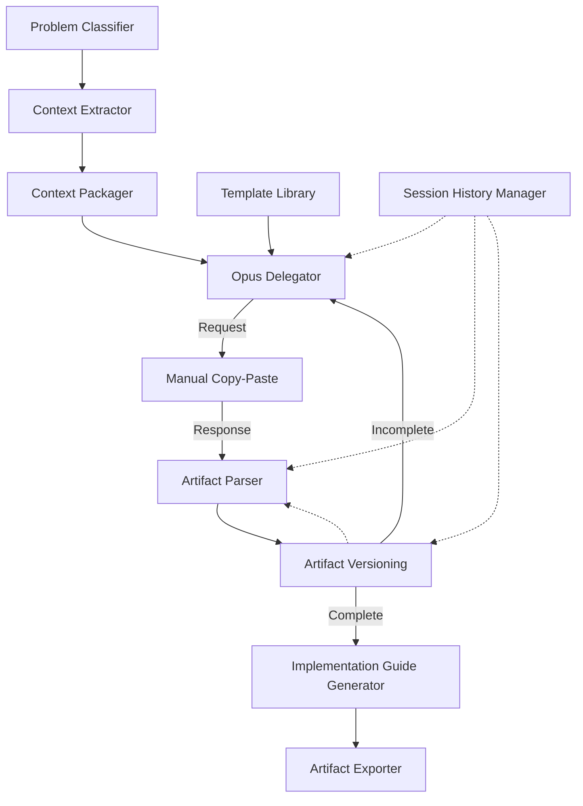

# Developer Documentation

## Architecture Overview

Opus Delegation System = TypeScript toolchain for delegating complex architectural problems to Claude Opus 4.5 via use.ai. Automates context extraction, delegation request formatting, artifact parsing, implementation guide generation.

### Core Flow

```
Problem → Classify → Extract Context → Package → Generate Request
                                                         ↓
                                                    Copy to use.ai
                                                         ↓
                                                    Opus Response
                                                         ↓
Parse Artifacts → Validate → Generate Guide → Export
```

### Component Interactions



## Component Details

### 1. Problem Classifier

**Location:** `src/components/ProblemClassifier.ts`

**Purpose:** Determines if problem suitable for Opus delegation, categorizes by type.

**Key Methods:**

```typescript
classifyProblem(description: string): {
  shouldDelegate: boolean;
  classification: ProblemClassification;
  recommendation: string;
}
```

**Delegation Types:**
- `architecture_design` - System structure, component relationships
- `api_design` - Endpoint design, schemas
- `test_strategy` - Property-based tests, coverage
- `integration_design` - External system integration
- `refactoring_analysis` - Code restructuring
- `formal_verification` - Invariants, correctness properties

**Extension Point:** Add new delegation types by:
1. Add to `DelegationType` enum in `src/types/core.ts`
2. Add classification indicators in `classifyProblem()`
3. Add context requirements in `recommendContext()`

### 2. Context Extractor

**Location:** `src/components/ContextExtractor.ts`

**Purpose:** Extracts relevant code/docs from repository based on problem type.

**Key Methods:**

```typescript
extractContext(
  query: string,
  problemType: DelegationType,
  options?: ExtractionOptions
): ExtractedFile[]
```

**Extraction Strategies:**

| Problem Type | Primary Sources | Secondary Sources |
|--------------|----------------|-------------------|
| architecture_design | Architecture docs, interfaces | Config files, deployment specs |
| api_design | Endpoints, data models, OpenAPI specs | Client code, integration tests |
| test_strategy | Test files, code under test | Coverage reports, CI config |
| integration_design | Protocol specs, external API docs | Error logs, retry policies |
| refactoring_analysis | Target modules, dependency graph | Git history, code reviews |

**Extension Point:** Add custom extraction strategy:

```typescript
// In extractContext()
if (problemType === 'custom_type') {
  return this.extractCustomStrategy(query, options);
}

private extractCustomStrategy(
  query: string,
  options?: ExtractionOptions
): ExtractedFile[] {
  // Custom logic
}
```

### 3. Context Packager

**Location:** `src/components/ContextPackager.ts`

**Purpose:** Formats extracted context as copy-paste ready markdown.

**Key Methods:**

```typescript
packageContext(
  files: ExtractedFile[],
  title: string,
  options?: PackagingOptions
): ContextBundle
```

**Size Management:**
- Default limit: 50,000 chars
- Compression: Remove redundant whitespace
- Summarization: Extract key points from large docs
- Priority queue: Include highest-relevance content first

**Extension Point:** Custom compression:

```typescript
// Override compressContent()
private compressContent(content: string): string {
  // Custom compression logic
}
```

### 4. Template Library

**Location:** `src/components/TemplateLibrary.ts`

**Purpose:** Manages delegation templates for common problem types.

**Template Structure:**

```yaml
template_id: custom_template
name: Custom Template
category: architecture_design
version: 1.0.0

parameters:
  - name: param1
    required: true
  - name: param2
    default: default_value

context_requirements:
  - requirement1
  - requirement2

expected_artifacts:
  - type: mermaid_diagram
    subtype: architecture
  - type: api_specification
    format: openapi_yaml

prompt_template: |
  Design {{param1}} with {{param2}}.
  
  Context:
  {{context_bundle}}
```

**Built-in Templates:**
- `federated_learning_architecture`
- `pacs_integration_design`
- `property_based_test_suite`
- `wsi_streaming_architecture`
- `refactoring_analysis`

**Extension Point:** Add custom template:

1. Create YAML file in `templates/`
2. Load via `loadTemplate(templateId)`
3. Use via `renderTemplate(templateId, params, context)`

### 5. Opus Delegator

**Location:** `src/components/OpusDelegator.ts`

**Purpose:** Orchestrates delegation workflow, generates requests, manages multi-round sessions.

**Key Methods:**

```typescript
createSession(
  title: string,
  description: string,
  problemType: DelegationType,
  complexity: 'simple' | 'moderate' | 'complex'
): DelegationSession

generateDelegationRequest(
  sessionId: string,
  templateId: string,
  parameters: Record<string, any>,
  contextBundle: string
): string

generateFollowUpRequest(
  sessionId: string,
  validationResults: ValidationResult[]
): string
```

**Multi-Round Session Flow:**

```
Round 1: Initial request → Opus response → Parse → Validate
         ↓ (if incomplete)
Round 2: Follow-up request → Opus response → Parse → Validate
         ↓ (if complete)
         Generate implementation guide
```

**Extension Point:** Custom request formatting:

```typescript
// Override formatDelegationRequest()
private formatDelegationRequest(
  template: string,
  params: Record<string, any>,
  context: string
): string {
  // Custom formatting logic
}
```

### 6. Artifact Parser

**Location:** `src/components/ArtifactParser.ts`

**Purpose:** Extracts structured artifacts from Opus text response.

**Key Methods:**

```typescript
parseResponse(
  response: string,
  sessionId: string,
  roundNumber: number
): ParsedArtifact[]
```

**Parsing Rules:**

| Artifact Type | Detection Pattern | Extraction Method |
|---------------|------------------|-------------------|
| Mermaid diagram | ```mermaid | Extract block, validate syntax |
| OpenAPI spec | ```yaml with openapi: | Extract YAML, validate schema |
| Implementation plan | Numbered markdown list | Parse hierarchy |
| Test strategy | Section header + test descriptions | Extract test cases |

**Extension Point:** Add custom artifact parser:

```typescript
// In parseResponse()
const customArtifacts = this.parseCustomArtifact(response);

private parseCustomArtifact(response: string): ParsedArtifact[] {
  // Custom parsing logic
  return artifacts;
}
```

### 7. Artifact Validator

**Location:** `src/components/ArtifactValidator.ts`

**Purpose:** Validates artifacts for completeness, correctness, implementability.

**Key Methods:**

```typescript
validateAll(artifacts: ParsedArtifact[]): ValidationResult[]

validateArchitectureDiagram(artifact: ParsedArtifact): ValidationResult
validateAPISpecification(artifact: ParsedArtifact): ValidationResult
validateImplementationPlan(artifact: ParsedArtifact): ValidationResult
validateTestStrategy(artifact: ParsedArtifact): ValidationResult
```

**Validation Criteria:**

**Architecture Diagrams:**
- All nodes have labels
- All edges have relationship labels
- No orphan nodes
- Consistent naming

**API Specifications:**
- All endpoints have request/response schemas
- Error responses defined (400, 500)
- Authentication requirements specified
- Examples for complex schemas

**Implementation Plans:**
- Each step has clear action verb
- Dependencies explicitly stated
- No circular dependencies
- Complexity estimates present

**Test Strategies:**
- Coverage targets specified
- Property-based tests include generators
- Edge cases identified
- Test data requirements defined

**Completeness Score:**

```
score = (present_required / total_required) × 70 +
        (present_optional / total_optional) × 20 +
        quality_bonus × 10
```

**Extension Point:** Add custom validator:

```typescript
validateCustomArtifact(artifact: ParsedArtifact): ValidationResult {
  const issues: ValidationIssue[] = [];
  
  // Custom validation logic
  
  return {
    artifactId: artifact.id,
    artifactType: artifact.type,
    isValid: issues.length === 0,
    completenessScore: calculateScore(),
    issues,
    suggestions: generateSuggestions(issues)
  };
}
```

### 8. Implementation Guide Generator

**Location:** `src/components/ImplementationGuideGenerator.ts`

**Purpose:** Transforms validated artifacts into actionable implementation steps.

**Key Methods:**

```typescript
generateGuide(
  artifacts: ParsedArtifact[],
  projectName: string
): ImplementationGuide
```

**Guide Structure:**

```markdown
# Implementation Guide: [Project Name]

## Prerequisites
- Dependencies

## Implementation Steps

### Phase 1: Foundation (Complexity: Low)
#### Step 1.1: Create base interfaces
**File:** path/to/file
**Action:** What to do
**Artifacts:** References artifact section
**Verification:** How to verify

### Phase 2: Integration (Complexity: Medium)
...

## Test Implementation
[Generated test stubs]

## Risk Register
| Risk | Mitigation | Owner |
```

**Extension Point:** Custom guide formatting:

```typescript
// Override formatGuide()
private formatGuide(
  steps: ImplementationStep[],
  projectName: string
): string {
  // Custom formatting logic
}
```

### 9. Session History Manager

**Location:** `src/components/SessionHistoryManager.ts`

**Purpose:** Persists delegation sessions for reuse and audit.

**Key Methods:**

```typescript
createSession(
  title: string,
  description: string,
  problemType: DelegationType,
  complexity: string
): DelegationSession

addRound(
  sessionId: string,
  request: string,
  response: string,
  artifacts: ParsedArtifact[],
  contextSize: number
): void

searchSessions(criteria: SearchCriteria): DelegationSession[]

generateSessionReport(sessionId: string): string
```

**Storage Structure:**

```
.opus-delegation/
└── sessions/
    └── session-{id}/
        ├── session.json
        ├── context.md
        ├── rounds/
        │   ├── 01_request.md
        │   ├── 01_response.md
        │   └── 01_artifacts.json
        └── artifacts/
            ├── architecture.mermaid
            └── api.yaml
```

**Extension Point:** Custom storage backend:

```typescript
// Override saveSession()
private saveSession(session: DelegationSession): void {
  // Custom storage logic (e.g., database)
}
```

### 10. Artifact Versioning

**Location:** `src/components/ArtifactVersioning.ts`

**Purpose:** Manages artifact versions across delegation rounds.

**Key Methods:**

```typescript
versionArtifact(
  artifact: ParsedArtifact,
  sessionId: string,
  roundNumber: number
): VersionedArtifact

compareVersions(
  artifactId: string,
  version1: number,
  version2: number
): ArtifactDiff

revertToVersion(
  artifactId: string,
  targetVersion: number
): ParsedArtifact
```

**Version Tracking:**
- Each round creates new version
- All versions stored with timestamps
- Diffs show additions/deletions/modifications
- Reversion creates new version (no destructive changes)

**Extension Point:** Custom diff algorithm:

```typescript
// Override generateDiff()
private generateDiff(
  oldContent: string,
  newContent: string
): ArtifactDiff {
  // Custom diff logic
}
```

### 11. Artifact Exporter

**Location:** `src/components/ArtifactExporter.ts`

**Purpose:** Exports artifacts to standard formats.

**Key Methods:**

```typescript
exportMermaidDiagram(
  artifact: ParsedArtifact,
  filename: string,
  format: 'mmd' | 'png' | 'svg'
): void

exportOpenAPISpec(
  artifact: ParsedArtifact,
  filename: string,
  format: 'yaml' | 'json' | 'html'
): void

exportImplementationGuide(
  guide: ImplementationGuide,
  filename: string
): void

exportTestStrategy(
  artifact: ParsedArtifact,
  filename: string
): void

exportDelegationPackage(
  sessionId: string,
  artifacts: ParsedArtifact[],
  contextBundle: ContextBundle,
  guide: ImplementationGuide
): void
```

**Export Formats:**

| Artifact Type | Formats |
|---------------|---------|
| Mermaid diagram | mmd, png, svg (via Mermaid CLI) |
| OpenAPI spec | yaml, json, html (via Redoc) |
| Implementation guide | markdown |
| Test strategy | test file templates |
| Full session | ZIP archive |

**Extension Point:** Add custom export format:

```typescript
exportCustomFormat(
  artifact: ParsedArtifact,
  filename: string
): void {
  // Custom export logic
}
```

## Configuration

**Location:** `.opus-delegation/config.yaml`

```yaml
context:
  max_size: 50000
  extraction:
    include_patterns:
      - "src/**/*.ts"
      - "src/**/*.py"
      - "docs/**/*.md"
    exclude_patterns:
      - "**/*.test.ts"
      - "**/node_modules/**"
  summarization:
    enabled: true
    max_doc_size: 5000

validation:
  completeness_threshold: 80
  quality_threshold: 70
  auto_followup: true

export:
  diagram_format: svg
  api_docs_generator: redoc

spec_integration:
  enabled: true
  output_dir: specs/
  templates:
    requirements: templates/requirements.md.j2
    design: templates/design.md.j2
    tasks: templates/tasks.md.j2
```

**Loading Configuration:**

```typescript
import { loadConfig } from './src/utils/config.js';

const config = loadConfig('.opus-delegation/config.yaml');
```

**Extension Point:** Add custom config section:

```yaml
custom:
  option1: value1
  option2: value2
```

```typescript
// In config loader
interface Config {
  // ... existing fields
  custom?: {
    option1: string;
    option2: string;
  };
}
```

## Testing

### Unit Tests

**Location:** `src/components/__tests__/`

**Run Tests:**

```bash
npm test
```

**Test Structure:**

```typescript
import { ProblemClassifier } from '../ProblemClassifier.js';

describe('ProblemClassifier', () => {
  let classifier: ProblemClassifier;
  
  beforeEach(() => {
    classifier = new ProblemClassifier();
  });
  
  test('classifies architecture design problems', () => {
    const result = classifier.classifyProblem(
      'Design federated learning architecture'
    );
    
    expect(result.shouldDelegate).toBe(true);
    expect(result.classification.delegationType).toBe('architecture_design');
  });
});
```

### Integration Tests

**Location:** `src/__tests__/integration/`

**Test End-to-End Flow:**

```typescript
test('complete delegation workflow', async () => {
  // 1. Classify problem
  const classification = classifier.classifyProblem(description);
  
  // 2. Extract context
  const files = extractor.extractContext(query, classification.delegationType);
  
  // 3. Package context
  const bundle = packager.packageContext(files, title);
  
  // 4. Generate request
  const request = delegator.generateDelegationRequest(
    sessionId,
    templateId,
    params,
    bundle.markdown
  );
  
  // 5. Parse response (mock Opus response)
  const artifacts = parser.parseResponse(mockResponse, sessionId, 1);
  
  // 6. Validate artifacts
  const validationResults = validator.validateAll(artifacts);
  
  // 7. Generate guide
  const guide = guideGenerator.generateGuide(artifacts, projectName);
  
  expect(guide.steps.length).toBeGreaterThan(0);
});
```

## Error Handling

### Error Types

| Error Type | Detection | Recovery |
|------------|-----------|----------|
| Context extraction failure | Missing files, permission errors | Partial extraction + manifest of missing |
| Size limit exceeded | Character count | Progressive summarization |
| Parse failure | Malformed markdown, invalid YAML | Identify problematic section |
| Validation failure | Missing required elements | Generate follow-up questions |
| Session corruption | Checksum mismatch | Restore from checkpoint |

### Error Handling Pattern

```typescript
try {
  const result = await operation();
  return result;
} catch (error) {
  if (error instanceof ContextExtractionError) {
    // Partial extraction
    return partialResult(error.extractedFiles);
  } else if (error instanceof ParseError) {
    // Identify problematic section
    throw new DetailedParseError(error.location, error.suggestion);
  } else {
    // Log and rethrow
    logger.error('Unexpected error', error);
    throw error;
  }
}
```

## Performance Optimization

### Context Extraction

- **Incremental indexing:** Cache file metadata, update on changes
- **Dependency graph caching:** Compute once, reuse across extractions
- **Parallel file reading:** Use Promise.all() for multiple files

```typescript
const files = await Promise.all(
  filePaths.map(path => fs.readFile(path, 'utf-8'))
);
```

### Template Rendering

- **Pre-compile templates:** Parse template once, reuse
- **Cache rendered templates:** Store common parameter combinations

```typescript
const templateCache = new Map<string, CompiledTemplate>();

function getTemplate(templateId: string): CompiledTemplate {
  if (!templateCache.has(templateId)) {
    templateCache.set(templateId, compileTemplate(templateId));
  }
  return templateCache.get(templateId)!;
}
```

### Artifact Parsing

- **Stream parsing:** Process large responses incrementally
- **Fail fast:** Detect syntax errors early, skip invalid sections

```typescript
function* parseArtifactsStream(response: string): Generator<ParsedArtifact> {
  for (const block of extractCodeBlocks(response)) {
    try {
      yield parseBlock(block);
    } catch (error) {
      // Log and continue
      logger.warn('Failed to parse block', error);
    }
  }
}
```

## Security Considerations

### Sensitive Code

**Exclude sensitive files from context:**

```yaml
# config.yaml
context:
  extraction:
    exclude_patterns:
      - "**/*.env"
      - "**/*.key"
      - "**/secrets/**"
```

**Scan and redact credentials:**

```typescript
function redactSecrets(content: string): string {
  return content
    .replace(/api[_-]?key["\s:=]+[\w-]+/gi, 'API_KEY=<redacted>')
    .replace(/password["\s:=]+[\w-]+/gi, 'password=<redacted>')
    .replace(/token["\s:=]+[\w-]+/gi, 'token=<redacted>');
}
```

### Session Storage

**Encrypt session data at rest:**

```typescript
import { encrypt, decrypt } from './utils/crypto.js';

function saveSession(session: DelegationSession): void {
  const encrypted = encrypt(JSON.stringify(session), encryptionKey);
  fs.writeFileSync(sessionPath, encrypted);
}
```

### Audit Log

**Record all delegations:**

```typescript
function logDelegation(
  sessionId: string,
  action: string,
  metadata: Record<string, any>
): void {
  auditLog.append({
    timestamp: new Date().toISOString(),
    sessionId,
    action,
    metadata
  });
}
```

## Debugging

### Enable Debug Logging

```bash
DEBUG=opus-delegate:* npm start
```

### Inspect Session Data

```typescript
import { SessionHistoryManager } from './src/components/SessionHistoryManager.js';

const manager = new SessionHistoryManager();
const session = manager.getSession(sessionId);

console.log('Session:', JSON.stringify(session, null, 2));
console.log('Rounds:', session.rounds.length);
console.log('Artifacts:', session.finalArtifacts.map(a => a.type));
```

### Validate Artifacts Manually

```typescript
import { ArtifactValidator } from './src/components/ArtifactValidator.js';

const validator = new ArtifactValidator();
const results = validator.validateAll(artifacts);

results.forEach(result => {
  console.log(`${result.artifactType}: ${result.completenessScore}%`);
  result.issues.forEach(issue => {
    console.log(`  - ${issue.severity}: ${issue.message}`);
  });
});
```

## Contributing

### Adding New Delegation Type

1. **Add to type definitions:**

```typescript
// src/types/core.ts
export type DelegationType = 
  | 'architecture_design'
  | 'api_design'
  | 'test_strategy'
  | 'integration_design'
  | 'refactoring_analysis'
  | 'formal_verification'
  | 'custom_type'; // Add here
```

2. **Add classification logic:**

```typescript
// src/components/ProblemClassifier.ts
private classifyProblem(description: string): ProblemClassification {
  // ... existing logic
  
  if (this.matchesCustomType(description)) {
    return {
      delegationType: 'custom_type',
      complexity: this.estimateComplexity(description),
      requiredContext: ['custom_context_1', 'custom_context_2']
    };
  }
}
```

3. **Add extraction strategy:**

```typescript
// src/components/ContextExtractor.ts
private extractContext(
  query: string,
  problemType: DelegationType
): ExtractedFile[] {
  // ... existing logic
  
  if (problemType === 'custom_type') {
    return this.extractCustomTypeContext(query);
  }
}
```

4. **Add template:**

```yaml
# templates/custom_type.yaml
template_id: custom_type
name: Custom Type Template
category: custom_type
version: 1.0.0

parameters:
  - name: param1
    required: true

prompt_template: |
  Design {{param1}}.
  
  Context:
  {{context_bundle}}
```

5. **Add validator:**

```typescript
// src/components/ArtifactValidator.ts
validateCustomTypeArtifact(artifact: ParsedArtifact): ValidationResult {
  // Custom validation logic
}
```

6. **Add tests:**

```typescript
// src/components/__tests__/ProblemClassifier.test.ts
test('classifies custom type problems', () => {
  const result = classifier.classifyProblem('Custom type description');
  expect(result.classification.delegationType).toBe('custom_type');
});
```

### Adding New Artifact Type

1. **Add to type definitions:**

```typescript
// src/types/core.ts
export type ArtifactType =
  | 'mermaid_diagram'
  | 'openapi_specification'
  | 'implementation_plan'
  | 'test_strategy'
  | 'custom_artifact'; // Add here
```

2. **Add parser:**

```typescript
// src/components/ArtifactParser.ts
private parseCustomArtifact(response: string): ParsedArtifact[] {
  // Custom parsing logic
}
```

3. **Add validator:**

```typescript
// src/components/ArtifactValidator.ts
validateCustomArtifact(artifact: ParsedArtifact): ValidationResult {
  // Custom validation logic
}
```

4. **Add exporter:**

```typescript
// src/components/ArtifactExporter.ts
exportCustomArtifact(
  artifact: ParsedArtifact,
  filename: string
): void {
  // Custom export logic
}
```

## Troubleshooting

### Context Extraction Issues

**Problem:** Missing files in context bundle

**Solution:**
1. Check `include_patterns` in config
2. Verify file permissions
3. Check extraction strategy for problem type

```typescript
const files = extractor.extractContext(query, problemType, {
  maxFiles: 50,
  maxFileSize: 100000,
  includeTests: true
});

console.log('Extracted files:', files.map(f => f.path));
```

### Parsing Failures

**Problem:** Artifacts not detected in Opus response

**Solution:**
1. Verify code block format (```mermaid, ```yaml)
2. Check for syntax errors in artifacts
3. Enable debug logging to see parsing attempts

```typescript
const artifacts = parser.parseResponse(response, sessionId, roundNumber);

if (artifacts.length === 0) {
  console.log('No artifacts found. Response preview:');
  console.log(response.substring(0, 500));
}
```

### Validation Failures

**Problem:** Low completeness scores

**Solution:**
1. Check validation results for specific issues
2. Generate follow-up request to address gaps
3. Adjust quality thresholds in config

```typescript
const results = validator.validateAll(artifacts);

results.forEach(result => {
  if (result.completenessScore < 80) {
    console.log('Issues:', result.issues);
    console.log('Suggestions:', result.suggestions);
  }
});

const followUp = delegator.generateFollowUpRequest(sessionId, results);
```

### Export Issues

**Problem:** Diagram export fails

**Solution:**
1. Verify Mermaid CLI installed (`npm install -g @mermaid-js/mermaid-cli`)
2. Check diagram syntax validity
3. Try exporting as `.mmd` first, then convert manually

```bash
# Manual conversion
mmdc -i diagram.mmd -o diagram.png
```

## Resources

- **TypeScript Documentation:** https://www.typescriptlang.org/docs/
- **Mermaid Syntax:** https://mermaid.js.org/intro/
- **OpenAPI Specification:** https://swagger.io/specification/
- **Property-Based Testing:** https://hypothesis.readthedocs.io/

## Support

For issues or questions:
1. Check this documentation
2. Review example delegations in `examples/`
3. Enable debug logging for detailed diagnostics
4. Open issue with session data and error logs
