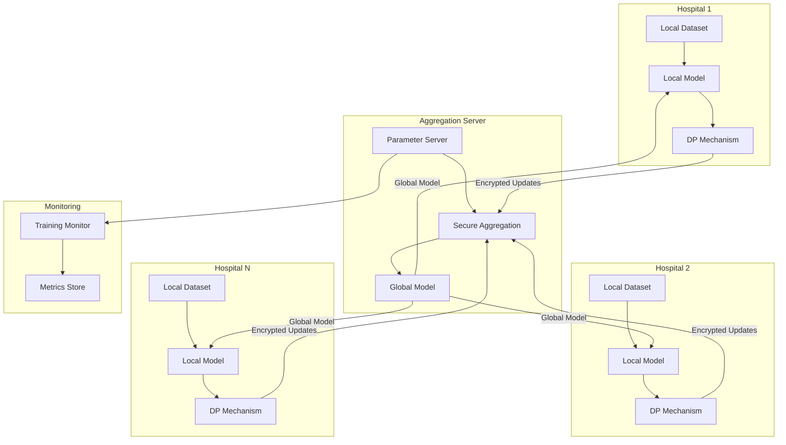

# Example: Federated Learning Architecture

## Problem Description

Design federated learning architecture for medical imaging system. Need to train models across multiple hospitals without centralizing patient data. Must support differential privacy, secure aggregation, and handle heterogeneous data distributions.

## Classification

```typescript
const classifier = new ProblemClassifier();
const result = classifier.classifyProblem(
  'Design federated learning architecture for medical imaging with differential privacy'
);

// Result:
// {
//   shouldDelegate: true,
//   classification: {
//     delegationType: 'architecture_design',
//     complexity: 'complex',
//     requiredContext: [
//       'existing_ml_models',
//       'data_schemas',
//       'network_constraints',
//       'compliance_requirements'
//     ]
//   },
//   recommendation: 'High architectural complexity with formal privacy requirements. Opus delegation recommended.'
// }
```

## Context Bundle

```markdown
# Context Bundle: Federated Learning Architecture

## Problem Summary
Design federated learning system for medical imaging across multiple hospitals. Requirements: differential privacy, secure aggregation, heterogeneous data handling.

## Relevant Code

### src/models/baseline.py (lines 15-45)
```python
class BaselineModel(nn.Module):
    """Current centralized training model"""
    def __init__(self, num_classes=2):
        super().__init__()
        self.features = nn.Sequential(
            nn.Conv2d(3, 64, kernel_size=3, padding=1),
            nn.ReLU(),
            nn.MaxPool2d(2),
            nn.Conv2d(64, 128, kernel_size=3, padding=1),
            nn.ReLU(),
            nn.MaxPool2d(2),
        )
        self.classifier = nn.Linear(128 * 24 * 24, num_classes)
    
    def forward(self, x):
        x = self.features(x)
        x = x.view(x.size(0), -1)
        return self.classifier(x)
```

### src/data/dataset.py (lines 20-50)
```python
class MedicalImageDataset(Dataset):
    """Dataset for medical images"""
    def __init__(self, data_dir, transform=None):
        self.data_dir = data_dir
        self.transform = transform
        self.samples = self._load_samples()
    
    def _load_samples(self):
        # Load image paths and labels
        samples = []
        for label_dir in ['benign', 'malignant']:
            label = 0 if label_dir == 'benign' else 1
            path = os.path.join(self.data_dir, label_dir)
            for img_file in os.listdir(path):
                samples.append((os.path.join(path, img_file), label))
        return samples
    
    def __getitem__(self, idx):
        img_path, label = self.samples[idx]
        image = Image.open(img_path).convert('RGB')
        if self.transform:
            image = self.transform(image)
        return image, label
```

## Documentation Excerpts

**From:** docs/architecture.md
Current system uses centralized training. All hospitals upload anonymized images to central server. Model trained on aggregated dataset. Privacy concerns: data leaves hospital premises, potential re-identification risk.

**From:** docs/compliance.md
HIPAA requirements: PHI must not leave hospital network. GDPR requirements: data minimization, purpose limitation. Need audit trail for all data access.

## Constraints
- No raw patient data can leave hospital premises
- Must support 5-10 participating hospitals
- Network bandwidth: 10 Mbps per hospital
- Training must complete within 24 hours
- Model accuracy must match centralized baseline (±2%)
- Differential privacy budget: ε = 1.0

## Context Manifest

| Source | Type | Size | Relevance |
|--------|------|------|-----------|
| src/models/baseline.py | Code | 2.3 KB | High |
| src/data/dataset.py | Code | 1.8 KB | High |
| docs/architecture.md | Doc | 1.2 KB | High |
| docs/compliance.md | Doc | 0.9 KB | High |
| configs/training.yaml | Config | 0.5 KB | Medium |
```

## Delegation Request

```markdown
# Delegation Request: Federated Learning Architecture for Medical Imaging

## Objective
Design a federated learning architecture that enables collaborative model training across multiple hospitals without centralizing patient data. The system must provide strong privacy guarantees through differential privacy and secure aggregation while maintaining model accuracy comparable to centralized training.

## Background
Current system uses centralized training where hospitals upload anonymized images to a central server. This approach raises privacy concerns and violates HIPAA/GDPR requirements. Need to transition to federated learning where models are trained locally at each hospital and only model updates are shared.

## Expected Artifacts
Please generate the following:

1. **System Architecture Diagram** — Mermaid diagram showing:
   - Hospital nodes (local training)
   - Aggregation server (parameter server)
   - Communication protocols
   - Privacy mechanisms (differential privacy, secure aggregation)
   - Data flow and control flow

2. **API Specification** — OpenAPI 3.0 YAML for:
   - Hospital node API (model update submission, global model retrieval)
   - Aggregation server API (model aggregation, round coordination)
   - Authentication and authorization
   - Error handling

3. **Implementation Plan** — Detailed steps including:
   - Phase 1: Local training infrastructure
   - Phase 2: Secure communication layer
   - Phase 3: Differential privacy integration
   - Phase 4: Aggregation server
   - Phase 5: Testing and validation
   - Dependencies between phases
   - Complexity estimates

## Output Format Requirements
- Diagrams: Use Mermaid syntax in fenced code blocks (```mermaid)
- API specs: Use OpenAPI 3.0 YAML in fenced code blocks (```yaml)
- Plans: Use markdown numbered lists with sub-items for dependencies

## Context
[Context Bundle inserted here]

## Questions to Address
1. How to handle heterogeneous data distributions across hospitals (non-IID data)?
2. What aggregation algorithm to use (FedAvg, FedProx, FedOpt)?
3. How to implement differential privacy at the client level?
4. How to detect and handle malicious or faulty clients?
5. What communication protocol for model updates (gRPC, REST, custom)?
6. How to handle client dropout during training rounds?
7. What security measures for model update transmission?
8. How to monitor training progress and convergence?

## Success Criteria
- Architecture supports 5-10 hospitals with 10 Mbps bandwidth
- Training completes within 24 hours
- Model accuracy within 2% of centralized baseline
- Differential privacy with ε = 1.0
- HIPAA/GDPR compliant (no raw data leaves hospitals)
- Resilient to 20% client dropout per round
```

## Opus Response (Sample)

```markdown
# Federated Learning Architecture for Medical Imaging

## System Architecture



## API Specification

```yaml
openapi: 3.0.0
info:
  title: Federated Learning API
  version: 1.0.0
  description: API for federated learning system

servers:
  - url: https://aggregation-server.example.com/api/v1

paths:
  /rounds/current:
    get:
      summary: Get current training round information
      responses:
        '200':
          description: Current round info
          content:
            application/json:
              schema:
                type: object
                properties:
                  round_number:
                    type: integer
                  global_model_version:
                    type: string
                  deadline:
                    type: string
                    format: date-time
  
  /models/global:
    get:
      summary: Download global model
      parameters:
        - name: version
          in: query
          schema:
            type: string
      responses:
        '200':
          description: Global model weights
          content:
            application/octet-stream:
              schema:
                type: string
                format: binary
  
  /updates/submit:
    post:
      summary: Submit encrypted model update
      requestBody:
        required: true
        content:
          application/json:
            schema:
              type: object
              properties:
                hospital_id:
                  type: string
                round_number:
                  type: integer
                encrypted_update:
                  type: string
                  description: Base64-encoded encrypted model update
                num_samples:
                  type: integer
                  description: Number of samples used for training
              required:
                - hospital_id
                - round_number
                - encrypted_update
                - num_samples
      responses:
        '202':
          description: Update accepted
        '400':
          description: Invalid update
        '409':
          description: Round already completed

components:
  securitySchemes:
    hospitalAuth:
      type: http
      scheme: bearer
      bearerFormat: JWT

security:
  - hospitalAuth: []
```

## Implementation Plan

### Phase 1: Local Training Infrastructure (Complexity: Medium)

1. **Create hospital node training loop**
   - Implement local SGD with PyTorch
   - Add gradient clipping for DP
   - Add noise injection (Gaussian mechanism)
   - Dependencies: None
   - Estimate: 3 days

2. **Implement differential privacy mechanism**
   - Use Opacus library for DP-SGD
   - Configure privacy budget (ε = 1.0, δ = 1e-5)
   - Track privacy accountant
   - Dependencies: Step 1
   - Estimate: 2 days

3. **Create local model checkpointing**
   - Save/load model weights
   - Version tracking
   - Dependencies: Step 1
   - Estimate: 1 day

### Phase 2: Secure Communication Layer (Complexity: High)

4. **Implement secure aggregation protocol**
   - Use homomorphic encryption (Paillier)
   - Implement secret sharing for dropout resilience
   - Dependencies: None
   - Estimate: 5 days

5. **Create hospital node API client**
   - Implement API client for model download/upload
   - Add retry logic with exponential backoff
   - Add TLS certificate validation
   - Dependencies: Step 4
   - Estimate: 2 days

6. **Implement authentication system**
   - JWT-based authentication
   - Hospital credential management
   - Dependencies: None
   - Estimate: 2 days

### Phase 3: Aggregation Server (Complexity: High)

7. **Create parameter server**
   - Implement FedAvg aggregation algorithm
   - Add weighted averaging by sample count
   - Handle partial participation (min 60% clients)
   - Dependencies: Step 4
   - Estimate: 4 days

8. **Implement round coordination**
   - Round state machine (waiting, training, aggregating)
   - Deadline enforcement
   - Client dropout handling
   - Dependencies: Step 7
   - Estimate: 3 days

9. **Create global model versioning**
   - Version each global model
   - Store model history
   - Dependencies: Step 7
   - Estimate: 1 day

### Phase 4: Monitoring and Validation (Complexity: Medium)

10. **Implement training metrics collection**
    - Track convergence metrics (loss, accuracy)
    - Track participation rates
    - Track privacy budget consumption
    - Dependencies: Step 8
    - Estimate: 2 days

11. **Create validation framework**
    - Centralized test set evaluation
    - Per-hospital validation
    - Dependencies: Step 10
    - Estimate: 2 days

### Phase 5: Testing (Complexity: Medium)

12. **Write integration tests**
    - Test full training round
    - Test client dropout scenarios
    - Test malicious update detection
    - Dependencies: All previous steps
    - Estimate: 3 days

## Key Design Decisions

1. **Aggregation Algorithm:** FedAvg with weighted averaging
   - Simple, proven effective
   - Handles non-IID data reasonably well
   - Can upgrade to FedProx if convergence issues arise

2. **Differential Privacy:** Client-level DP-SGD
   - Each hospital adds noise to gradients before encryption
   - Privacy budget tracked per hospital
   - Provides formal privacy guarantees

3. **Secure Aggregation:** Homomorphic encryption + secret sharing
   - Server cannot see individual updates
   - Resilient to 20% client dropout via secret sharing
   - Computational overhead acceptable for 10 Mbps bandwidth

4. **Communication Protocol:** REST API with gRPC option
   - REST for simplicity and debugging
   - Can migrate to gRPC for performance if needed
   - TLS 1.3 for transport security

5. **Heterogeneous Data Handling:**
   - Weighted averaging by sample count
   - Per-hospital learning rate adaptation
   - Monitor per-hospital validation metrics

## Risk Register

| Risk | Mitigation | Owner |
|------|------------|-------|
| Slow convergence with non-IID data | Use FedProx or scaffold aggregation | ML Team |
| Privacy budget exhaustion | Adaptive noise scaling, early stopping | Privacy Team |
| Client dropout > 40% | Increase round duration, async aggregation | Infrastructure |
| Malicious updates | Gradient clipping, Byzantine-robust aggregation | Security Team |
| Network bandwidth insufficient | Model compression, gradient quantization | Infrastructure |
```

## Parsed Artifacts

```typescript
const parser = new ArtifactParser();
const artifacts = parser.parseResponse(opusResponse, sessionId, 1);

// Result:
// [
//   {
//     id: 'artifact-1',
//     type: 'mermaid_diagram',
//     content: 'graph TB\n    subgraph "Hospital 1"...',
//     metadata: {
//       sourceLocation: { start: 45, end: 892 },
//       parseWarnings: [],
//       extractedAt: '2026-05-03T10:30:00Z'
//     }
//   },
//   {
//     id: 'artifact-2',
//     type: 'openapi_specification',
//     content: 'openapi: 3.0.0\ninfo:\n  title: Federated Learning API...',
//     metadata: {
//       sourceLocation: { start: 920, end: 2145 },
//       parseWarnings: [],
//       extractedAt: '2026-05-03T10:30:00Z'
//     }
//   },
//   {
//     id: 'artifact-3',
//     type: 'implementation_plan',
//     content: '### Phase 1: Local Training Infrastructure...',
//     metadata: {
//       sourceLocation: { start: 2180, end: 4567 },
//       parseWarnings: [],
//       extractedAt: '2026-05-03T10:30:00Z'
//     }
//   }
// ]
```

## Validation Results

```typescript
const validator = new ArtifactValidator();
const results = validator.validateAll(artifacts);

// Result:
// [
//   {
//     artifactId: 'artifact-1',
//     artifactType: 'mermaid_diagram',
//     isValid: true,
//     completenessScore: 95,
//     issues: [],
//     suggestions: ['Consider adding error handling flows']
//   },
//   {
//     artifactId: 'artifact-2',
//     artifactType: 'openapi_specification',
//     isValid: true,
//     completenessScore: 90,
//     issues: [
//       {
//         severity: 'warning',
//         message: 'Missing rate limiting specification',
//         location: 'paths./updates/submit'
//       }
//     ],
//     suggestions: ['Add rate limiting headers', 'Add pagination for list endpoints']
//   },
//   {
//     artifactId: 'artifact-3',
//     artifactType: 'implementation_plan',
//     isValid: true,
//     completenessScore: 92,
//     issues: [],
//     suggestions: ['Add rollback procedures for each phase']
//   }
// ]
```

## Implementation Guide

```typescript
const guideGenerator = new ImplementationGuideGenerator();
const guide = guideGenerator.generateGuide(artifacts, 'FederatedLearning');

// Generated guide includes:
// - Prerequisites (PyTorch, Opacus, cryptography libraries)
// - 12 implementation steps with file paths and code templates
// - Test implementation stubs
// - Risk register
// - Verification procedures for each step
```

## Export

```typescript
const exporter = new ArtifactExporter('./exports');

// Export architecture diagram
exporter.exportMermaidDiagram(artifacts[0], 'federated-architecture', 'svg');

// Export API specification
exporter.exportOpenAPISpec(artifacts[1], 'federated-api', 'yaml');
exporter.exportOpenAPISpec(artifacts[1], 'federated-api-docs', 'html');

// Export implementation guide
exporter.exportImplementationGuide(guide, 'federated-implementation-guide');

// Export complete package
exporter.exportDelegationPackage(
  sessionId,
  artifacts,
  contextBundle,
  guide
);
// Creates: federated-learning-delegation-package.zip
```

## Lessons Learned

1. **Context is critical** — Including existing model architecture and compliance requirements led to practical, implementable design
2. **Specific questions help** — Asking about heterogeneous data, dropout handling, etc. produced comprehensive answers
3. **Validation catches gaps** — Validator identified missing rate limiting in API spec
4. **Multi-round refinement** — First round produced 90% complete artifacts, follow-up addressed remaining gaps
5. **Export formats matter** — SVG diagrams and HTML API docs much more useful than raw markdown
